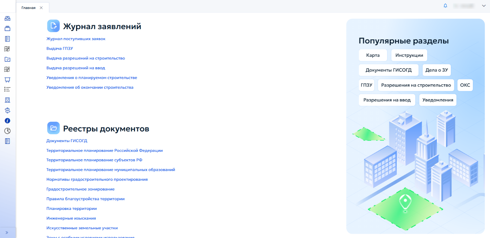

# 3 Подготовка к работе

## 3.1 Авторизация в Системе

При первом входе в Систему необходимо ввести логин и пароль, предоставленные администратором (рисунок 1).

<figure class="doc-figure" markdown="span">
  
  <figcaption>Рисунок 1 — Авторизация в системе.</figcaption>
</figure>

В случае неверного логина или пароля на экран выводится сообщение об ошибке (рисунок 2).

<figure class="doc-figure" markdown="span">
  
  <figcaption>Рисунок 2 — Некорректная авторизация.</figcaption>
</figure>

Если логин и пароль введены правильно, выполняется вход в Систему (рисунок 3).

<figure class="doc-figure" markdown="span">
  
  <figcaption>Рисунок 3 — Корректный вход.</figcaption>
</figure>

## 3.2 Стартовая страница

Главное окно ГИСОГД содержит следующие функциональные области:

1. «Журнал заявлений» — раздел для работы с входящими заявками и документами:

- «Журнал поступивших заявок»;

- «Выдача градостроительных планов земельных участков (ГПЗУ)»;

- «Выдача разрешений на строительство»;

- «Выдача разрешений на ввод объектов в эксплуатацию»;

- «Уведомления о планируемом строительстве»;

- «Уведомление об окончании строительства».

2. «Реестры документов» — раздел для доступа к нормативной и проектной документации:

- «Документы ГИСОГД»;

- «Территориальное планирование Российской Федерации»;

- «Территориальное планирование муниципальных образований»;

- «Нормативные правовые акты»;

- «Градостроительное зонирование»;

- «Правила благоустройства территории»;

- «Планировка территории»;

- «Инженерные изыскания»;

- «Искусственные земельные участки»;

- «Зоны с особыми условиями использования»;

- «Надземные и подземные коммуникации»;

- «Резервирование земель и изъятие земельных участков»;

- «Дела о земельных участках»;

- «Программы реализации документов территориального планирования»;

- «Особо охраняемые природные территории»;

- «Лесничества»;

- «Информационные модели ОКС»;

- «Иные документы».

3. «Отчеты»:

- «Статистика по разделам и ГИСОГД»;

- «Документы ГИСОГД»;

- «Загруженная графика».

4. «Популярные разделы»:

- «Карта»;

- «Инструкции»;

- «Документы ГИСОГД»;

- «Дело с земельным участком (ЗУ)»;

- «Градостроительный план земельного участка (ГПЗУ)»;

- «Разрешения на строительство»;

- «Объекты капитального строительства (ОКС)»;

- «Разрешения на ввод»;

- «Уведомления».
