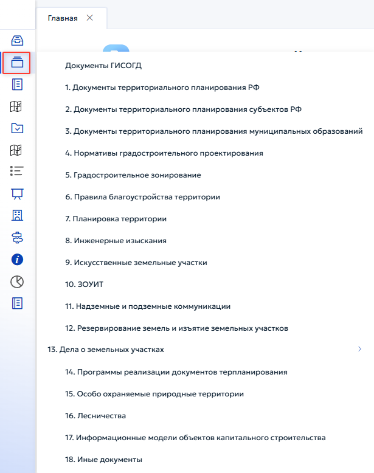
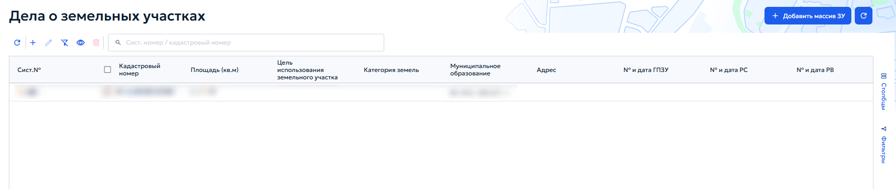
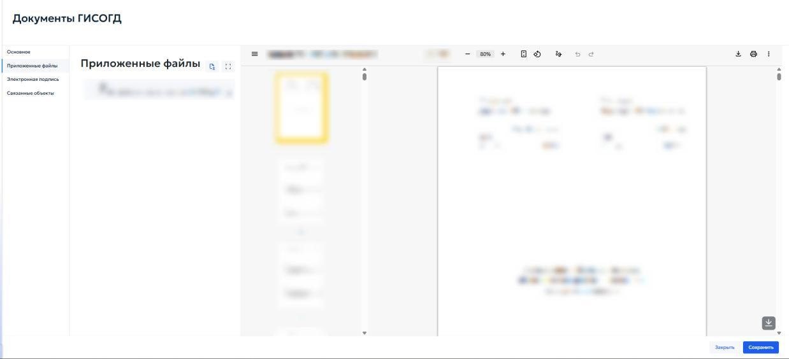
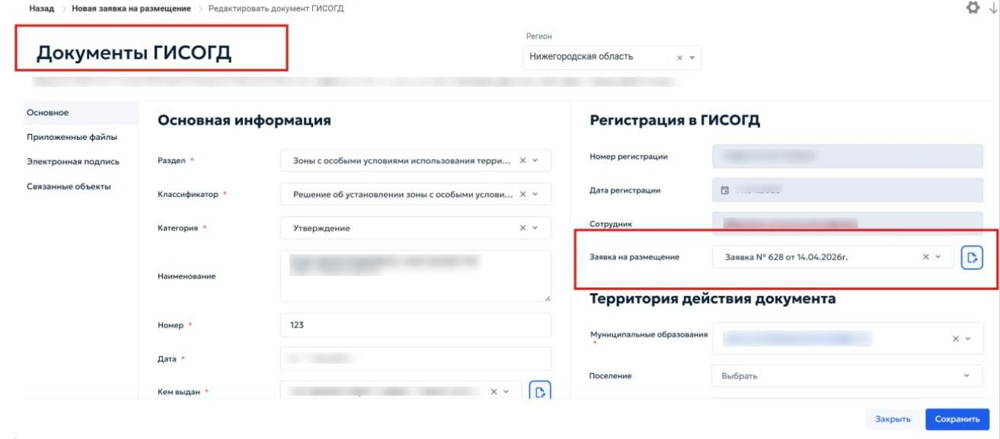
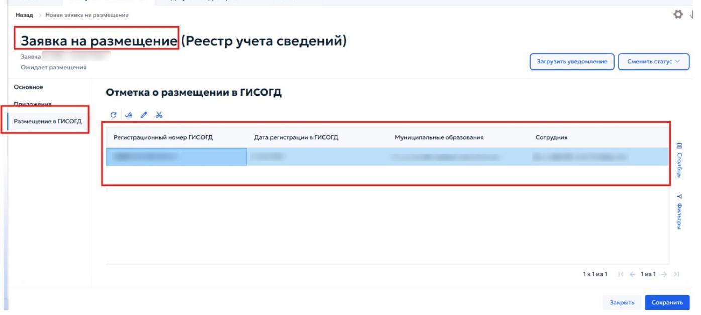

# 5.3 Размещение документа в ГИСОГД

Документы ГИСОГД хранятся в одноимённом реестре, который включает документы всех разделов и типов. Для каждого раздела Системы предусмотрен отдельный реестр со своим набором атрибутов. Внесение документа выполняется через карточку записи соответствующего реестра. Чтобы открыть реестр нужного раздела, выберите соответствующий пункт меню (рисунок 53).

### 5.3.1 Создание записи в реестре раздела

Для всех разделов алгоритм действий по добавлению записи в реестр и внесению документа ГИСОГД в раздел одинаковый:

1) Добавьте в реестр новую запись, заполнив все необходимые поля в карточке. Сохраните данные.
2) Во вкладке «Документы ГИСОГД» в карточке реестра добавьте документ ГИСОГД, заполнив все необходимые поля и приложив файлы документа. После сохранения документа ГИСОГД он появится в списке документов в карточке реестра соответствующего раздела (рисунок 54).

Подробный порядок внесения информации в записи реестров по разделам описан в разделе 5.4.

### 5.3.2 Размещение документа во вкладке «Документы ГИСОГД»

Карточка «Документы ГИСОГД» открывается при добавлении или редактировании документа в любом разделе системы. Она содержит следующие вкладки: «Основное», «Приложенные файлы», «Электронная подпись», «Связанные объекты». Вид карточки одинаков для всех разделов. Во вкладке «Основное» расположены три информационных блока: «Основная информация», «Регистрация в ГИСОГД» и «Территория действия документа» (рисунок 55).

Блок «Основная информация» включает следующие поля:

- «Раздел» — выберите из выпадающего списка раздел ГИСОГД, к которому относится документ;
- «Классификатор» — выберите тип документа из справочника;
- «Категория» — укажите категорию документа;
- «Наименование» — введите наименование документа;
- «Номер» — укажите номер документа;
- Дата — выберите дату документа с помощью календаря;
- «Кем выдан» — выберите организацию или орган власти, издавший документ;
- «Статус» — выберите текущий статус документа;
- «Заявитель» — выберите заявителя из справочников;
- «Окончание действия» — при необходимости укажите дату окончания срока действия документа;
- «Web-адрес публикации» — введите ссылку на публикацию документа в интернете, если она имеется. В блоке «Регистрация в ГИСОГД» поля «Номер регистрации», «Дата регистрации» и «Сотрудник» заполняются автоматически при сохранении документа. Чтобы связать документ с заявкой на размещение, в поле «Заявка на размещение» выберите нужную заявку из выпадающего списка.

В блоке «Территория действия документа» укажите территорию, на которую распространяется действие документа:

- «Муниципальные образования» — выберите одно или несколько муниципальных образований из списка;
- Поселение — при необходимости выберите поселение;
- Населенный пункт — при необходимости выберите населенный пункт. Регистрационный номер документа ГИСОГД формируется согласно требованиям приказа Минстроя от 6 августа 2020 г. № 433/пр и состоит из кода ОКТМО муниципалитета, номера раздела ГИСОГД, года внесения документа и порядкового номера документа в году. Вкладка «Приложенные файлы» предназначена для загрузки файлов, прилагаемых к документу (рисунок 56).

Работа с вкладкой аналогична типовой вкладке «Приложенные файлы», описанной в пункте 4.5.1 настоящего Руководства. Во вкладке «Электронная подпись» отображаются сведения об усиленной квалифицированной электронной подписи, которой подписан документ. Поля заполняются автоматически при загрузке подписанного файла (рисунок 57).

В блоке «Архив ЭП» отображаются архивные записи об электронных подписях (рисунок 57). Во вкладке «Связанные объекты» устанавливаются связи документа с другими объектами системы:

- Дела о земельных участках;
- Проекты планировки территории;
- Инженерные изыскания;
- Программы реализации документов территориального планирования.

### 5.3.3 Связывание документа ГИСОГД с заявкой на размещение

Если в журнале заявок зарегистрирована заявка на размещение документа ГИСОГД, после создания записи в соответствующем разделе и добавления документа свяжите его с заявкой. Для этого после сохранения документа в карточке выберите заявку по номеру и дате из выпадающего списка, затем сохраните карточку документа (рисунок 58).

После создания документа ГИСОГД в заявке на размещение доступен выбор созданного документа (рисунок 59).

Для просмотра заявки в отдельном окне нажмите ссылку «Посмотреть заявку». Все связанные объекты добавляются в карточку «Документы ГИСОГД» во вкладку «Связанные объекты», описанную в разделе 5.4.7.3.
