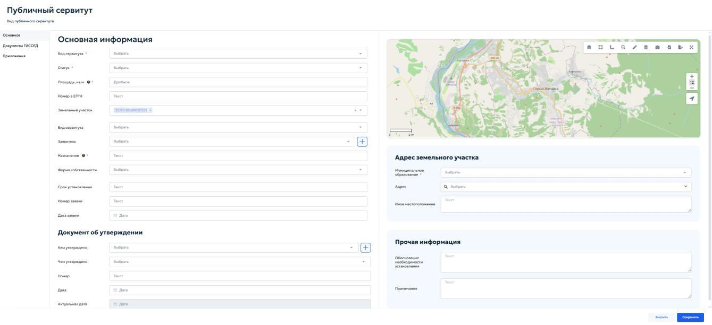
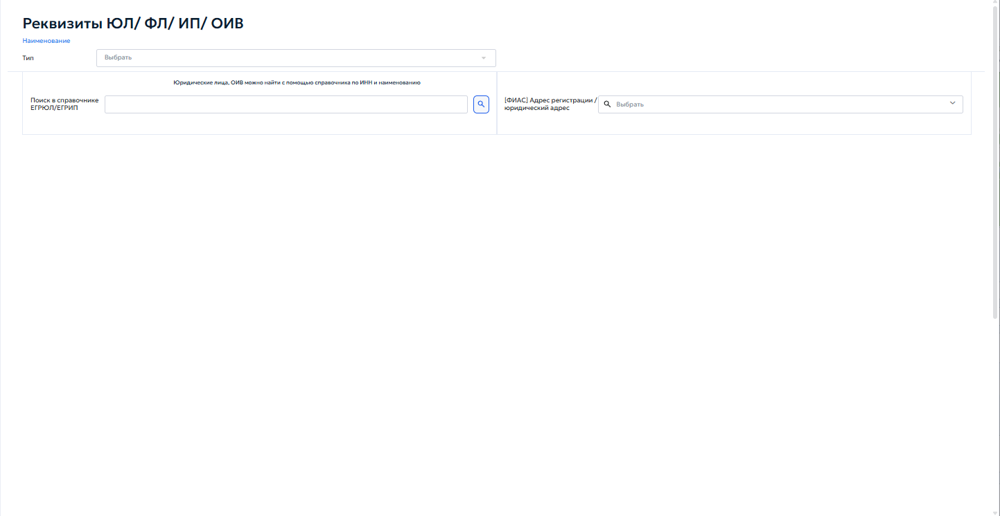
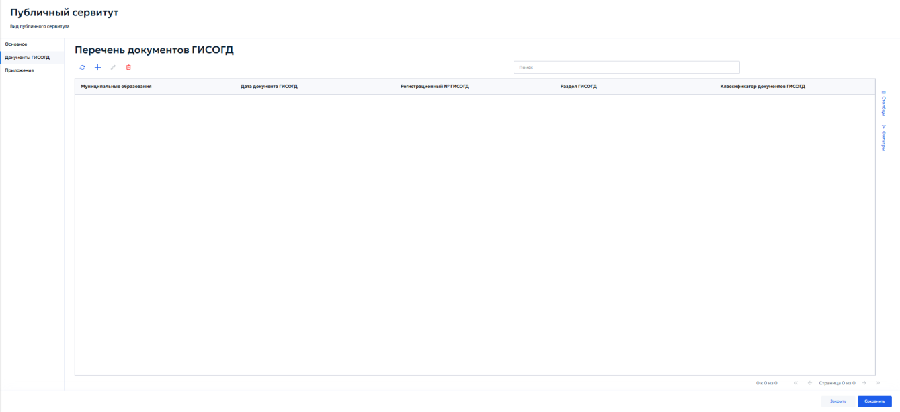
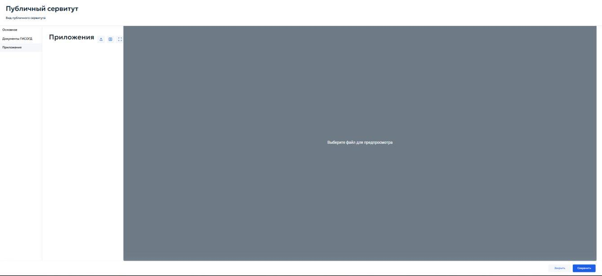

# 5.4.13.9 Вкладка «Публичные сервитуты»

Вкладка «Публичные сервитуты» предназначена для учёта сведений о публичных сервитутах, установленных в отношении земельного участка. Добавление и редактирование сведений выполняются в карточке «Публичный сервитут» (рисунок 133).

Карточка содержит вкладки «Основное», «Документы ГИСОГД» и «Приложения». Во вкладке «Основное» в блоке «Основная информация» указываются следующие данные:

1. «Вид сервитута» — выберите вид публичного сервитута из выпадающего списка;
2. «Статус» — выберите текущий статус публичного сервитута;
3. «Площадь, кв. м» — укажите площадь территории публичного сервитута в квадратных метрах;

4. «Номер в ЕГРН» — введите номер публичного сервитута в ЕГРН при наличии сведений;
5. «Земельный участок» — выберите земельный участок, в отношении которого устанавливается публичный сервитут;
6. «Вид сервитута» — уточните вид сервитута в соответствии со справочником системы;
7. «Заявитель» — выберите заявителя из справочника. Для добавления записи нажмите кнопку «+» справа от поля. Откроется окно «Реквизиты ЮЛ/ФЛ/ИП/ОИВ»;
8. «Назначение» — укажите назначение устанавливаемого публичного сервитута;
9. «Форма собственности» — выберите форму собственности из выпадающего списка;
10. «Срок установления» — укажите срок, на который устанавливается публичный сервитут;
11. «Номер заявки» — введите номер заявки на установление публичного сервитута;
12. «Дата заявки» — укажите дату заявки с помощью календаря. В блоке «Документ об утверждении» заполняются реквизиты документа, которым утверждено установление публичного сервитута:

1. «Кем утверждено» — выберите орган или лицо, утвердившее документ. Для добавления записи нажмите кнопку «+» справа от поля. Откроется окно «Реквизиты ЮЛ/ФЛ/ИП/ОИВ»;
2. «Чем утверждено» — выберите документ или основание утверждения из справочника;
3. «Номер» — введите номер утверждающего документа;
4. «Дата» — укажите дату утверждающего документа;
5. «Актуальная дата» — укажите дату актуальности сведений.

В правой части вкладки отображается карта. С помощью инструментов карты пользователь может просмотреть местоположение участка, изменить масштаб и проверить пространственное расположение публичного сервитута. Блок «Адрес земельного участка» предназначен для указания местоположения участка. В поле «Муниципальное образование» выберите муниципальное образование из списка, в поле «Адрес» выберите адрес из справочника, при отсутствии адреса укажите сведения в поле «Иное местоположение». В блоке «Прочая информация» заполните поле «Обоснование необходимости установления» и при необходимости укажите дополнительные сведения в поле «Примечания». Окно «Реквизиты ЮЛ/ФЛ/ИП/ОИВ» открывается при нажатии кнопки «+» у поля выбора физического лица, юридического лица, индивидуального предпринимателя или органа исполнительной власти (рисунок 134).

В окне «Реквизиты ЮЛ/ФЛ/ИП/ОИВ» заполните поле «Наименование» и выберите значение в поле «Тип». Для юридических лиц и индивидуальных предпринимателей доступен поиск по ЕГРЮЛ/ЕГРИП: введите ИНН или

наименование и нажмите кнопку поиска. В поле «[ФИАС] Адрес регистрации / юридический адрес» выберите адрес. После выбора или заполнения реквизитов закройте карточку и вернитесь к карточке публичного сервитута. Выбранная запись будет подставлена в соответствующее поле. Во вкладке «Документы ГИСОГД» отображается перечень документов ГИСОГД, связанных с публичным сервитутом (рисунок 135).

Сведения представлены в табличной форме с колонками «Муниципальные образования», «Дата документа ГИСОГД», «Регистрационный № ГИСОГД», «Раздел ГИСОГД», «Классификатор документов ГИСОГД». Для поиска используйте поле «Поиск», для настройки отображения используйте панели «Столбцы» и «Фильтры». С помощью кнопок панели инструментов можно обновить список, добавить, изменить или удалить связь с документом ГИСОГД. Порядок добавления и связывания документов ГИСОГД описан в пунктах 5.3.2 и 5.3.3 настоящего Руководства. Во вкладке «Приложения» загружаются файлы, относящиеся к публичному сервитуту и не зарегистрированные как самостоятельные документы ГИСОГД (рисунок 136).

Для добавления приложения нажмите кнопку загрузки файла и выберите файл на компьютере. После загрузки выберите файл в списке, чтобы просмотреть его в области предварительного просмотра. Для просмотра файла в отдельном режиме используйте кнопку разворачивания области просмотра. После заполнения сведений нажмите «Сохранить». Для выхода из карточки без сохранения нажмите «Закрыть».

## 5.4.13.10 Вкладка «Технические условия»

Находится в разработке
