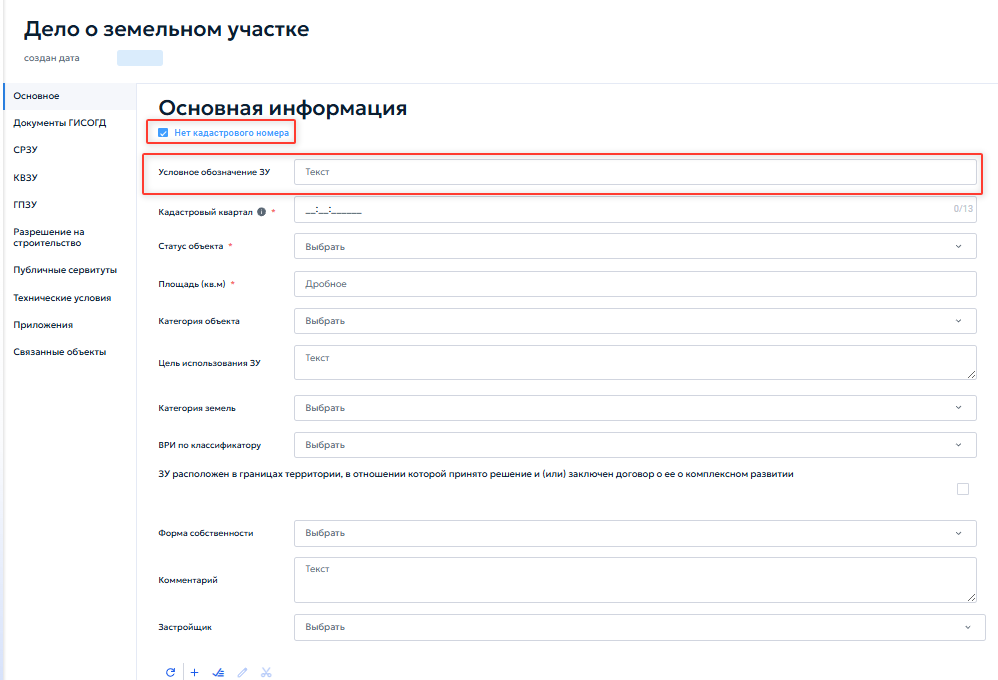
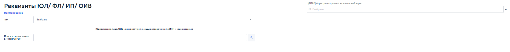

# 5.4.13 Дела о застроенных или подлежащих застройке земельных участках

Раздел предназначен для ведения полного жизненного цикла земельного участка — от начального этапа формирования земельного участка до получения разрешения на ввод объекта капитального строительства в эксплуатацию. Ведение раздела осуществляется в соответствии с пунктом 16 части 4 и частями 5–6 статьи 56 Градостроительного кодекса Российской Федерации, а также иными нормативными правовыми актами, регламентирующими предоставление государственных и муниципальных услуг в сфере градостроительства.

Раздел объединяет все документы и сведения, относящиеся к конкретному земельному участку:

- первичные сведения об участке: кадастровый номер, площадь, категория земель, вид разрешенного использования;

- схемы расположения земельного участка;

- кадастровые выписки;

- градостроительные планы земельного участка;

- сведения об объектах капитального строительства, расположенных или планируемых на участках;

- разрешения на строительство, на ввод в эксплуатацию, на отклонение от предельных параметров;

- уведомление о планируемом строительстве или об окончании строительства;

- публичные сервитуты;

- технические условия;

- дополнительные файлы и связанные объекты из других разделов ГИСОГД.

Кроме того, в состав дела при наличии соответствующих оснований и в случаях, предусмотренных законодательством, включаются:

- результаты инженерных изысканий с установлением связи с реестром «Инженерные изыскания»;

- сведения о площади, высоте и этажности объекта капитального строительства, а также об инженерно-технических сетях;

- архитектурные решения и заключения, предусмотренные для объектов, расположенных в границах исторических поселений;

- заключения государственной историко-культурной экспертизы и государственной экологической экспертизы;

- сведения из единого государственного реестра заключений;

- решения о прекращении действия или изменении разрешения на строительство;

- разрешения на условно разрешенный вид использования земельного участка или объекта капитального строительства;

- заключения органа государственного строительного надзора, учитываемые перед вводом объекта в эксплуатацию в предусмотренных законодательством случаях;

- технические планы объектов капитального строительства;

- схемы расположения построенных или реконструированных объектов и сетей инженерно-технического обеспечения;

- документы и материалы по сносу объектов капитального строительства;

- исполнительная документация;

- документы по комплексному развитию территории;

- иные сведения, документы и материалы, предусмотренные законодательством.

Все сведения, заполняемые на вкладках дела о земельном участке, автоматически сохраняются в соответствующих отдельных реестрах ГИСОГД. Эти реестры доступны через главное меню и содержат документы определенного типа по всем земельным участкам. Например:

1. пункт «СРЗУ» открывает реестр всех схем расположения земельных участков, зарегистрированных в системе;

2. пункт «ГПЗУ» — реестр всех градостроительных планов;

3. пункт «Разрешения на строительство» — реестр всех разрешений на строительство.

При работе в карточке «Дело о земельном участке» отображаются только документы, относящиеся к выбранному участку.

При открытии раздела отображается табличная форма со списком записей. Работа с реестром выполняется в соответствии с разделом 4.2 настоящего Руководства.

Добавление новой записи или редактирование существующей осуществляется в карточке дела о земельном участке (рисунок 107).

<figure class="doc-figure" markdown="span">
  
  <figcaption>Рисунок 107 — Карточка «Дело о земельном участке».</figcaption>
</figure>

Карточка содержит разветвленную систему вкладок, каждая из которых соответствует определенному этапу или типу документов:

- вкладка «Основное»;

- вкладка «Документы ГИСОГД»;

- вкладка «Схема расположения земельного участка на кадастровом плане территории» (СРЗУ);

- вкладка «Кадастровая выписка о земельном участке» (КВЗУ);

- вкладка «Градостроительный план земельного участка» (ГПЗУ);

- вкладка «Объекты капитального строительства»;

- вкладка «Разрешение на строительство»;

- вкладка «Разрешение на ввод объекта в эксплуатацию»;

- вкладка «Разрешение на отклонение от предельных параметров»;

- вкладка «Уведомление»;

- вкладка «Публичные сервитуты»;

- вкладка «Технические условия»;

- вкладка «Приложения»;

- вкладка «Связанные объекты».

Работа с вкладкой «Приложения» выполняется в соответствии с типовым порядком, описанным в пункте 5.2.3 настоящего Руководства. Работа с вкладкой «Связанные объекты» выполняется в соответствии с общим порядком установления связей, описанным в пункте 5.4.7.3 настоящего Руководства.

## 5.4.13.1 Вкладка «Основное»

Вкладка «Основное» содержит блок «Основная информация». В блоке указать следующие данные:

1. «Нет кадастрового номера» — флажок устанавливается, если земельный участок не поставлен на кадастровый учет и не имеет присвоенного номера. Если участок имеет кадастровый номер, флажок должен быть снят. При нажатии откроется дополнительное поле «Условное обозначение ЗУ» (рисунок 108);

<figure class="doc-figure" markdown="span">
  
  <figcaption>Рисунок 108 — Отсутствие кадастрового номера земельного участка.</figcaption>
</figure>

После установки флажка в левом меню становятся недоступными вкладки «Объекты капитального строительства», «Разрешение на строительство», «Разрешение на ввод объекта в эксплуатацию», «Разрешение на отклонение от предельных параметров» и «Уведомления».

2. «Кадастровый номер» — ввести кадастровый номер земельного участка в соответствии с выпиской из ЕГРН;

3. «Кадастровый квартал» — указать номер кадастрового квартала, в котором расположен участок;

4. «Статус объекта» — указать текущий статус объекта;

5. «Площадь кв. м» — указать площадь земельного участка в квадратных метрах;

6. «Категория объекта» — выбрать категорию объекта из выпадающего списка;

7. «Цель использования ЗУ» — указать цели использования участка;

8. «Категория земель» — выбрать из выпадающего списка категорию земли;

9. «ВРИ по классификатору» — выбрать вид разрешенного использования в соответствии с классификатором;

10. «ЗУ расположен в границах территории, в отношении которой принято решение и (или) заключен договор о его комплексном развитии» — флажок устанавливается, если участок находится в границах комплексного развития территории (КРТ) (рисунок 109);

<figure class="doc-figure" markdown="span">
  
  <figcaption>Рисунок 109 — Флажок «ЗУ расположен в границах территории, в отношении которой принято решение и (или) заключён договор о её комплексном развитии».</figcaption>
</figure>

11. «Форма собственности» — выбрать форму собственности земельного участка из выпадающего списка;

12. «Комментарий» — указать дополнительные сведения о земельном участке;

13. «Застройщик» — выбрать из справочника организацию или лицо, являющееся застройщиком. При необходимости добавить нового застройщика в отдельном окне.

При нажатии кнопки добавления в поле «Застройщик» открывается окно с регистрацией реквизитов. Окно предназначено для выбора застройщика из централизованного справочника или добавления нового лица (рисунок 110).

<figure class="doc-figure" markdown="span">
  
  <figcaption>Рисунок 110 — Добавление реквизитов лица.</figcaption>
</figure>

В поле «Тип» необходимо указать категорию лица:

1. юридическое лицо;

2. физическое лицо;

3. индивидуальный предприниматель;

4. орган исполнительной власти.

После выбора типа лица поиск в справочнике выполняется по ИНН или наименованию организации. Для этого ввести соответствующие данные в поле «Поиск в справочнике ЕГРЮЛ/ЕГРИП» и нажать кнопку поиска. Система отобразит список подходящих записей. Выбрать нужную запись, после чего она будет внесена в поле «Застройщик» дела о земельном участке.

Если необходимое лицо отсутствует в справочнике, его добавление выполняется вручную средствами администрирования справочников. Более подробное описание работы с реквизитами юридических и физических лиц, включая заполнение контактных данных и реквизитов документа, приведено в пункте 5.2.1 настоящего Руководства.

Блок «Адрес земельного участка» заполняется в порядке, описанном в пункте 5.4.8.

Границы земельного участка отображаются и редактируются на карте. Для обеспечения точности координат рекомендуется использовать импорт координат из файла кадастровой выписки с помощью кнопки «Импорт» на панели инструментов карты (см. пункт 4.5.2.12). Ручная отрисовка контура не гарантирует точности и не рекомендуется для участков, по которым в дальнейшем потребуются официальные координаты.

Вкладка «Документы ГИСОГД» предназначена для регистрации и хранения документов дела о земельном участке. Порядок работы приведён в пунктах 5.3.2 и 5.3.3.
