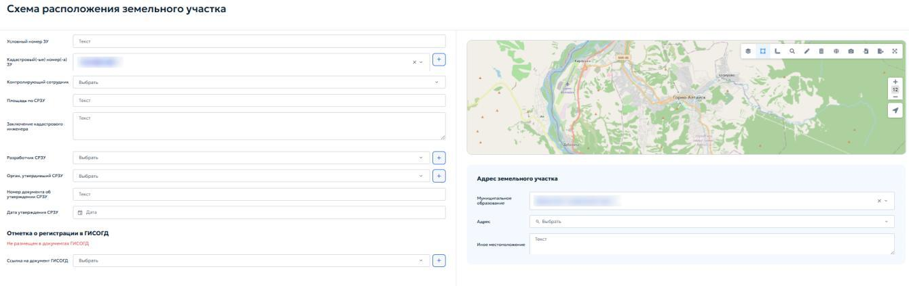
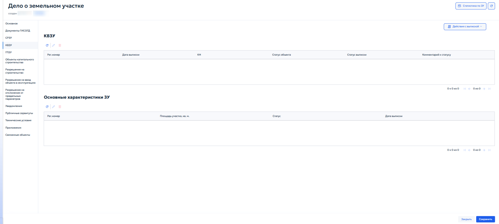
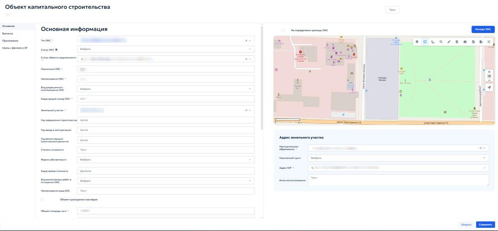

# 5.4.13.2 Вкладка «СРЗУ»

Вкладка «Схема расположения земельного участка» (СРЗУ) связана с общесистемным реестром СРЗУ и позволяет создавать, редактировать и просматривать схемы, относящиеся к текущему делу. Записи, созданные во вкладке, доступны в общем реестре, и наоборот.

Во вкладке отображается перечень подготовленных схем. Для добавления схемы нажать кнопку «Добавить». Откроется карточка «Схема расположения земельного участка» (рисунок 111). В карточке заполнить следующие поля:

<figure class="doc-figure" markdown="span">
  
  <figcaption>Рисунок 111 — Карточка «Схема расположения земельного участка».</figcaption>
</figure>

1. «Условный номер ЗУ» — ввести номер, присвоенный земельному участку на этапе подготовки схемы;

2. «Кадастровый номер» — указать кадастровый номер участка, для которого разработана схема;

3. «Контролирующий сотрудник» — выбрать из выпадающего списка сотрудника из справочника;

4. «Площадь по СРЗУ» — указать площадь участка, указанную в схеме;

5. «Заключение кадастрового инженера» — ввести текст заключения по земельному участку;

6. «Разработчик СРЗУ» — выбрать организацию-разработчика схемы из справочника;

7. «Орган утвердивший СРЗУ» — выбрать из выпадающего списка орган власти, утвердивший схему;

В обоих полях «Разработчик СРЗУ» и «Орган, утвердивший СРЗУ» при нажатии кнопки { .ui-icon } открывается окно «Реквизиты ЮЛ/ФЛ/ИП/ОИВ». Подробное описание работы с реквизитами лиц приведено в пункте 5.2.1.

8. «Номер документа об утверждении СРЗУ» — указать номер правового акта;

9. «Дата утверждения СРЗУ» — выбрать дату утверждения с помощью календаря;

10. «Отметка о регистрации в ГИСОГД» — поле автоматически заполняется после регистрации связанного документа ГИСОГД;

11. «Ссылка на документ ГИСОГД» — выбрать из выпадающего списка документ ГИСОГД, которым зарегистрирована утвержденная схема.

Вкладка «Основное» также содержит блок «Отметка о регистрации в ГИСОГД». В нём отображается статус размещения связанного документа в ГИСОГД. Если документ не выбран, отображается статус «Не размещён в документах ГИСОГД». Нажать кнопку «Выбрать», открыть перечень документов и выбрать нужный документ, например утверждённую схему. После выбора статус обновится автоматически, а СРЗУ будет связана с документом. Порядок выбора документа приведён в пункте 5.3.2.

Блок «Адрес земельного участка» заполняется в порядке, описанном в пункте 5.4.8.

## 5.4.13.3 Вкладка «КВЗУ»

Вкладка «Кадастровая выписка о земельном участке» (КВЗУ) отображает выписки из ЕГРН, поступившие в систему (рисунок 112).

<figure class="doc-figure" markdown="span">
  
  <figcaption>Рисунок 112 — Вкладка «Кадастровая выписка о земельном участке».</figcaption>
</figure>

Вкладка содержит две области:

1. «Таблица выписок» — отображает регистрационный номер, дату выписки, кадастровый номер, статус объекта и комментарий к статусу;

2. «Основные характеристики ЗУ» — отображает ключевые сведения: площадь, статус и дату выписки, принятой за основную.

Панель инструментов позволяет добавить новую выписку вручную или связать существующую запись из реестра КВЗУ.

## 5.4.13.4 Вкладка «ГПЗУ»

Вкладка «Градостроительный план земельного участка» (ГПЗУ) отображает перечень градостроительных планов, подготовленных для данного участка.

Описание будет доступно после соответствующего обновления в системе.

## 5.4.13.5 Вкладка «Объекты капитального строительства»

Вкладка содержит перечень объектов капитального строительства (ОКС), расположенных или планируемых на земельном участке. Работа со списком выполняется с помощью кнопок панели инструментов, описанных в пунктах 4.2 и 4.3. При добавлении ОКС открывается карточка «Объект капитального строительства» (рисунок 113).

<figure class="doc-figure" markdown="span">
  
  <figcaption>Рисунок 113 — Карточка «Объект капитального строительства».</figcaption>
</figure>

Во вкладке «Основное» в блоке «Основная информация» указать следующие данные:

1. «Тип ОКС» — выбрать тип объекта из выпадающего списка;

2. «Статус ОКС» — выбрать из выпадающего списка статус объекта;

3. «Статус объекта недвижимости» — выбрать из выпадающего списка состояние учета объекта;

4. «Назначение ОКС» — описать назначение объекта;

5. «Наименование ОКС» — указать наименование объекта;

6. «Вид разрешенного использования ОКС» — выбрать из выпадающего списка вид разрешенного использования в соответствии с классификатором;

7. «Кадастровый номер ОКС» — при наличии указать кадастровый номер объекта;

8. «Земельный участок» — текстовое поле заполняется автоматически при сохранении карточки. При необходимости выбрать данные из выпадающего списка;

9. «Год завершения строительства» — указать год окончания строительства;

10. «Год ввода в эксплуатацию» — указать год ввода объекта в эксплуатацию;

11. «Год реконструкции (капитального ремонта)» — при наличии указать год последней реконструкции объекта;

12. «Степень готовности» — описать в текстовом поле текущую готовность объекта;

13. «Форма собственности» — выбрать из выпадающего списка форму собственности ОКС;

14. «Кадастровая стоимость» — указать кадастровую стоимость объекта;

15. «Вид выполнения работ в отношении ОКС» — выбрать из выпадающего списка вид выполнения работ в отношении ОКС;

16. «Наименование вида ОКС» — при необходимости уточнить вид и наименование указанного объекта;

Если объект является объектом культурного наследия, установить соответствующий флажок в карточке. После этого раскроется дополнительный блок полей для ввода сведений об объекте культурного наследия. Если объект не относится к культурному наследию, флажок устанавливать не нужно, и перечисленные поля останутся скрытыми.

17. «Регистрационный номер ОКН» — ввести регистрационный номер объекта культурного наследия;

18. «Дата постановки ОКН на учет» — указать дату постановки на учет с помощью календаря;

19. «ОИВ, принявший решения о включении ОКН в реестр» — выбрать из выпадающего списка орган исполнительной власти, принявший решение;

20. «Общая площадь, кв. м» — указать общую площадь объекта культурного наследия;

21. «Площадь застройки» — указать площадь застройки под объектом;

22. «Высота, м» — указать высоту объекта в метрах;

23. «Этажность» — указать этажность объекта;

24. «Количество подземных этажей» — указать количество подземных этажей;

25. «Количество надземных этажей» — указать количество надземных этажей;

26. «Протяженность» — указать протяженность объекта в метрах;

27. «Материалы стен» — выбрать из выпадающего списка материал стен объекта;

28. «Иные параметры» — при необходимости ввести дополнительные технические характеристики объекта;

29. «Сведения о СИТО» — при необходимости указать сведения об инженерно-техническом обеспечении (СИТО) объекта.

Блок «Адрес земельного участка» заполняется аналогично пункту 5.4.8 настоящего Руководства.

В карточке «Объект капитального строительства» вкладка «Приложения» предназначена для загрузки дополнительных файлов, относящихся к ОКС. Порядок работы приведён в пункте 4.5.1. Вкладка «Связь с делами о ЗУ» устанавливает связь объекта с другими земельными участками; порядок установления связей описан в пункте 5.4.7.3.

## 5.4.13.5.1 Вкладка «Выписка»

Вкладка предназначена для просмотра, поиска и загрузки кадастровых выписок об объекте капитального строительства (КВОКС), полученных из Единого государственного реестра недвижимости (ЕГРН). При открытии вкладки отображается таблица со списком ранее загруженных выписок, а также панель управления для импорта и поиска записей (рисунок 114).

<figure class="doc-figure" markdown="span">
  
  <figcaption>Рисунок 114 — Вкладка «Выписка».</figcaption>
</figure>

Основными элементами окна являются:

1. «Поиск» — позволяет выполнять поиск по атрибутам объекта;

2. «Лог импорта» — предназначен для пакетной загрузки нескольких файлов выписок, полученных из ЕГРН. При выборе «Лог импорта» открывается проводник системы;

3. «КВОКС» — реестр КВОКС агрегирует выписки по всем объектам капитального строительства.

В таблице указываются кадастровый номер объекта, номер кадастрового квартала, код нормативно-справочной информации (НСИ), текстовое значение из справочника НСИ и адрес по ФИАС.

Для добавления новой выписки нажать кнопку { .ui-icon } и выбрать необходимый файл в формате XML. После успешной загрузки поля в таблице заполнятся автоматически.
