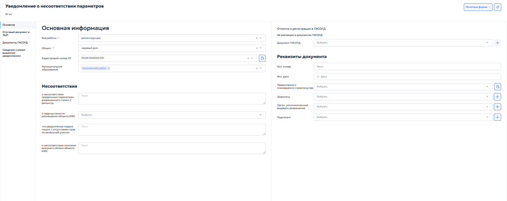
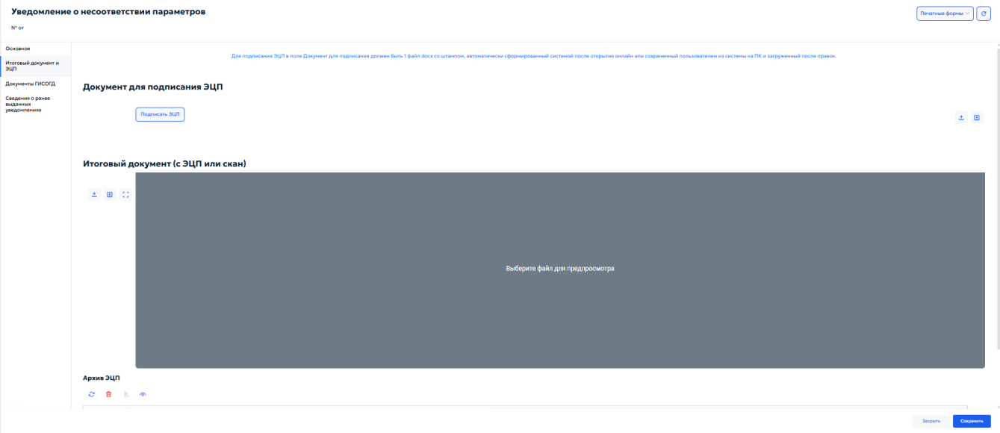
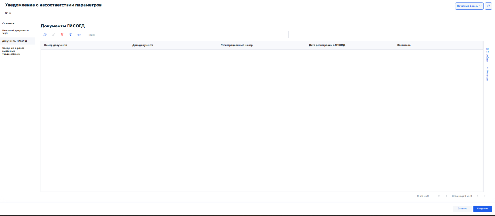
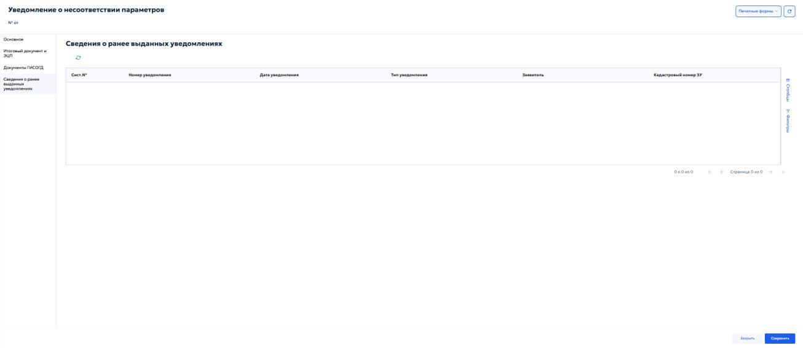

# 5.4.13.8 Вкладка «Уведомления»

Вкладка «Уведомления» в карточке «Дело о земельном участке» предназначена для учёта уведомлений, направляемых застройщиком в уполномоченный орган. В соответствии с Градостроительным кодексом РФ, застройщик обязан уведомить орган, выдавший разрешение на строительство, о планируемом начале строительства и о его завершении. Также могут фиксироваться иные виды уведомлений, предусмотренные нормативными актами. Во вкладке отображается перечень ранее зарегистрированных уведомлений (рисунок 124).

Общие правила работы с табличными формами описаны в пункте 4.3. Для добавления уведомления нажмите кнопку добавления на панели инструментов. Откроется карточка создания уведомления (рисунок 125).

- «Выберите тип уведомления» — справочник видов уведомлений. Выберите нужное значение;
- «Муниципальное образование» — укажите муниципальное образование, на территории которого расположен земельный участок;

- «Кадастровый номер ЗУ» — укажите кадастровый номер земельного участка.

### 5.4.13.8.1 Карточка «Уведомление о несоответствии объекта»

Выберите тип «Уведомление о несоответствии построенных или реконструированных объектов индивидуального жилищного строительства или садового дома требованиям законодательства о градостроительной деятельности» и нажмите кнопку «Далее». Откроется специализированная карточка (рисунок 126).

Карточка «Уведомление о несоответствии объекта» предназначена для фиксации факта выявления органом власти несоответствий параметров построенного или реконструированного объекта капитального строительства требованиям проектной документации, разрешению на строительство или техническим регламентам. Карточка содержит вкладки «Основное», «Итоговый документ и ЭЦП», «Документы ГИСОГД». Во вкладке «Основное» в блоке «Основная информация» укажите следующие данные:

1) «Тип объекта» — выберите тип капитального строительства из выпадающего списка;
2) «Кадастровый номер ЗУ» — выберите кадастровый номер земельного участка, на котором расположен объект, из выпадающего списка. Если

номера ЗУ нет в списке — нажмите кнопку добавления, чтобы указать его вручную;

3) «Муниципальное образование» — укажите из выпадающего списка муниципальное образование, на территории которого расположен объект;
4) «Адрес ЗУ» — укажите адрес земельного участка. Порядок заполнения адреса описан в разделе 5.4.8 настоящего Руководства;
5) «Описание местоположения ЗУ» — при необходимости укажите дополнительное описание ориентиров и местоположения участка. Блок «Несоответствия» предназначен для детализации выявленных нарушений. В блоке указывается следующая информация:
1) «Сведения о несоответствии параметров объекта» — укажите, в чем заключается несоответствие параметров объекта, проектной документации или разрешению на строительство;
2) «Сведения о несоответствии внешнего объекта» — укажите несоответствие внешнего облика объекта утвержденным требованиям;
3) «Сведения о несоответствии вида разрешенного использования объекта» — опишите несоответствие фактического использования объекта установленному виду разрешенного использования земельного участка;
4) «Сведения о недопустимости разрешенного объекта» — укажите причины, по которым размещение или сохранение объекта на данном участке является недопустимым. В блоке «Реквизиты документа» укажите сведения уведомления:
1) «Иск.номер» — исходящий регистрационный номер уведомления;
2) «Иск.дата» — дата исходящего уведомления;

3) «Уведомление об окончании строительства» — выберите из выпадающего списка тип уведомления об окончании строительства. При нажатии кнопки

выбора будет выполнена загрузка необходимого уведомления.

4) «Заявитель» — выберите из справочника физическое или юридическое лицо, направившее уведомление об окончании строительства. При нажатии

кнопки добавления открывается карточка «Реквизиты ЮЛ/ФЛ/ИП/ОИВ». Подробное описание работы с карточкой выполнено в разделе 5.2.1 настоящего Руководства.

5) «Орган, уполномоченный выдавать разрешение» — выберите из справочника необходимый орган, выдавший разрешение

на строительство. При нажатии кнопки добавления откроется карточка «Реквизиты ЮЛ/ФЛ/ИП/ОИВ».

6) «Подписант» — выберите из справочника должностное лицо, подписавшее уведомление о несоответствии. При необходимости можно указать

дополнительного подписанта, нажав кнопку добавления . Откроется карточка «Реквизиты подписанта» (см. пункт 5.4.13.8.1.1). Во вкладке «Итоговый документ и ЭЦП» укажите итоговую версию уведомления о несоответствии. Порядок работы с вкладкой приведён в пункте 5.4.13.6.1. Во вкладке «Документы ГИСОГД» укажите документы, связанные с уведомлением о соответствии. Порядок работы с вкладкой описан в пунктах 5.3.2 и 5.3.3 настоящего Руководства.

### 5.4.13.8.1.1 Окно «Реквизиты подписанта»

Карточка «Реквизиты подписанта» (рисунок 127) предназначена для указания должностного лица, уполномоченного подписывать документ.

В блоке «Основное» укажите данные подписанта: ФИО, дату рождения, должность и муниципальное образование. В блоке «Контакты» укажите контактные данные подписанта: телефон, e- mail, примечание.

### 5.4.13.8.2 Карточка «Уведомление о соответствии объекта»

Карточка «Уведомление о соответствии объекта» (рисунок 128) открывается при выборе одноимённого типа уведомления.

Данный вид уведомления направляется застройщиком в уполномоченный орган после завершения строительства или реконструкции объекта ИЖС или садового дома для подтверждения соответствия параметров объекта требованиям,

установленным разрешением на строительство (при его наличии) или уведомлением о соответствии планируемого строительства. На основании положительного уведомления о соответствии орган власти принимает решение о выдаче уведомления о соответствии построенного объекта. Карточка содержит вкладки «Основное», «Итоговый документ и ЭЦП», «Документы ГИСОГД». Во вкладке «Основное» в блоке «Основная информация» укажите следующие данные:

1) «Тип объекта» — укажите тип объекта из выпадающего списка;
2) «Кадастровый номер ЗУ» — выберите кадастровый номер земельного участка, на котором расположен объект, из выпадающего списка. Если

номера ЗУ нет в списке — нажмите кнопку добавления, чтобы указать его вручную;

3) «Муниципальное образование» — выберите из выпадающего списка муниципальное образование, на территории которого расположен объект;
4) «Адрес ЗУ» — укажите адрес земельного участка. Порядок заполнения адреса описан в разделе 5.4.8 настоящего Руководства;
5) Описание местоположения ЗУ — при необходимости укажите дополнительное описание ориентиров и местоположения участка. В блоке «Реквизиты документа» указываются следующие данные:
1) «Иск.номер» — введите исходящий регистрационный номер уведомления;
2) «Исх.дата» — укажите дату исходящего уведомления с помощью календаря;
3) «Уведомление об окончании строительства» — выберите из списка ранее зарегистрированное уведомление об окончании строительства, к которому относится данное уведомление о соответствии. При нажатии кнопки

добавления вы можете указать дополнительное уведомление;

4) «Заявитель» — выберите из выпадающего списка физическое или юридическое лицо, направившее уведомление. При нажатии кнопки

добавления в карточке «Реквизиты ЮЛ/ФЛ/ИП/ОИВ» вы можете внести

дополнительного заявителя, если его нет в списке. Описание работы с карточкой приведено в разделе 5.2.1 настоящего Руководства.

4) «Орган, уполномоченный выдавать разрешение» — выберите из выпадающего списка орган местного самоуправления или исполнительной власти, выдавший разрешение на строительство.

При нажатии кнопки добавления в карточке «Реквизиты ЮЛ/ФЛ/ИП/ОИВ» вы можете внести дополнительный орган, если его нет в списке. Описание работы с карточкой приведено в разделе 5.2.1 настоящего Руководства.

5) «Подписант» — выберите из справочника должностное лицо, подписавшего уведомление о соответствии. При необходимости, вы можете указать

дополнительного подписанта нажав кнопку добавления . Откроется карточка «Реквизиты Подписанта». Описание работы с карточкой приведено в разделе 5.2.1 настоящего Руководства. Во вкладке «Итоговый документ и ЭЦП» сформируйте итоговую версию уведомления о соответствии. Подробное описание работы с вкладкой приведено в пункте 5.4.13.6.1.

### 5.4.13.8.3 Карточка «Уведомление о несоответствии параметров»

Карточка «Уведомление о несоответствии параметров» (рисунок 129) открывается при выборе одноименного типа уведомления.

Карточка предназначена для оформления уведомления уполномоченного органа о несоответствии параметров планируемого строительства или реконструкции объекта ИЖС либо садового дома установленным требованиям. Карточка содержит вкладки «Основное», «Итоговый документ и ЭЦП», «Документы ГИСОГД», «Сведения о ранее выданных уведомлениях». Во вкладке «Основное» в блоке «Основная информация» указываются следующие данные:

1) «Вид работы» — выберите вид работ из выпадающего списка;
2) «Объект» — выберите тип объекта из выпадающего списка;
3) «Кадастровый номер ЗУ» — выберите кадастровый номер земельного участка, к которому относится уведомление. При необходимости нажмите кнопку справа от поля, чтобы открыть связанную карточку;
4) «Муниципальное образование» — укажите муниципальное образование, на территории которого расположен земельный участок. Блок «Несоответствия» предназначен для указания причин подготовки уведомления. В блоке заполняются следующие сведения:
1) «о несоответствии предельным параметрам разрешенного строительства/реконструкции» — укажите сведения о несоответствии параметров объекта установленным предельным параметрам;
2) «о недопустимости размещения объекта ИЖС» — выберите или укажите основание, по которому размещение объекта ИЖС на земельном участке недопустимо;
3) «что уведомление подано лицом, с отсутствием прав на земельный участок»
- укажите сведения о заявителе и отсутствии прав на земельный участок;
4) «о несоответствии описания внешнего облика объекта ИЖС» — укажите сведения о несоответствии описания внешнего облика объекта установленным требованиям. В блоке «Отметка о регистрации в ГИСОГД» отображается статус размещения уведомления в документах ГИСОГД. Если документ еще не размещен, в карточке отображается отметка «Не размещен в документах
ГИСОГД». В поле «Документ ГИСОГД» выберите связанный документ ГИСОГД или нажмите кнопку добавления справа от поля. В блоке «Реквизиты документа» указываются следующие данные:

1) «Исх. номер» — введите исходящий номер уведомления;
2) «Исх. дата» — укажите дату исходящего уведомления с помощью календаря;
3) «Уведомление о планируемом строительстве» — выберите связанное уведомление о планируемом строительстве. При необходимости нажмите кнопку справа от поля, чтобы открыть связанную карточку;
4) «Заявитель» — выберите заявителя из справочника. Если нужного заявителя нет в списке, нажмите кнопку добавления справа от поля;
5) «Орган, уполномоченный выдавать разрешение» — выберите орган местного самоуправления или исполнительной власти, уполномоченный выдавать разрешение;
6) «Подписант» — выберите должностное лицо, подписывающее уведомление. При необходимости нажмите кнопку добавления справа от поля. Для формирования печатного документа используйте кнопку «Печатные формы». После заполнения карточки нажмите «Сохранить». Для выхода без сохранения нажмите «Закрыть». Во вкладке «Итоговый документ и ЭЦП» выполняется подготовка, подписание и загрузка итогового документа уведомления (рисунок 130).

В поле «Документ для подписания ЭЦП» должен быть загружен один файл формата DOCX со штампом, автоматически сформированный системой после открытия онлайн, либо файл, сохраненный пользователем из системы на ПК и загруженный после внесения правок. Для подписания документа нажмите кнопку «Подписать ЭЦП». В блоке «Итоговый документ (с ЭЦП или скан)» загрузите подписанный файл или скан итогового документа и проверьте его в области предварительного просмотра. В блоке «Архив ЭЦП» отображаются сведения об электронных подписях; доступны обновление, удаление, загрузка файла и просмотр подписи. Во вкладке «Документы ГИСОГД» отображаются документы ГИСОГД, связанные с уведомлением (рисунок 131).

Сведения представлены в табличной форме с колонками «Номер документа», «Дата документа», «Регистрационный номер», «Дата регистрации в ГИСОГД», «Заявитель». Для поиска документа используйте поле «Поиск». Порядок добавления и связывания документов ГИСОГД описан в пунктах 5.3.2 и 5.3.3 настоящего Руководства. Во вкладке «Сведения о ранее выданных уведомлениях» отображаются ранее выданные уведомления, связанные с земельным участком или заявителем (рисунок 132).

«Уведомление о несоответствии параметров».

Данные отображаются в табличной форме с колонками «Сист. №», «Номер уведомления», «Дата уведомления», «Тип уведомления», «Заявитель», «Кадастровый номер ЗУ». Вкладка используется для проверки ранее зарегистрированных уведомлений перед сохранением текущей карточки.
