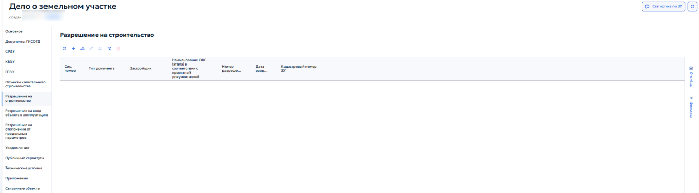
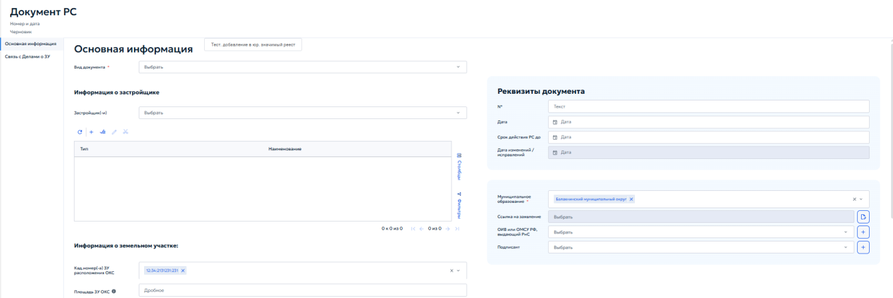
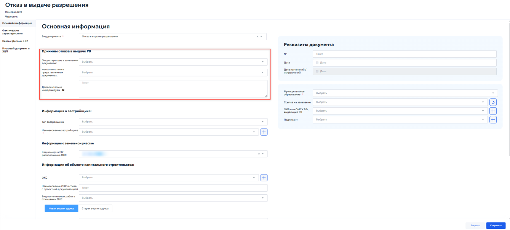
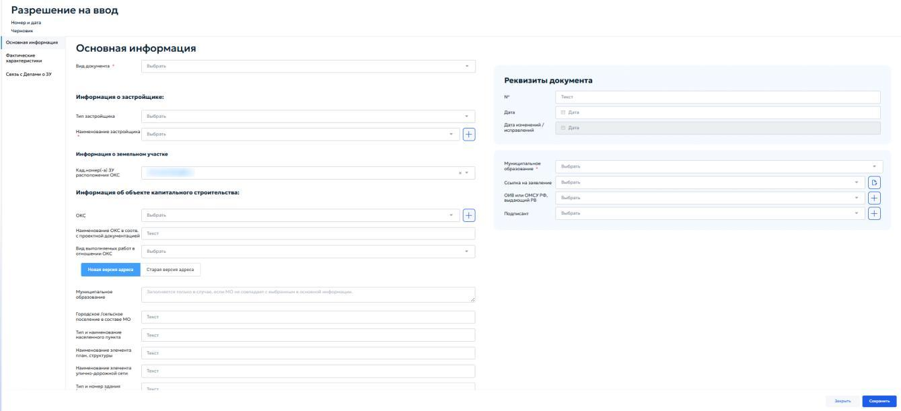
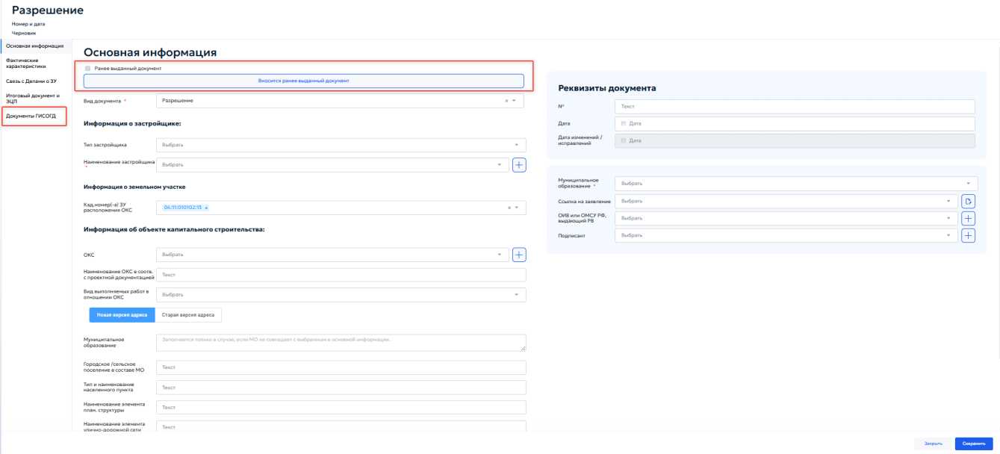
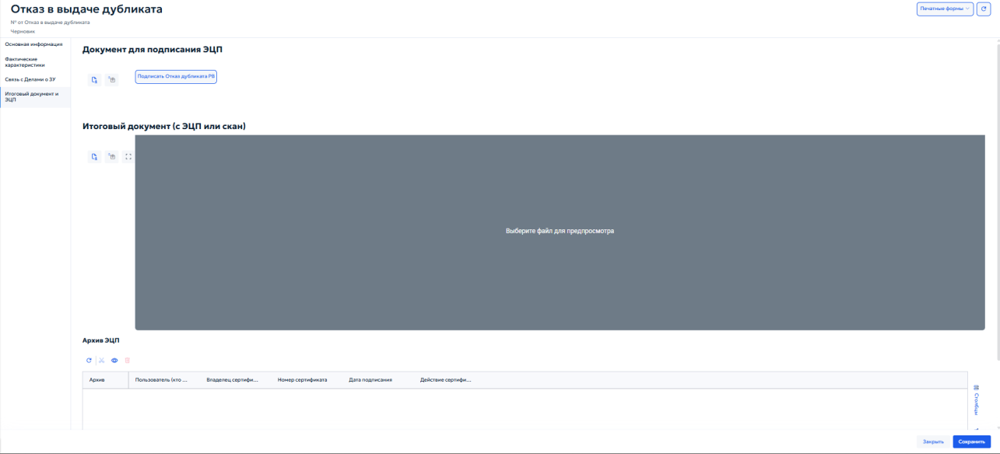

# 5.4.13.6 Вкладка «Разрешение на строительство»

Вкладка «Разрешение на строительство» в карточке «Дело о земельном участке» предназначена для учета разрешений на строительство, выданных в отношении данного земельного участка. Разрешение на строительство оформляется в соответствии с требованиями Градостроительного кодекса РФ и является одним из ключевых документов, подтверждающих право на осуществление строительства или реконструкции объекта капитального строительства.

Во вкладке отображается перечень ранее зарегистрированных разрешений (рисунок 115).

<figure class="doc-figure" markdown="span">
  
  <figcaption>Рисунок 115 — Вкладка «Разрешение на строительство».</figcaption>
</figure>

В перечне указываются: системный номер записи, тип документа, застройщик, наименование объекта капитального строительства в соответствии с проектной документацией, номер и дата выдачи разрешения, а также кадастровый номер земельного участка.

При нажатии кнопки добавления открывается карточка «Документ РС» (рисунок 116).

<figure class="doc-figure" markdown="span">
  
  <figcaption>Рисунок 116 — Карточка «Документ РС».</figcaption>
</figure>

В блоке «Основная информация» в поле «Вид документа» необходимо выбрать из выпадающего списка документ, разрешающий строительство.

Блок «Информация о застройщике» предназначен для выбора застройщика, которому выдано разрешение на строительство. Нажать кнопку «Выбрать» рядом с полем «Застройщик» и выбрать организацию или физическое лицо. Порядок выбора застройщика описан в пункте 5.4.13.1. Ниже отображается таблица выбранных застройщиков.

В блоке «Информация о земельном участке» указываются сведения о земельных участках, на которых планируется размещение объекта капитального строительства:

1. «Кад.номер(а) ЗУ расположения ОКС» — выпадающий список, в котором указывается кадастровый номер земельного участка. Если выбрано несколько участков, рядом с основным номером отображается индикатор «+№»;

2. «Площадь ЗУ ОКС» — указать общую площадь земельного участка.

Ниже расположена таблица, в которой автоматически отображаются добавленные земельные участки. Управление записями описано в разделе 4.3 настоящего Руководства.

В блоке «Реквизиты документа» указываются следующие данные:

1. «№» — ввести регистрационный номер разрешения на строительство;

2. «Дата» — указать дату выдачи разрешения с помощью календаря;

3. «Срок действия РС до» — указать дату окончания срока действия разрешения;

4. «Дата изменения/исправления» — поле заполняется автоматически при внесении изменений в документ;

5. «Муниципальное образование» — выбрать из выпадающего списка муниципальное образование, на территории которого планируется строительство;

6. «Ссылка на заявление» — нажать кнопку «Выбрать», чтобы привязать заявку на выдачу разрешения, зарегистрированную в журнале поступивших заявок. При нажатии кнопки перехода { .ui-icon } выполняется переход на прикрепленное заявление;

7. «ОИВ или ИМСУ РФ, выдающий РнС» — нажать кнопку «Выбрать», чтобы указать орган исполнительной власти или орган местного самоуправления, выдавший разрешение на строительство. Выбор осуществляется из справочника органов власти;

8. «Подписант» — нажать кнопку «Выбрать», чтобы указать должностное лицо, подписавшее разрешение. Выбор осуществляется из справочника должностных лиц.

Вкладка «Связь с делами о ЗУ» предназначена для установления и просмотра связей между разрешением на строительство и делами о земельных участках, на которых планируется возведение ОКС. Порядок работы с таблицей описан в пункте 5.2.2.

## 5.4.13.7 Вкладка «Разрешение на ввод объекта в эксплуатацию»

Вкладка «Разрешение на ввод объекта в эксплуатацию» в карточке «Дело о земельном участке» предназначена для учета разрешений на ввод объекта капитального строительства в эксплуатацию, выданных в отношении объектов, расположенных на данном земельном участке. Разрешение на ввод оформляется в соответствии с требованиями Градостроительного кодекса РФ и подтверждает завершение строительства или реконструкции объекта в полном соответствии с проектной документацией.

Во вкладке отображается перечень ранее зарегистрированных разрешений на ввод. Карточка выбранного документа открывается из перечня; пример карточки для вида документа «Отказ в выдаче разрешения» приведён на рисунке 117.

<figure class="doc-figure" markdown="span">
  
  <figcaption>Рисунок 117 — Карточка «Разрешение на ввод». Вид документа «Отказ в выдаче разрешения».</figcaption>
</figure>

В перечне указываются: системный номер записи, тип документа, застройщик, номер и дата выдачи разрешения, наименование объекта капитального строительства, а также кадастровый номер земельного участка.

Панель инструментов перечня позволяет добавлять, редактировать, удалять, обновлять и экспортировать записи. Общие правила работы с табличными формами описаны в пункте 4.3.

При нажатии кнопки «Добавить» открывается карточка «Разрешение на ввод» (рисунок 118).

<figure class="doc-figure" markdown="span">
  
  <figcaption>Рисунок 118 — Карточка «Разрешение на ввод».</figcaption>
</figure>

Карточка «Разрешение на ввод объекта в эксплуатацию» содержит вкладки «Основная информация», «Итоговый документ и ЭЦП» и, в зависимости от значения поля «Вид документа», «Документы ГИСОГД».

## 5.4.13.7.1 Вкладка «Основная информация»

Во вкладке «Основная информация» в зависимости от значения поля «Вид документа» отображаются следующие дополнительные блоки или поля:

1. «Разрешение» — отображается кнопка «Вносится ранее выданный документ», позволяющая выбрать существующее разрешение, на основании которого создаётся новое. В карточке появляется вкладка «Документы ГИСОГД» (рисунок 119);

<figure class="doc-figure" markdown="span">
  
  <figcaption>Рисунок 119 — Карточка «Разрешение на ввод». Вид документа «Разрешение».</figcaption>
</figure>

2. «Отказ во внесении исправлений» — отображается блок «Отказ в исправлении опечаток и ошибок» (рисунок 120);

<figure class="doc-figure" markdown="span">
  
  <figcaption>Рисунок 120 — Карточка «Разрешение на ввод». Вид документа «Отказ во внесении исправлений».</figcaption>
</figure>

В блоке указывается следующая информация:

- «Основания для отказа» — выбрать причину для отказа из выпадающего списка;

- «Дополнительно информируем» — написать разъяснение для отказа.

3. «Отказ во внесении изменений» — отображается блок «Причины отказа во внесении изменений в РВ»;

В блоке указывается следующая информация:

- «Отсутствующие в заявлении документы» — выбрать из списка документы, которые не были предоставлены;

- «Несоответствия в представленных документах» — выбрать вид выявленных несоответствий.

4. «Отказ в выдаче разрешения» — отображается блок «Причины отказа в выдаче РВ» (рисунок 121), содержащий следующие поля:

<figure class="doc-figure" markdown="span">
  
  <figcaption>Рисунок 121 — Вид документа «Отказ в выдаче разрешения».</figcaption>
</figure>

- «Отсутствующие в заявлении документы» — выбрать из справочника документы, обязательные для предоставления в соответствии с требованиями Градостроительного кодекса РФ и административного регламента;

- «Несоответствия в представленных документах» — выбрать из справочника виды несоответствий, выявленных в представленных документах;

- «Дополнительно информируем» — указать дополнительные данные, обоснования отказа или иную информацию, которую заявитель должен учесть.

5. «Отказ в выдаче дубликата» — состав вкладки «Основная информация» не изменяется. В меню карточки появляется вкладка «Итоговый документ и ЭЦП» (см. пункт 5.4.13.7.2);

6. «Внесение изменений/исправлений» — отображается блок «Ранее выданный документ» (рисунок 122).

<figure class="doc-figure" markdown="span">
  
  <figcaption>Рисунок 122 — Вид документа «Внесение изменений/исправлений».</figcaption>
</figure>

В блоке указывается следующая информация:

- «Вносится ранее выданный документ» — кнопка выбора ранее выданного разрешения; отображается для вида документа «Разрешение»;

- «Ссылка на ранее выданное РВ» — выбрать из справочника ссылку на ранее выданное разрешение. При необходимости прикрепить ее с помощью кнопки выбора{ .ui-icon };

- «Заполнить поля из документа» — кнопка, при нажатии на которую система переносит данные из выбранного ранее выданного разрешения в текущую карточку.

В блоке «Информация о земельном участке» в выпадающем списке «Кад.номер(-а) ЗУ расположения ОКС» выбирается кадастровый номер земельного участка, на котором расположен объект. Если выбрано несколько участков, рядом с основным номером отображается индикатор «+№».

Блок «Информация об объекте капитального строительства» включает в себя следующие поля:

- «ОКС» — выбрать в справочнике объект капитального строительства;

- «Наименование ОКС в соотв. с проектной документацией» — указать название объекта капитального строительства;

- «Вид выполняемых работ в отношении ОКС» — выбрать вид выполняемых работ из выпадающего списка.

Для указания местоположения ОКС заполнить адресную форму. В карточке доступны вкладки «Новая версия адреса» и «Старая версия адреса».

Вкладка «Новая версия адреса» содержит следующие поля:

- «Муниципальное образование» — указать, если муниципальное образование не совпадает с указанным в основной информации дела о ЗУ;

- «Городское/сельское поселение в составе МО» — указать наименование поселения, входящего в состав выбранного муниципального образования;

- «Тип и наименование населенного пункта» — указать тип населенного пункта и его наименование;

- «Наименование элемента план. структуры» — указать территорию — микрорайон, квартал, жилой район, промышленная территория и т. д.;

- «Наименование элемента улично-дорожной сети» — указать элемент улично-дорожной сети: проезд, переулок и т. д.;

- «Тип и номер здания (сооружения)» — указать тип и номер здания или сооружения.

Вкладка «Старая версия адреса» содержит следующие поля:

- «Адрес (местоположение) ОКС ГАР» — выбрать адрес из Государственного адресного реестра;

- «Описание адреса» — указать описание местоположения, если адрес отсутствует в ГАР.

В блоке «РС, на основании которого осуществлялось строительство, реконструкция объекта капитального строительства» в реестре выбрать разрешение на строительство, связанное с текущим делом о земельном участке (см. раздел 5.4.13.6).

В блоке «Отметка о регистрации в ГИСОГД» в поле «Ссылка на документ ГИСОГД» выбрать документ, связываемый с объектом.

Блок «Реквизиты документа» содержит регистрационные сведения разрешения на ввод объекта. Порядок заполнения реквизитов документа приведен в пункте 5.3.2 настоящего Руководства.

## 5.4.13.7.2 Вкладка «Итоговый документ и ЭЦП»

Вкладка «Итоговый документ и ЭЦП» (рисунок 123) предназначена для формирования, подписания и хранения итоговой версии документа, а также для управления электронными подписями. На основании данных карточки Система формирует файл, пригодный для подписания.

<figure class="doc-figure" markdown="span">
  
  <figcaption>Рисунок 123 — Вкладка «Итоговый документ и ЭЦП».</figcaption>
</figure>

## 5.4.13.7.3 Вкладка «Документы ГИСОГД»

Вкладка «Документы ГИСОГД» отображается для видов документа, предусматривающих связь с зарегистрированными документами ГИСОГД. Порядок добавления и связывания документов приведен в пунктах 5.3.2 и 5.3.3 настоящего Руководства.

## 5.4.13.8 Вкладка «Разрешение на отклонение от предельных параметров»

Находится в разработке
