# 5.4 Реестры документов

Разделы ГИСОГД, перечисленные в разделе 5.1, ведутся в отдельных реестрах. В каждом реестре создаются записи об объектах соответствующего вида, а к записям прикрепляются документы ГИСОГД. Поэтому заполнение сведений по разделам выполняется через карточки записей соответствующих реестров.

## 5.4.1 Документы территориального планирования Российской Федерации

В раздел «Документы территориального планирования Российской Федерации» вносятся документы федерального уровня, относящиеся к территории региона. Например, схема территориального планирования Российской Федерации (СТП РФ) в области энергетики, СТП РФ в области федерального транспорта и автомобильных дорог.

## 5.4.2 Документы территориального планирования двух и более субъектов Российской Федерации, документы территориального планирования субъектов Российской Федерации

В раздел вносятся сведения о схеме территориального планирования региона, документы СТП, а также документы об утверждении или внесении изменений в СТП.

Схема территориального планирования субъекта Российской Федерации содержит положения о территориальном планировании и карты планируемого размещения объектов регионального значения в следующих сферах: транспорт, предупреждение чрезвычайных ситуаций, образование, спорт, здравоохранение, энергетика.

## 5.4.3 Документы территориального планирования муниципальных образований

В раздел «Документы территориального планирования муниципальных образований» вносятся генеральные планы городских и муниципальных округов, а также схемы территориального планирования муниципальных районов (рисунок 60).

<figure class="doc-figure" markdown="span">
  
  <figcaption>Рисунок 60 — Раздел 3. Реестр «Документы территориального планирования муниципальных образований».</figcaption>
</figure>

Документы территориального планирования федерального, межрегионального, регионального и муниципального уровней включают в себя текстовую и графическую часть и определяют направления развития территории соответствующего уровня. Например, региональная схема территориального планирования (РСТП) показывает расположение объектов регионального значения, дорожной и инженерной инфраструктуры, их характеристики. Планируемые объекты наносятся на карту, а сами документы заносятся в реестр ГИСОГД.

Ниже приведен порядок внесения документа территориального планирования на примере генерального плана городского округа.

### 5.4.3.1 Создание записи

Для создания записи выполнить следующие действия:

1. на панели инструментов реестра нажать кнопку «Добавить»;

2. в открывшейся карточке заполнить атрибуты (рисунок 61).

<figure class="doc-figure" markdown="span">
  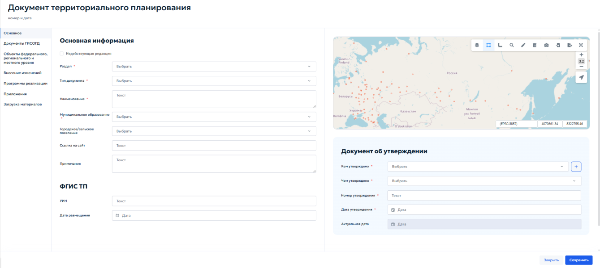
  <figcaption>Рисунок 61 — Заполнение сведений по документу территориального планирования.</figcaption>
</figure>

### 5.4.3.2 Заполнение вкладки «Основное»

Во вкладке «Основное» в блоке «Основная информация» выбрать следующие данные:

1. «Раздел» — выбрать значение «Документы территориального планирования муниципальных образований»;

2. «Тип документа» — выбрать «Генеральный план городского округа, муниципального округа»;

3. «Наименование» — ввести полное наименование в соответствии с утвержденным документом;

4. «Муниципальное образование» — выбрать из списка нужный городской округ или муниципальный район;

5. «Городское/сельское поселение» — при необходимости выбрать поселение;

6. «Ссылка на сайт» — указать адрес страницы муниципалитета, на которой размещен документ;

7. «Примечания» — внести дополнительные сведения, например об изменениях документа.

В блоке «Документ об утверждении» указать:

1. «Кем утверждено» — выбрать из выпадающего списка орган или должностное лицо, утвердившее документ;

2. «Чем утверждено» — выбрать вид нормативного правового акта: «Указ», «Распоряжение», «Решение», «Постановление» или «Приказ»;

3. «Номер утверждения» — ввести номер документа;

4. «Дату утверждения» — указать дату акта с помощью календаря;

5. «Актуальная дата» — поле заполняется автоматически на основании даты последнего документа ГИСОГД о внесении изменений. Ручное редактирование не требуется.

Нанесение границ выполняется вручную средствами рисования геометрии на карте или путем импорта геометрии из файла. Порядок рисования геометрии описан в разделе 4.5.2.10. Общий вид карточки документа территориального планирования приведен на рисунке 62.

<figure class="doc-figure" markdown="span">
  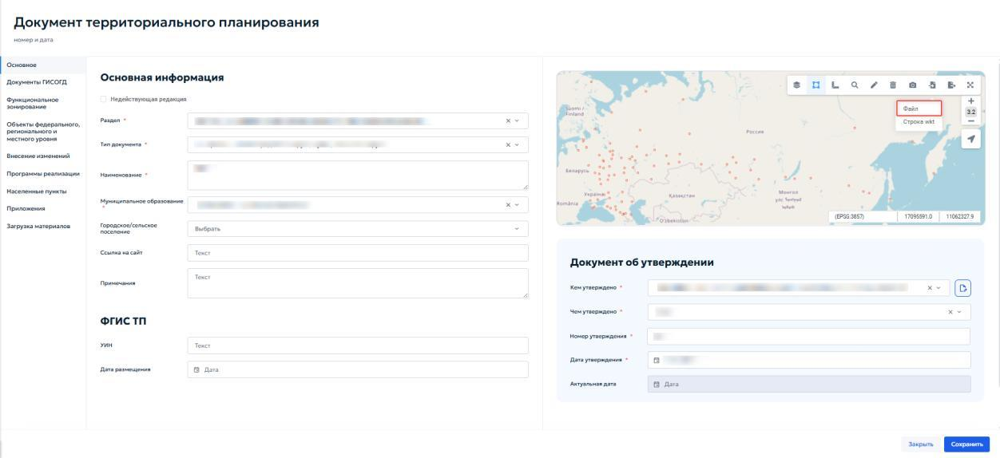
  <figcaption>Рисунок 62 — Документ территориального планирования.</figcaption>
</figure>

На карте нажать кнопку «Импорт» и выбрать пункт меню «Файл» (рисунок 63).

<figure class="doc-figure" markdown="span">
  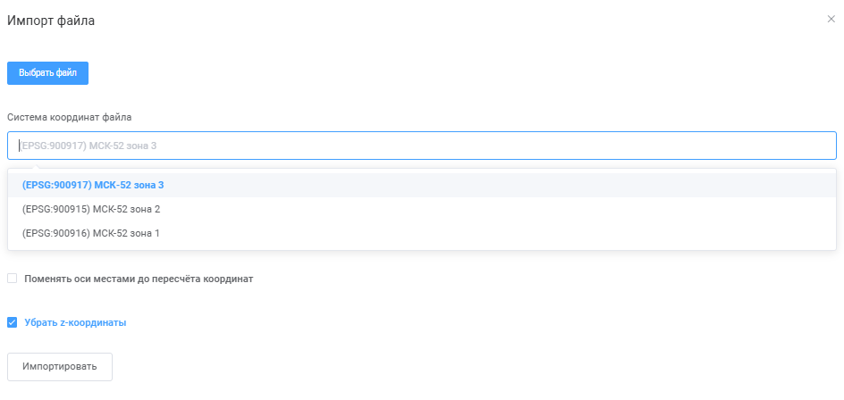
  <figcaption>Рисунок 63 — Импорт геометрии из файла.</figcaption>
</figure>

В окне импорта выбрать файл с координатами — обычно используется формат MIF. В поле «Система координат» ввести «МСК». Система предложит доступные варианты местных систем координат (рисунок 64).

<figure class="doc-figure" markdown="span">
  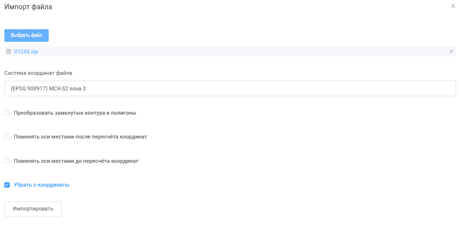
  <figcaption>Рисунок 64 — Выбор зоны МСК.</figcaption>
</figure>

По координатам из файла определить нужную зону: если координата X начинается с 1 миллиона, это первая зона (МСК-1, МСК-2 и т. д.). Выбрать соответствующую систему координат (рисунок 65).

<figure class="doc-figure" markdown="span">
  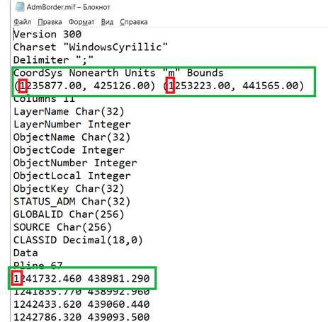
  <figcaption>Рисунок 65 — Определение зоны.</figcaption>
</figure>

Для загрузки координат и границ загруженных объектов нажать кнопку «Импортировать».

### 5.4.3.3 Добавление документов ГИСОГД

Во вкладке «Документы ГИСОГД» внести материалы генерального плана или схемы территориального планирования, а также правовые документы об утверждении или внесении изменений (рисунок 66).

<figure class="doc-figure" markdown="span">
  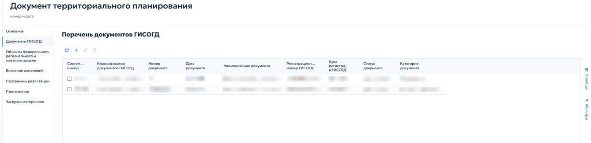
  <figcaption>Рисунок 66 — Перечень документов ГИСОГД для документа территориального планирования.</figcaption>
</figure>

Для добавления документа ГИСОГД нажать кнопку { .ui-icon } на панели инструментов. В карточке необходимо заполнить реквизиты документа ГИСОГД и приложить файлы для документа.

Во вкладке «Приложенные файлы» в генеральном плане прикрепляются текстовая часть генерального плана, схемы и правовой документ об утверждении или о внесении изменений в генеральный план (рисунок 67). При наличии документов о публичных слушаниях они также прикрепляются во вкладке «Приложенные файлы».

<figure class="doc-figure" markdown="span">
  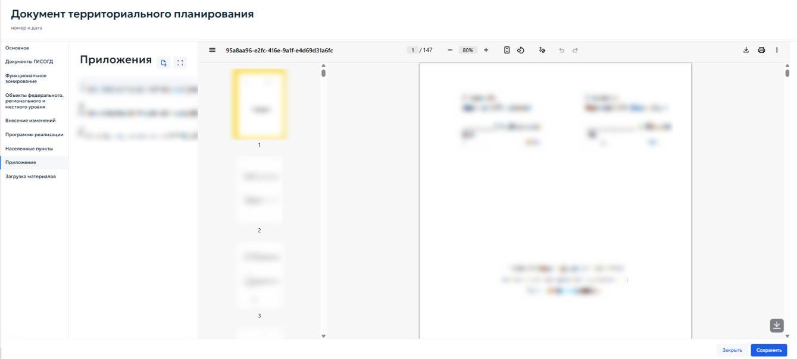
  <figcaption>Рисунок 67 — Приложенные к документу ГИСОГД «Генеральный план» файлы.</figcaption>
</figure>

Вкладка «Функциональное зонирование» в карточке генерального плана позволяет внести перечень функциональных зон, включенных в схему функционального зонирования генерального плана (рисунок 68).

<figure class="doc-figure" markdown="span">
  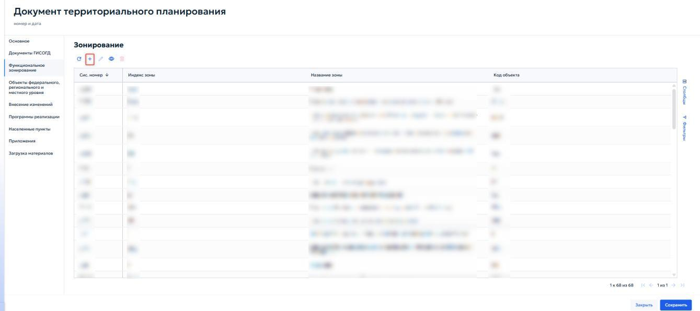
  <figcaption>Рисунок 68 — Список функциональных зон в генплане.</figcaption>
</figure>

Открывшаяся карточка функциональной зоны включает в себя информационный блок «Информация об объекте», в составе которого находятся следующие поля:

1. «Код объекта» — уникальный код контура; допускается совпадение с кодом функциональной зоны;

2. «Индекс зоны» — указать краткое буквенно-цифровое обозначение зоны;

3. «Название зоны» — ввести полное наименование функциональной зоны в соответствии с генеральным планом;

4. «Название по CLASSID» — при необходимости указать текстовую характеристику зоны.

Если зона является архивной, установить флажок «Архивная зона» в начале блока.

Карточка «Функциональная зона» показана на рисунке 69.

<figure class="doc-figure" markdown="span">
  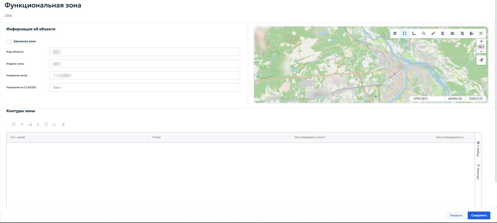
  <figcaption>Рисунок 69 — Карточка добавления типа зоны генерального плана.</figcaption>
</figure>

Блок «Контуры зоны» содержит таблицу, в которой перечислены все пространственные контуры данной функциональной зоны (рисунок 70). Таблица включает следующие столбцы:

1. «Системный номер» — системный номер контура;

2. «Статус» — состояние контура;

3. «Чем утверждено (текст)» — краткое описание документа-основания;

4. «Чем утверждено (ссылка)» — ссылка на документ ГИСОГД, которым утвержден контур (рисунок 70).

<figure class="doc-figure" markdown="span">
  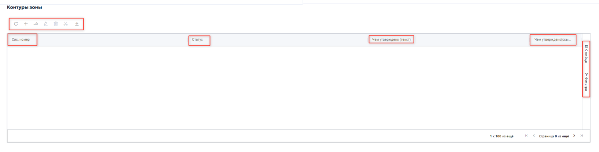
  <figcaption>Рисунок 70 — Контуры зоны.</figcaption>
</figure>

Панель инструментов блока позволяет редактировать, загружать и удалить действующий контур. При нажатии на кнопку { .ui-icon } открывается карточка «Контуры функциональных зон». Она предназначена для добавления или редактирования пространственного контура. Общий вид карточки приведен на рисунке 71.

<figure class="doc-figure" markdown="span">
  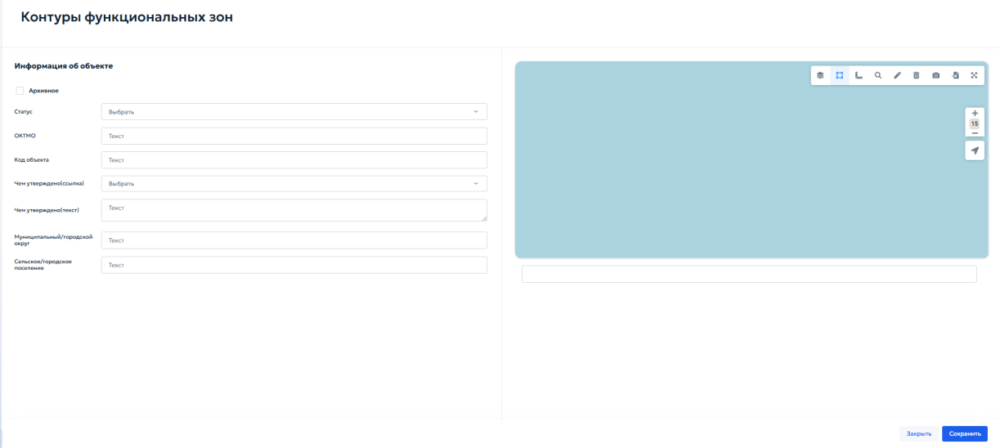
  <figcaption>Рисунок 71 — Контуры функциональных зон.</figcaption>
</figure>

Внутри карточки находится информационный блок «Информация об объекте», который состоит из следующих элементов:

1. «Архивное» — флажок, который устанавливается, если контур утратил актуальность;

2. «Статус» — выбрать значение из выпадающего списка: «существующий» — действующий контур или «планируемый» — контур, который планируется к установке в будущем;

3. «ОКТМО» — код муниципального образования;

4. «Код объекта» — уникальный код контура;

5. «Чем утверждено (ссылка)» — выбрать из выпадающего списка документ ГИСОГД, которым утвержден данный контур. В списке отображаются реквизиты документов — номер, дата, дата регистрации, извещающая организация. Для выбора щелкнуть левой кнопкой мыши по нужной строке;

6. «Чем утверждено» — указать, каким документом утверждена новая функциональная зона;

7. «Муниципальный/городской округ» — выбрать из списка муниципальное образование, на территории которого расположен контур;

8. «Сельское/городское поселение» — при необходимости выбрать поселение из списка.

Код объекта для функциональной зоны генплана введен Приказом Министерства экономического развития РФ от 9 января 2018 г. № 10 «Об утверждении Требований к описанию и отображению в документах территориального планирования объектов федерального значения, объектов регионального значения, объектов местного значения и о признании утратившим силу приказа Минэкономразвития России от 7 декабря 2016 г. № 793». Генеральные планы, разработанные до даты приказа, кодов объекта не имеют.

### 5.4.3.4 Загрузка материалов

Загрузка материалов выполняется во вкладке «Загрузка материалов» карточки документа территориального планирования. Вкладка содержит блок «Загрузка пространственных данных».

Вкладка предназначена для импорта векторных данных функциональных зон и объектов территориального планирования из файлов (рисунок 72).

<figure class="doc-figure" markdown="span">
  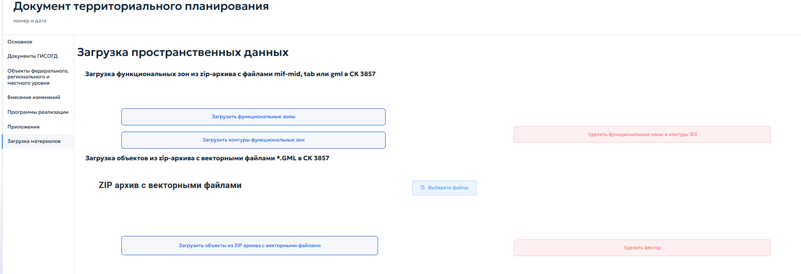
  <figcaption>Рисунок 72 — Блок «Загрузка пространственных материалов».</figcaption>
</figure>

При нажатии кнопки «Загрузить функциональные зоны» система открывает окно «Импорт» с кнопкой «Выбрать». При нажатии кнопки «Выбрать» открывается проводник операционной системы. После выбора архива система автоматически обрабатывает файлы и добавляет функциональные зоны в соответствующий реестр (рисунок 73). Данный функционал работает аналогично при нажатии других кнопок в блоке «Загрузка пространственных данных».

<figure class="doc-figure" markdown="span">
  
  <figcaption>Рисунок 73 — Окно «Импорт».</figcaption>
</figure>

Кнопка «Загрузить контуры функциональных зон» предназначена для импорта геометрии контуров функциональных зон из ZIP-архива с векторными файлами формата GML в системе координат EPSG:3857.

Кнопка «Загрузить объекты из ZIP-архива с векторными файлами» предназначена для импорта архива, содержащего векторные файлы формата GML.

Кнопка «Выберите файлы» — открывает стандартное окно операционной системы для выбора файлов на локальном компьютере.

Кнопка «Удалить вектор» — удаляет все загруженные ранее векторные данные текущего документа.

## 5.4.4 Нормативы градостроительного проектирования

Нормативы градостроительного проектирования устанавливают обязательные требования при строительстве и реконструкции объектов капитального строительства на территории муниципального образования. Они определяют расчётные параметры, которые необходимо учитывать при разработке документации по планировке территории: максимальные значения коэффициента плотности застройки, жилищную обеспеченность, размеры земельных участков для размещения многоквартирных жилых домов и т. п.

В раздел «Нормативы градостроительного проектирования» вносятся документы ГИСОГД — нормативы градостроительного проектирования и правовые акты об их утверждении или о внесении изменений. Для каждого муниципалитета в реестре создаётся одна запись, к которой прикрепляются соответствующие документы ГИСОГД.

Документы этого раздела не содержат картографических данных, поэтому в карточке записи отсутствует окно карты (рисунок 74).

<figure class="doc-figure" markdown="span">
  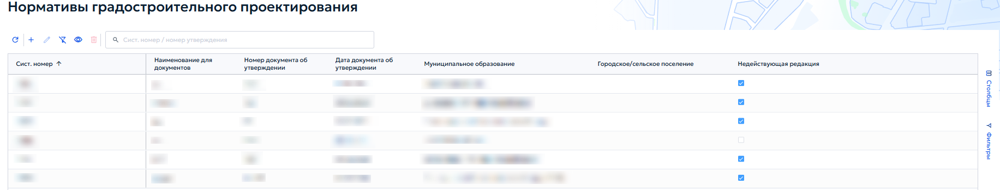
  <figcaption>Рисунок 74 — Раздел 4. Реестр «Нормативы градостроительного проектирования».</figcaption>
</figure>

При добавлении или редактировании записи открывается карточка «Нормативы градпроектирования» (рисунок 75). В верхней части карточки отображаются дата создания и системный номер записи.

<figure class="doc-figure" markdown="span">
  
  <figcaption>Рисунок 75 — Карточка «Нормативы градпроектирования».</figcaption>
</figure>

Вкладка «Основное» содержит два информационных блока: «Основная информация» и «Документ об утверждении».

В состав блока «Основная информация» входят следующие информационные поля и флажки:

1. «Недействующая редакция» — если норматив утратил силу, здесь отображается ссылка на документ, которым он отменен. Кнопка «Поменять статус в документах ГИСОГД на „Недействующий“» позволяет перевести связанные документы ГИСОГД в статус недействующих;

2. «Тип» — выбрать тип норматива из выпадающего списка;

3. «Наименование» — ввести полное наименование норматива;

4. «Муниципальное образование» — выбрать муниципальное образование из списка;

5. «Городское/сельское поселение» — при необходимости выбрать поселение;

6. «Ссылка на сайт» — указать адрес страницы, где опубликован документ.

В состав блока «Документ об утверждении» входят следующие поля:

1. «Кем утверждено» — выбрать орган или должностное лицо, утвердившее норматив;

2. «Чем утверждено» — выбрать вид нормативного правового акта из выпадающего списка;

3. «Номер утверждения» — ввести номер документа;

4. «Дата» — указать дату утверждения с помощью календаря;

5. «Актуальная дата» — поле заполняется автоматически по дате документа ГИСОГД о внесении изменений.

## 5.4.5 Градостроительное зонирование

В раздел «Градостроительное зонирование» вносятся правила землепользования и застройки территорий (далее — ПЗЗ), нормативные правовые акты об утверждении или внесении изменений в ПЗЗ, а также материалы публичных слушаний (рисунок 76). Для каждого муниципального образования в реестре создаётся одна запись, к которой прикрепляются документы ГИСОГД. В карточке записи ведётся реестр территориальных зон в соответствии с ПЗЗ.

<figure class="doc-figure" markdown="span">
  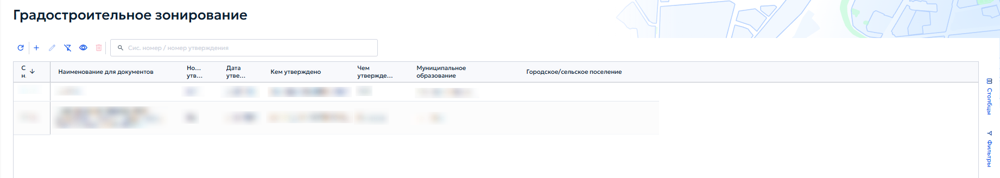
  <figcaption>Рисунок 76 — Раздел 5. Реестр «Градостроительное зонирование».</figcaption>
</figure>

При добавлении или редактировании записи открывается карточка «Градостроительное зонирование» (рисунок 77). Карточка содержит следующие вкладки: «Основное», «Документы ГИСОГД», «Территориальное зонирование», «Приложения».

<figure class="doc-figure" markdown="span">
  
  <figcaption>Рисунок 77 — Карточка «Градостроительное зонирование».</figcaption>
</figure>

Порядок заполнения блоков «Основная информация» и «Документ об утверждении» аналогичен порядку создания записи, описанному в пункте 5.4.3.1 настоящего Руководства.

В поле «Генеральный план» указать соответствующий генеральный план муниципального образования.

Во вкладке «Документы ГИСОГД» прикрепить файлы ПЗЗ и правовые акты об утверждении или внесении изменений. Порядок добавления документа ГИСОГД описан в пункте 5.4.3.3.

### 5.4.5.1 Вкладка «Территориальное зонирование»

Вкладка предназначена для ведения списка территориальных зон, установленных ПЗЗ (рисунок 78).

<figure class="doc-figure" markdown="span">
  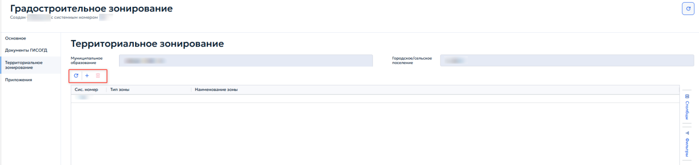
  <figcaption>Рисунок 78 — Территориальное зонирование.</figcaption>
</figure>

Добавление, редактирование и удаление зон выполняется с помощью кнопок панели инструментов. При создании или редактировании зоны открывается карточка «Территориальная зона» (рисунок 79).

<figure class="doc-figure" markdown="span">
  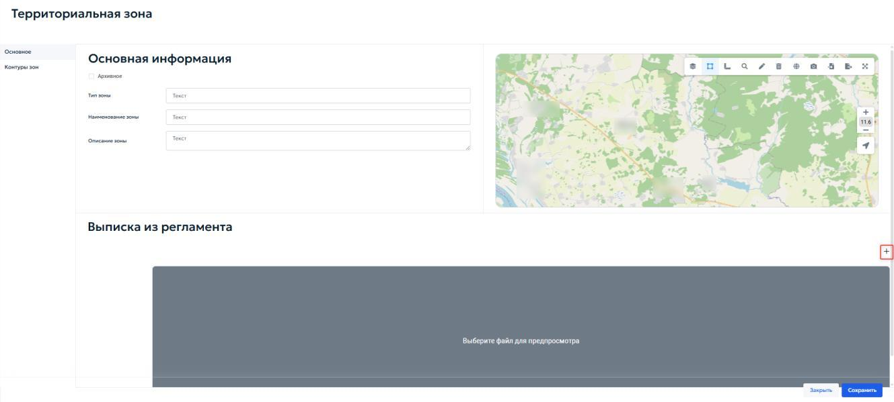
  <figcaption>Рисунок 79 — Территориальная зона.</figcaption>
</figure>

Во вкладке «Основное» в блоке «Основная информация» указываются следующие поля:

1. «Тип зоны» — ввести наименование типа территориальной зоны;

2. «Наименование зоны» — ввести наименование в соответствии с ПЗЗ;

3. «Описание зоны» — поле для текстового описания (при необходимости).

Если зона утратила актуальность и является архивной, установить флажок «Архивное» в начале блока.

В блоке «Выписка из регламента» для прикрепления файла с градостроительным регламентом нажать кнопку «Выберите файлы»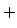{ .ui-icon }.

Вкладка «Градостроительные регламенты» предназначена для ведения перечня видов разрешённого использования (ВРИ) земельных участков и объектов капитального строительства в пределах территориальной зоны. Для каждого ВРИ указываются тип и наименование из справочника (рисунок 80).

<figure class="doc-figure" markdown="span">
  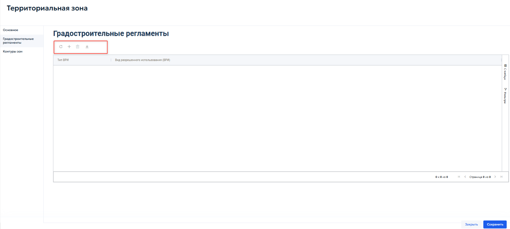
  <figcaption>Рисунок 80 — Градостроительные регламенты.</figcaption>
</figure>

Добавление, редактирование и удаление записей выполняются с помощью кнопок панели инструментов таблицы.

Для настройки параметров, установленных градостроительным регламентом для конкретного вида разрешенного использования, нажать кнопку «Добавить»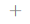{ .ui-icon }. Откроется карточка «Предельные величины» (рисунок 81).

<figure class="doc-figure" markdown="span">
  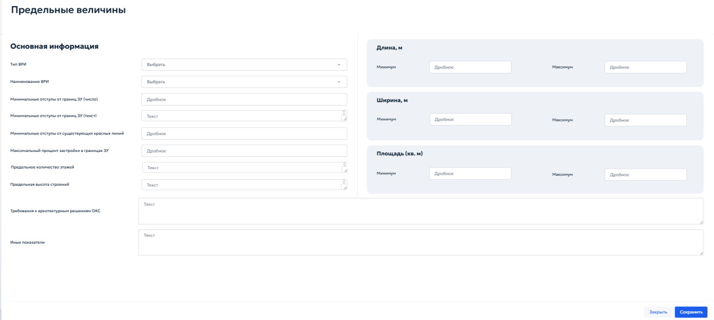
  <figcaption>Рисунок 81 — «Предельные величины».</figcaption>
</figure>

В блоке «Основная информация» указать следующие параметры:

1. «Тип ВРИ» — выбрать из выпадающего списка необходимый вариант;

2. «Наименование ВРИ» — выбрать вид разрешенного использования из справочника;

3. «Минимальные отступы от границ ЗУ (число)» — ввести числовое значение отступа в метрах;

4. «Минимальные отступы от границ ЗУ (текст)» — при необходимости указать текстовое описание отступов;

5. «Минимальные отступы от существующих красных линий» — ввести значение отступа в метрах (дробное число);

6. «Максимальный процент застройки в границах ЗУ» — указать максимально допустимый процент застройки земельного участка;

7. «Предельное количество этажей» — указать максимальное количество этажей (текст или число);

8. «Предельная высота строений» — указать максимальную высоту зданий (текст);

9. «Требования к архитектурным решениям ОКС» — ввести текстовые требования (при наличии);

10. «Иные показатели» — при необходимости указать дополнительные параметры.

В параметрах длины, ширины и площади указать:

1. «Длина, м» — указать дробное значение «Минимума» и «Максимума» необходимой длины объекта;

2. «Ширина, м» — указать дробное значение «Минимума» и «Максимума» необходимой ширины объекта;

3. «Площадь (кв. м)» — указать дробное значение «Минимума» и «Максимума» площади земельного участка или объекта капитального строительства в квадратных метрах.

После заполнения карточки и сохранения данных вернуться в реестр «Территориальная зона» и перейти во вкладку «Контуры зоны» (рисунок 82).

<figure class="doc-figure" markdown="span">
  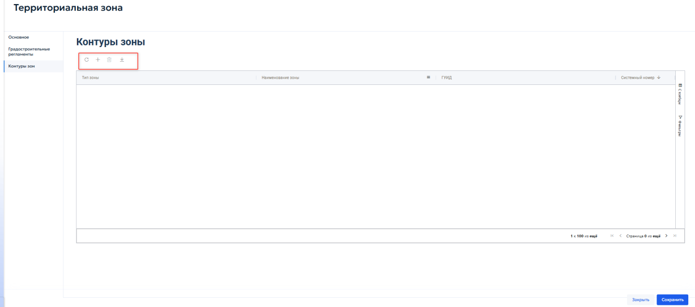
  <figcaption>Рисунок 82 — Вкладка «Контуры зоны».</figcaption>
</figure>

Вкладка предназначена для отображения и управления пространственными границами — контурами территориальной зоны. Контуры представляют собой полигоны, нанесенные на карту, и определяют местоположение зоны на местности.

Добавление, редактирование и удаление записей выполняются с помощью кнопок панели инструментов, расположенной над таблицей.

При нажатии кнопки «Добавить»{ .ui-icon } откроется карточка «Контуры зон» (рисунок 83).

<figure class="doc-figure" markdown="span">
  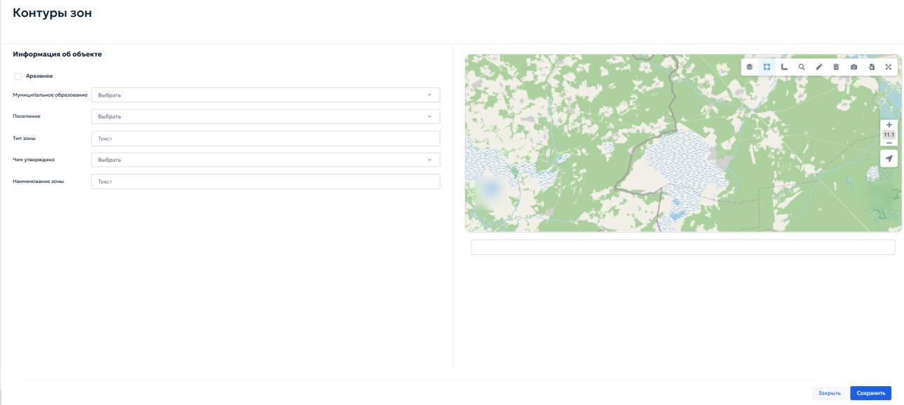
  <figcaption>Рисунок 83 — Карточка «Контуры зон».</figcaption>
</figure>

Карточка предназначена для указания параметров пространственного контура и загрузки его геометрии.

В блоке «Информация об объекте» заполнить следующие поля:

1. «Муниципальное образование» — выбрать из выпадающего списка муниципальное образование, на территории которого расположен контур;

2. «Поселение» — при необходимости выбрать городское или сельское поселение;

3. «Тип зоны» — отображается автоматически (наследуется из карточки территориальной зоны). Поле доступно только для просмотра;

4. «Чем утверждено» — выбрать из выпадающего списка документ ГИСОГД, которым утверждён данный контур (например, правовой акт об утверждении ПЗЗ или о внесении изменений);

5. «Наименование зоны» — отображается автоматически (наследуется из карточки территориальной зоны). Поле доступно только для просмотра.

Если контур является архивным, установить флажок «Архивное» в начале блока.

## 5.4.6 Правила благоустройства территории

В раздел «Правила благоустройства территории» вносятся документы, регулирующие вопросы благоустройства на муниципальном уровне. К таким документам относятся:

- правила благоустройства территории муниципального образования;

- нормативные правовые акты, которыми утверждены правила благоустройства территории или внесены изменения в них;

- закон субъекта Российской Федерации, которым утвержден порядок определения границ прилегающих территорий.

Раздел «Правила благоустройства территории» показан на рисунке 84.

<figure class="doc-figure" markdown="span">
  
  <figcaption>Рисунок 84 — Раздел 6. Реестр «Правила благоустройства территории».</figcaption>
</figure>

При добавлении или редактировании записи открывается одноименная с реестром карточка (рисунок 85).

<figure class="doc-figure" markdown="span">
  
  <figcaption>Рисунок 85 — Карточка «Правила благоустройства территории».</figcaption>
</figure>

Во вкладке «Основное» в блоке «Основная информация» указать следующие данные:

1. «Тип документа» — поле заполняется автоматически значением «Правила благоустройства территории»;

2. «Наименование для документа» — ввести полное наименование документа в соответствии с утвержденным актом;

3. «Муниципальное образование» — выбрать из выпадающего списка муниципальное образование, для которого разработаны правила;

4. «Городское/сельское поселение» — при необходимости выбрать поселение;

5. «Ссылка на сайт» — указать адрес страницы, где опубликован документ.

Если редакция является недействующей, установить флажок «Недействующая редакция» и выбрать в появившемся выпадающем списке необходимый вариант.

В блоке «Документ об утверждении» указать следующие данные:

1. «Кем утверждено» — выбрать орган или должностное лицо в выпадающем списке, утвердившее правила благоустройства;

2. «Чем утверждено» — выбрать вид нормативного правового акта из выпадающего списка;

3. «Номер утверждения» — ввести номер документа;

4. «Дата документа об утверждении» — указать дату утверждения с помощью календаря;

5. «Актуальная дата» — поле заполняется автоматически по дате последнего документа ГИСОГД о внесении изменений.
