# 5.4.14 Раздел 14. Программы реализации документов территориального планирования

В раздел «Программы реализации документов территориального планирования» вносятся программы, которыми предусмотрены мероприятия по реализации документов территориального планирования, а также документы, связанные с их утверждением или внесением изменений. К таким документам относятся:

- инвестиционные программы субъектов естественных монополий;
- инвестиционные программы организаций коммунального комплекса;
- программы комплексного развития транспортной инфраструктуры;
- программы комплексного развития социальной инфраструктуры;
- программы комплексного развития систем коммунальной инфраструктуры;
- иные программы, направленные на реализацию документов территориального планирования. Раздел предназначен для учета программ реализации, связанных с документами территориального планирования, хранения реквизитов программы, сведений о документе об утверждении, адресной привязки, а также связанных документов ГИСОГД и приложений. Для добавления новой записи в реестр нажмите кнопку «Добавить» на панели инструментов. Откроется карточка «Программы реализации документов территориального планирования» во вкладке «Основное» (рисунок 137).

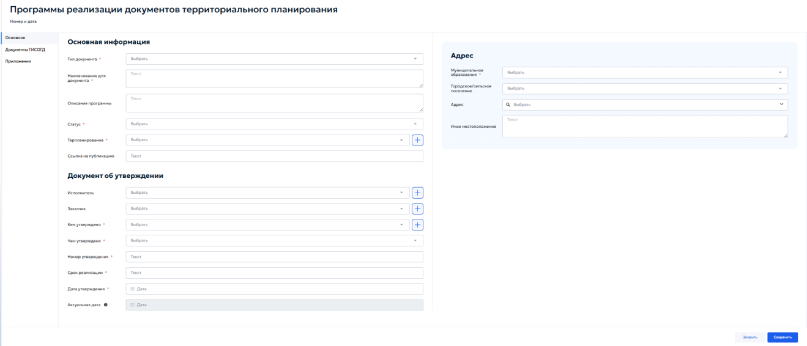

Карточка содержит следующие вкладки:

- «Основное»;
- «Документы ГИСОГД»;
- «Приложения». Во вкладке «Основное» отображаются блоки:
- «Основная информация»;
- «Документ об утверждении»;
- «Адрес». В блоке «Основная информация» указываются основные сведения о программе реализации документа территориального планирования (рисунок 138).

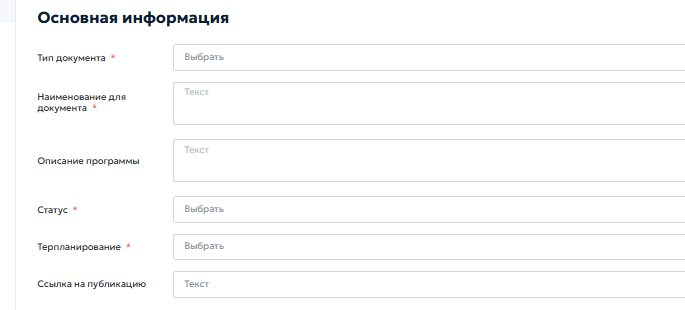

В состав блока «Основная информация» входят следующие поля:

1) «Тип документа» — выберите тип программы из выпадающего списка.
2) «Наименование для документа» — введите полное наименование программы в соответствии с утвержденным документом.
3) «Описание программы» — укажите краткое описание программы, ее назначение, сферу реализации или иные сведения, необходимые для идентификации документа.
4) «Статус» — выберите текущий статус программы из выпадающего списка.
5) «Терпланирование» — выберите документ территориального планирования, для реализации которого принята программа. Если нужный документ отсутствует в списке, нажмите кнопку «+» справа от поля. Откроется карточка «Документ территориального планирования». Описание работы с данной карточкой приведено в пункте 5.4.14.1 настоящего руководства.
6) «Ссылка на публикацию» — укажите ссылку на официальный источник публикации программы или документа, которым она утверждена. В блоке «Документ об утверждении» указываются сведения о документе, которым утверждена программа реализации документа территориального планирования (рисунок 139).

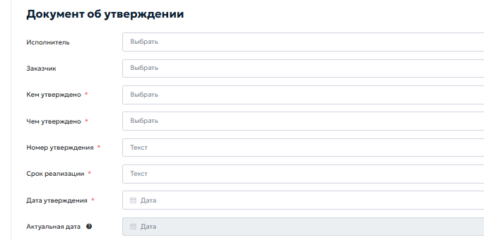

В состав блока «Документ об утверждении» входят следующие поля:

1) «Исполнитель» — выберите из выпадающего списка организацию или лицо, ответственное за исполнение программы. Если нужной записи нет в справочнике, нажмите кнопку «+» справа от поля и добавьте новую запись.
2) «Заказчик» — выберите заказчика программы из выпадающего списка. Если нужная запись отсутствует, нажмите кнопку «+» справа от поля и заполните карточку новой записи.
3) «Кем утверждено» — выберите орган, организацию или должностное лицо, утвердившее программу. Для добавления новой записи нажмите кнопку «+» справа от поля.
4) «Чем утверждено» — выберите вид документа об утверждении из выпадающего списка.
5) «Номер утверждения» — введите номер документа, которым утверждена программа.
6) «Срок реализации» — укажите срок реализации программы. Поле заполняется вручную в соответствии с утвержденным документом.
7) «Дата утверждения» — укажите дату утверждения программы с помощью календаря.

8) «Актуальная дата» — поле отображает актуальную дату сведений. Поле недоступно для ручного редактирования и заполняется системой. Блок «Адрес» предназначен для указания территории или местоположения, к которому относится программа реализации (рисунок 140).

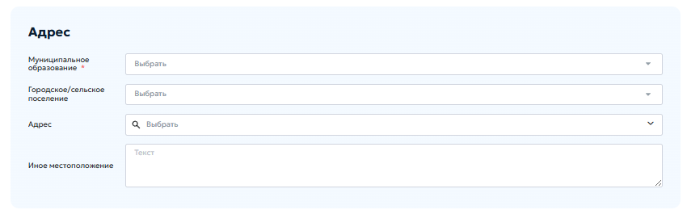

В состав блока «Адрес» входят следующие поля:

1) «Муниципальное образование» — выберите муниципальное образование из выпадающего списка.
2) «Городское/сельское поселение» — при необходимости выберите городское или сельское поселение, входящее в состав выбранного муниципального образования.
3) «Адрес» — выберите адрес из справочника. Для поиска адреса начните вводить значение в поле поиска и выберите подходящую запись из списка.
4) «Иное местоположение» — укажите описание местоположения вручную, если адрес отсутствует в справочнике или требуется уточнить территориальную привязку программы. После заполнения обязательных полей нажмите кнопку «Сохранить». Для выхода из карточки без сохранения нажмите кнопку «Закрыть». Во вкладке «Документы ГИСОГД» отображается перечень документов ГИСОГД, связанных с программой реализации документа территориального планирования. В данной вкладке необходимо добавить программу, документ об утверждении программы и при необходимости документы о внесении

изменений. Порядок добавления и связывания документов ГИСОГД описан в пунктах 5.3.2 и 5.3.3 настоящего руководства. Во вкладке «Приложения» можно прикрепить файлы, относящиеся к программе реализации, но не размещаемые как самостоятельные документы ГИСОГД. Для добавления приложения нажмите кнопку загрузки файла, выберите файл на компьютере и после загрузки проверьте его отображение в области предварительного просмотра.

### 5.4.14.1 Карточка «Документ территориального планирования»

Карточка «Документ территориального планирования» открывается при нажатии кнопки «+» справа от поля «Терпланирование» в карточке программы реализации документа территориального планирования. Карточка предназначена для добавления или редактирования документа территориального планирования, к которому относится программа реализации (рисунок 141).

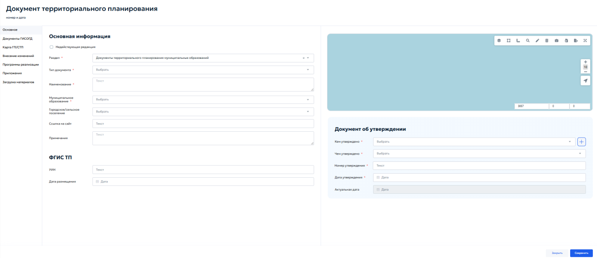

В левой части карточки расположено меню вкладок:

- «Основное»;
- «Документы ГИСОГД»;
- «Карта ГП/СТП»;
- «Внесение изменений»;

- «Программы реализации»;
- «Приложения»;
- «Загрузка материалов». Во вкладке «Основное» отображаются блоки:
- «Основная информация»;
- «ФГИС ТП»;
- «Документ об утверждении». В блоке «Основная информация» указываются сведения о документе территориального планирования. В состав блока «Основная информация» входят следующие поля и элементы:
1) «Недействующая редакция» — флажок устанавливается, если документ территориального планирования утратил актуальность. При установке флажка под ним отображается дополнительное поле «Новый документ отменяющий действие». В данном поле выберите из выпадающего списка документ, которым отменяется действие текущего документа (рисунок 142).

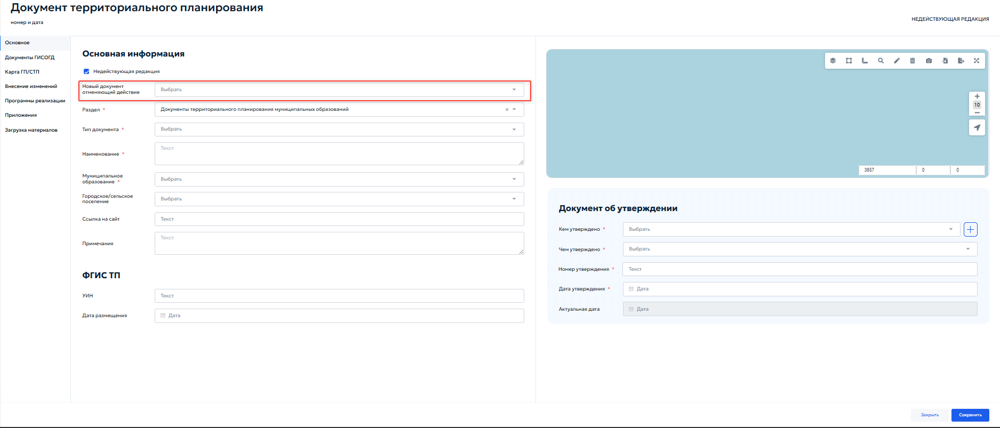

2) «Раздел» — выберите раздел ГИСОГД, к которому относится документ. Для документов территориального планирования муниципальных образований

выбирается значение «Документы территориального планирования муниципальных образований».

3) «Тип документа» — выберите тип документа территориального планирования из выпадающего списка.
4) «Наименование» — введите полное наименование документа в соответствии с утвержденным актом.
5) «Муниципальное образование» — выберите муниципальное образование из выпадающего списка.
6) «Городское/сельское поселение» — при необходимости выберите поселение, входящее в состав муниципального образования.
7) «Ссылка на сайт» — укажите ссылку на официальный сайт или страницу публикации документа.
8) «Примечания» — внесите дополнительные сведения о документе, например информацию об особенностях редакции, изменениях или источнике размещения. В блоке «ФГИС ТП» указываются сведения о размещении документа в федеральной государственной информационной системе территориального планирования. В состав блока «ФГИС ТП» входят следующие поля:
1) «УИН» — введите уникальный идентификационный номер документа в ФГИС ТП.
2) «Дата размещения» — укажите дату размещения документа с помощью календаря. В блоке «Документ об утверждении» указываются реквизиты документа, которым утвержден документ территориального планирования. В состав блока «Документ об утверждении» входят следующие поля:
1) «Кем утверждено» — выберите орган, организацию или должностное лицо, утвердившее документ. При необходимости нажмите кнопку «+» справа от поля для добавления новой записи.

2) «Чем утверждено» — выберите вид документа об утверждении из выпадающего списка.
3) «Номер утверждения» — введите номер документа об утверждении.
4) «Дата утверждения» — укажите дату утверждения с помощью календаря.
5) «Актуальная дата» — поле отображает актуальную дату сведений. Поле недоступно для ручного редактирования и заполняется системой. Во вкладке «Документы ГИСОГД» отображается перечень документов ГИСОГД, связанных с текущим документом территориального планирования. В перечень могут входить текстовая часть документа, графические материалы, документ об утверждении, документы о внесении изменений и иные материалы, подлежащие размещению в ГИСОГД. Для добавления документа ГИСОГД используйте кнопку «Добавить» на панели инструментов. Порядок заполнения карточки документа ГИСОГД и прикрепления файлов описан в пунктах 5.3.2 и 5.3.3 настоящего руководства. Вкладка «Карта ГП/СТП» предназначена для просмотра и работы с пространственными данными документа территориального планирования. Во вкладке отображаются функциональные зоны и объекты, относящиеся к документу территориального планирования. Работа с картой выполняется с помощью стандартных инструментов карты: управление слоями, выбор объектов, поиск, рисование или редактирование геометрии, импорт и экспорт геометрии. Описание работы с инструментами карты приведено в пункте 4.5.2 настоящего руководства (рисунок 143).

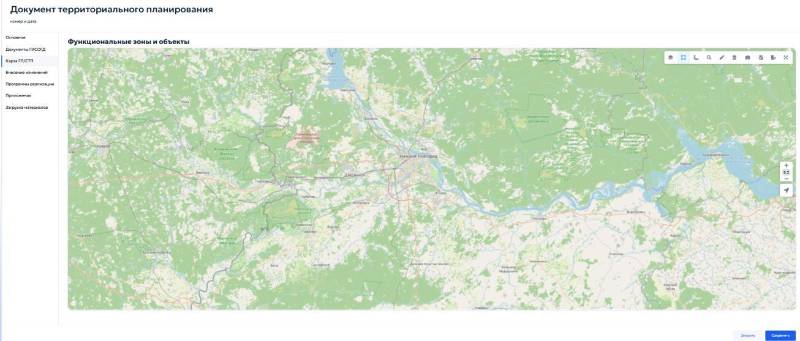

Вкладка «Внесение изменений» содержит раздел «Изменения в ГП/СТП», предназначенный для учёта документов о внесении изменений в документ территориального планирования. Для добавления новой записи нажмите кнопку «+» на панели инструментов. Откроется карточка «Внесение изменений в документ терпланирования». Карточка «Внесение изменений в документ территориального планирования» содержит блок «Основное», карту и блок «Пересечения» (рисунок 144).

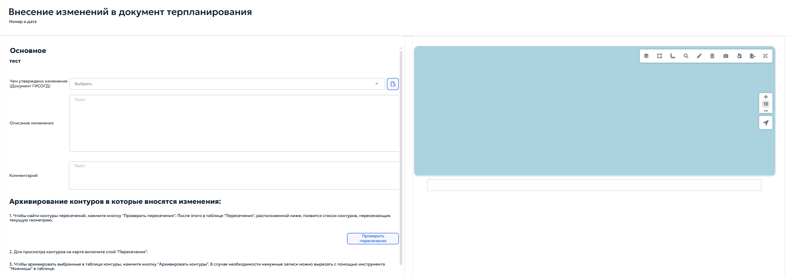

В блоке «Основное» заполняются следующие поля:

1) «Чем утверждено изменение (Документ ГИСОГД)» — выберите документ ГИСОГД, которым утверждено внесение изменений. При нажатии кнопки справа от поля открывается карточка «Документы ГИСОГД».
2) «Описание изменения» — укажите описание внесенных изменений.
3) «Комментарий» — при необходимости внесите дополнительный комментарий к изменению. В правой части карточки отображается карта. На карте можно проверить пространственную привязку изменений, область их действия и возможные пересечения с ранее внесенными контурами. Блок «Архивирование контуров, в которые вносятся изменения» предназначен для поиска и обработки контуров, пересекающихся с текущей геометрией изменения. Для работы с блоком выполните следующие действия:
1) Нажмите кнопку «Проверить пересечения». После проверки в таблице «Пересечения» отобразится список контуров, пересекающих текущую геометрию.
2) Для просмотра контуров на карте включите слой «Пересечения».
3) Для архивирования выбранных контуров выделите записи в таблице и нажмите кнопку «Архивировать контуры». При необходимости ненужные записи можно вырезать с помощью инструмента «Ножницы» в таблице. В блоке «Пересечения» отображается таблица найденных пересечений. Таблица содержит сведения о системном номере, коде объекта, названии зоны, индексе зоны и признаке архивности (рисунок 145).

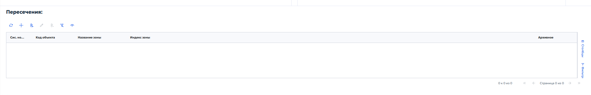

При нажатии кнопки «+» в блоке «Пересечения» открывается карточка «Контуры функциональных зон». Карточка «Контуры функциональных зон» предназначена для создания или редактирования пространственного контура функциональной зоны. В карточке «Контуры функциональных зон» в блоке «Информация об объекте» указываются следующие данные:

1) «Статус» — выберите статус контура из выпадающего списка.
2) «Код объекта» — введите код объекта.
3) «Название зоны» — введите наименование функциональной зоны.
4) «Чем утверждено» — выберите документ, которым утвержден контур. При нажатии кнопки с изображением файла справа от поля открывается карточка «Документы ГИСОГД».
5) «Муниципальный/городской округ» — выберите муниципальное образование, в границах которого расположен контур.
6) «Сельское/городское поселение» — при необходимости выберите поселение.
7) «Площадь, га» — укажите площадь контура в гектарах.
8) «Уровень управления в РФ» — выберите уровень управления из выпадающего списка.
9) «Сведения о планируемых объектах» — внесите сведения о планируемых объектах, если они предусмотрены документом территориального планирования.
10) «Коэффициент застройки, %» — укажите значение коэффициента застройки при наличии таких сведений.
11) «Иной параметр и его единицы измерения» — укажите дополнительный параметр и единицы измерения, если они предусмотрены документом. В правой части карточки отображается карта. С помощью инструментов карты можно нанести, просмотреть или отредактировать контур функциональной зоны. Если контур утратил актуальность, установите флажок «Архив» (рисунок 146).
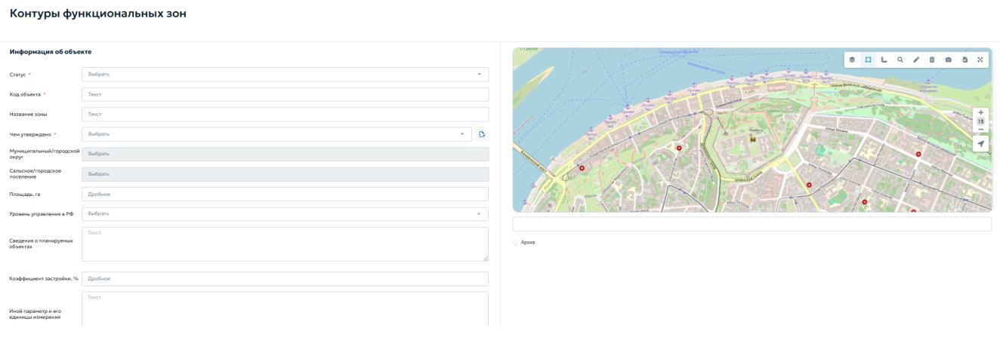

Во вкладке «Программы реализации» карточки документа территориального планирования отображается перечень программ реализации, связанных с данным документом. В этой вкладке можно проверить, какие программы относятся к выбранному документу территориального планирования, а также перейти к связанной программе реализации. Во вкладке «Приложения» прикрепляются файлы, относящиеся к документу территориального планирования, но не размещаемые как самостоятельные документы ГИСОГД. Для добавления файла нажмите кнопку загрузки, выберите файл на компьютере и проверьте его отображение в области предварительного просмотра. Во вкладке «Загрузка материалов» выполняется загрузка пространственных данных документа территориального планирования. Вкладка предназначена для импорта функциональных зон и объектов из zip-архива с векторными файлами формата.gml. В блоке «Загрузка пространственных данных» доступны следующие действия:

1) «Загрузить функциональные зоны» — загрузка функциональных зон из zip- архива с векторными файлами.
2) «Загрузить контуры функциональных зон» — загружает контуры функциональных зон из zip-архива с векторными файлами формата.gml;

3) «Загрузить объекты из zip-архива с векторными файлами» — загружает объекты территориального планирования из zip-архива, содержащего векторные файлы формата.gml;
4) «Выберите файлы» — открывает стандартное окно операционной системы для выбора файла на локальном компьютере.
5) «Удалить вектор» — удаляет ранее загруженные векторные данные текущего документа. После выбора zip-архива система выполняет импорт пространственных данных и добавляет загруженные функциональные зоны или объекты в соответствующие реестры карточки документа территориального планирования. После заполнения сведений нажмите «Сохранить». Для выхода из карточки без сохранения нажмите «Закрыть».

## 5.4.15 Раздел 15. Особо охраняемые природные территории

Раздел «Особо охраняемые природные территории» предназначен для учета сведений, документов и материалов об особо охраняемых природных территориях, а также нормативных правовых актов, которыми утверждены положения об особо охраняемых природных территориях или внесены изменения в такие положения. В реестре хранятся основные сведения об особо охраняемой природной территории, реквизиты документа об утверждении, адресная и пространственная привязка, связанные документы ГИСОГД и приложения. Для добавления новой записи нажмите кнопку «Добавить» на панели инструментов реестра. Откроется карточка «Особо охраняемые природные территории» во вкладке «Основное» (рисунок 147).

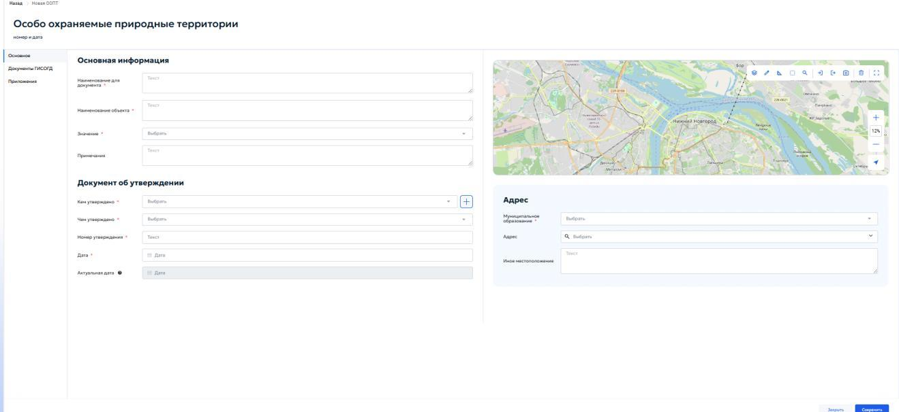

Карточка содержит следующие вкладки:

- «Основное»;
- «Документы ГИСОГД»;
- «Приложения». Во вкладке «Основное» отображаются блоки «Основная информация», «Документ об утверждении» и «Адрес», а также карта для пространственной привязки особо охраняемой природной территории. В блоке «Основная информация» указываются основные сведения об особо охраняемой природной территории. В состав блока «Основная информация» входят следующие поля:
1) «Наименование для документа» — введите наименование, которое должно использоваться при формировании и отображении документа. Поле обязательно для заполнения.
2) «Наименование объекта» — введите полное наименование особо охраняемой природной территории. Поле обязательно для заполнения.
3) «Значение» — выберите требуемое значение из выпадающего списка в соответствии со сведениями об особо охраняемой природной территории. Поле обязательно для заполнения.

4) «Примечания» — при необходимости внесите дополнительные сведения об объекте, особенностях его учета или источнике данных. В блоке «Документ об утверждении» указываются реквизиты документа, которым утверждена особо охраняемая природная территория или положение о ней. В состав блока «Документ об утверждении» входят следующие поля:
1) «Кем утверждено» — выберите орган, организацию, юридическое или физическое лицо, утвердившее документ. Если нужная запись отсутствует, нажмите кнопку «+» справа от поля. Откроется окно «Реквизиты ЮЛ/ФЛ/ИП/ОИВ». Порядок работы с ним описан в пункте 5.2.1. Поле обязательно для заполнения.
2) «Чем утверждено» — выберите вид документа об утверждении из выпадающего списка. Поле обязательно для заполнения.
3) «Номер утверждения» — введите номер документа об утверждении. Поле обязательно для заполнения.
4) «Дата» — укажите дату документа об утверждении с помощью календаря. Поле обязательно для заполнения.
5) «Актуальная дата» — поле отображает актуальную дату сведений. Поле недоступно для ручного редактирования и заполняется системой. Блок «Адрес» предназначен для указания территориальной и адресной привязки особо охраняемой природной территории. В состав блока «Адрес» входят следующие поля:
1) «Муниципальное образование» — выберите муниципальное образование из выпадающего списка. Поле обязательно для заполнения.
2) «Адрес» — выберите адрес из адресного справочника. Для поиска начните вводить адрес и выберите подходящую запись из выпадающего списка.
3) «Иное местоположение» — укажите местоположение вручную, если адрес отсутствует в справочнике или требуется дополнительное описание территории.

В правой части вкладки «Основное» отображается карта. С помощью инструментов карты можно указать, просмотреть или изменить границу особо охраняемой природной территории, а также проверить ее пространственное положение. Для нанесения границы используйте инструменты рисования геометрии. Порядок добавления и удаления геометрии описан в пункте 4.5.2.10 настоящего руководства. При наличии файла с координатами границу можно загрузить с помощью импорта геометрии, описанного в пункте 4.5.2.12 настоящего руководства. После заполнения обязательных полей и указания пространственной привязки нажмите кнопку «Сохранить». Для выхода из карточки без сохранения нажмите кнопку «Закрыть». Во вкладке «Документы ГИСОГД» отображается перечень документов ГИСОГД, связанных с особо охраняемой природной территорией (рисунок 148).

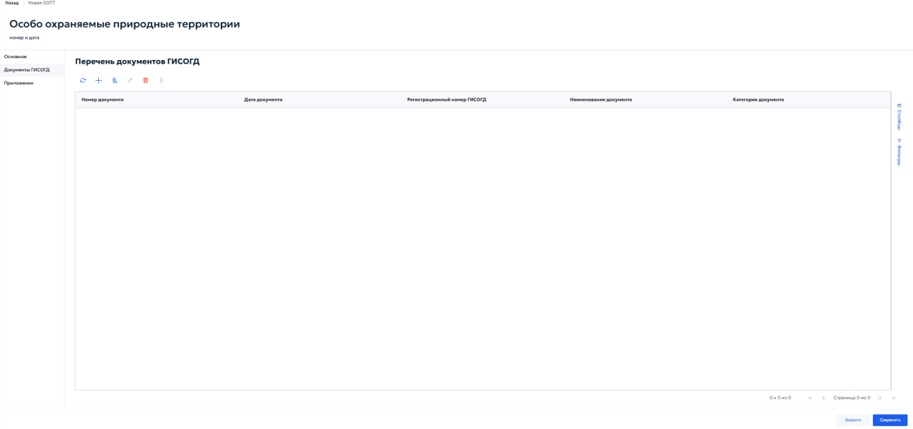

Перечень представлен в табличной форме и содержит следующие столбцы:

1) «Номер документа» — номер связанного документа.
2) «Дата документа» — дата связанного документа.

3) «Регистрационный номер ГИСОГД» — регистрационный номер документа в ГИСОГД.
4) «Наименование документа» — наименование связанного документа.
5) «Категория документа» — категория документа ГИСОГД. На панели инструментов доступны стандартные действия для обновления перечня, добавления и управления связанными документами. Справа расположены панели «Столбцы» и «Фильтры», предназначенные для настройки отображения и отбора записей. Порядок создания и заполнения карточки документа ГИСОГД приведен в пункте 5.3.2, а порядок связывания документа с заявкой на размещение — в пункте 5.3.3 настоящего руководства. Во вкладке «Приложения» прикрепляются файлы, относящиеся к особо охраняемой природной территории и не размещаемые как самостоятельные документы ГИСОГД (рисунок 149).

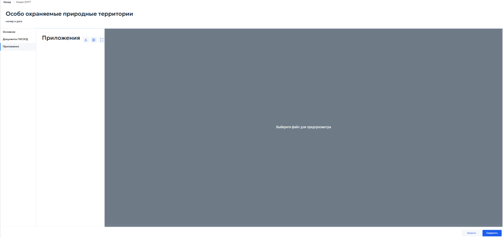

В левой части вкладки отображается список прикрепленных файлов, в правой части — область предварительного просмотра выбранного файла. Для загрузки приложения нажмите кнопку загрузки, выберите файл на компьютере и после загрузки проверьте его отображение в области предварительного просмотра.

Подробный порядок работы с файлами приведен в пункте 4.5.1 настоящего руководства. После добавления документов и приложений нажмите кнопку «Сохранить» для сохранения внесенных изменений.

## 5.4.16 Раздел 16. Лесничества

Раздел «Лесничества» предназначен для учета сведений, документов и материалов о лесничествах, в том числе лесохозяйственных регламентов, проектов освоения лесов и проектной документации лесных участков. В реестре хранятся основные сведения о лесничестве, реквизиты документа об утверждении, адресная и пространственная привязка, связанные документы ГИСОГД и приложения. Для добавления новой записи нажмите кнопку «Добавить» на панели инструментов реестра. Откроется карточка «Лесничества» во вкладке «Основное» (рисунок 150).

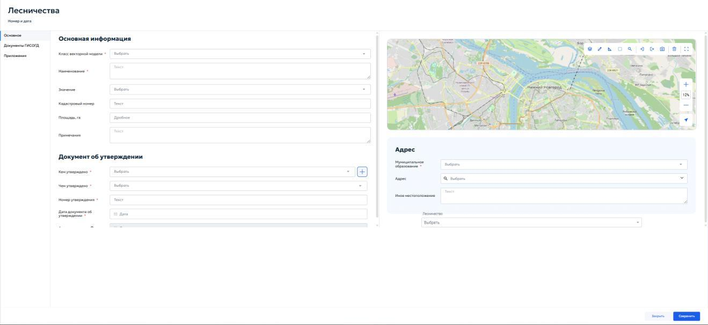

В верхней части карточки отображается строка «Номер и дата» с системными сведениями о записи. Значения формируются системой после сохранения карточки и не вводятся пользователем вручную.

Карточка содержит следующие вкладки:

- «Основное»;
- «Документы ГИСОГД»;
- «Приложения». Во вкладке «Основное» отображаются блоки «Основная информация», «Документ об утверждении» и «Адрес», поле «Лесничество», а также карта для пространственной привязки объекта. В блоке «Основная информация» указываются основные сведения о лесничестве. В состав блока «Основная информация» входят следующие поля:
1) «Класс векторной модели» — выберите требуемый класс векторной модели из выпадающего списка. Поле обязательно для заполнения.
2) «Наименование» — введите полное наименование лесничества в соответствии с документом-основанием. Поле обязательно для заполнения.
3) «Значение» — выберите требуемое значение из выпадающего списка в соответствии со сведениями о лесничестве.
4) «Кадастровый номер» — при наличии введите кадастровый номер лесного участка или иного учитываемого объекта.
5) «Площадь, га» — укажите площадь объекта в гектарах. Поле предназначено для ввода дробного числового значения.
6) «Примечания» — при необходимости внесите дополнительные сведения об объекте, особенностях его учета или источнике данных. В блоке «Документ об утверждении» указываются реквизиты документа, которым утверждены сведения о лесничестве или соответствующий документ лесного планирования. В состав блока «Документ об утверждении» входят следующие поля:
1) «Кем утверждено» — выберите орган, организацию, юридическое или физическое лицо, утвердившее документ. Если нужная запись отсутствует, нажмите кнопку «+» справа от поля. Откроется окно «Реквизиты
ЮЛ/ФЛ/ИП/ОИВ». Порядок работы с ним описан в пункте 5.2.1. Поле обязательно для заполнения.

2) «Чем утверждено» — выберите вид документа об утверждении из выпадающего списка. Поле обязательно для заполнения.
3) «Номер утверждения» — введите номер документа об утверждении. Поле обязательно для заполнения.
4) «Дата документа об утверждении» — укажите дату документа с помощью календаря. Поле обязательно для заполнения.
5) «Актуальная дата» — поле отображает актуальную дату сведений. Поле недоступно для ручного редактирования и заполняется системой. Блок «Адрес» предназначен для указания территориальной и адресной привязки лесничества. В состав блока «Адрес» входят следующие поля:
1) «Муниципальное образование» — выберите муниципальное образование из выпадающего списка. Поле обязательно для заполнения.
2) «Адрес» — выберите адрес из адресного справочника. Для поиска начните вводить адрес и выберите подходящую запись из выпадающего списка.
3) «Иное местоположение» — укажите местоположение вручную, если адрес отсутствует в справочнике или требуется дополнительное описание территории. В поле «Лесничество» выберите соответствующее лесничество из выпадающего списка. В правой части вкладки «Основное» отображается карта. С помощью инструментов карты можно указать, просмотреть или изменить границу лесничества или лесного участка, а также проверить его пространственное положение. Для нанесения границы используйте инструменты рисования геометрии. Порядок добавления и удаления геометрии описан в пункте 4.5.2.10 настоящего руководства. При наличии файла с координатами границу можно загрузить с

помощью импорта геометрии, описанного в пункте 4.5.2.12 настоящего руководства. После заполнения обязательных полей и указания пространственной привязки нажмите кнопку «Сохранить». Для выхода из карточки без сохранения нажмите кнопку «Закрыть». Во вкладке «Документы ГИСОГД» добавляются документы, относящиеся к лесничеству, в том числе лесохозяйственные регламенты, проекты освоения лесов и проектная документация лесных участков. Порядок создания и заполнения карточки документа ГИСОГД приведен в пункте 5.3.2 настоящего руководства. Во вкладке «Приложения» прикрепляются файлы, относящиеся к лесничеству и не размещаемые как самостоятельные документы ГИСОГД. Подробный порядок работы с файлами приведен в пункте 4.5.1 настоящего руководства. После добавления документов и приложений нажмите кнопку «Сохранить» для сохранения внесенных изменений.

## 5.4.17 Раздел 17. Информационные модели объектов капитального строительства

Находится в разработке

## 5.4.18 Раздел 18. Иные документы

Находится в разработке
