# 5.4.7 Раздел 7. Планировка территории

В раздел «Планировка территории» вносится документация по планировке территории, а также правовые акты о её утверждении или внесении изменений. Кроме того, здесь хранятся нормативные правовые акты, устанавливающие порядок подготовки, утверждения, изменения и отмены такой документации либо признания её отдельных частей недействующими. Документация по планировке территории включает в себя проекты планировки и проекты межевания. Иногда эти два документа объединены в один

- проект планировки и межевания одновременно.

Процесс разработки и утверждения проекта планировки и межевания состоит из нескольких этапов:

1) Застройщик обращается в орган власти — муниципальный или региональный за разрешением на подготовку проекта. Орган местного самоуправления уточняет границу, в пределах которой будет разрабатываться проект планировки, а также определяет границу участка для проведения инженерных изысканий. Формируется задание на проектирование, и издается постановление или приказ о подготовке проекта планировки и межевания. В этом документе указываются предельные сроки разработки проекта и срок его предоставления на утверждение.
2) Застройщик поручает проектировщику разработку проекта планировки. Проектировщик проводит необходимые инженерные изыскания и готовит проект.
3) Застройщик передает готовый проект в тот орган власти, который выдал задание на проектирование. В ГИСОГД вносится запись о новой версии проекта, которая привязывается к ранее созданной записи на проектирование.
4) Специалисты рассматривают проект, формируют замечания и возвращают его на доработку. Все замечания прикрепляются к версии проекта в ГИСОГД. Процесс может повторяться несколько раз, пока все замечания не будут устранены.
5) После полного исправления замечаний документации по планировке территории утверждается правовым актом. Утвержденный проект заносится в реестр как документ ГИСОГД. Материалы инженерных изысканий, выполненных при разработке проекта планировки и межевания, вносятся в раздел 8 «Инженерные изыскания». Для выдачи задания на проектирование в разделе 7 необходимо создать новую запись о проекте в таблице, нажав кнопку «Добавить» (рисунок 86).

Работа с реестром выполняется в соответствии с общими принципами, описанными в разделе 4.2 настоящего Руководства.

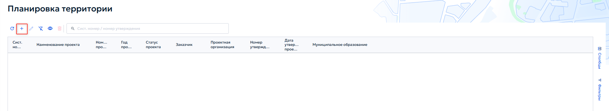

При добавлении или редактировании записи открывается карточка «Проект планировки и межевания территории» (рисунок 87).

Во вкладке «Основное» в блоке «Основная информация» укажите следующие данные:

1) «Тип документа» — выберите тип документа из выпадающего списка;
2) «Статус проекта» — выберите текущий статус из выпадающего списка;
2.1) При выборе статуса «Аннулировано» в карточке появляется поле «Основания для отмены» — выпадающий список, содержащий ссылки на документы ГИСОГД, на основании которых проект аннулируется. Выберите нужный документ из списка (рисунок 88).

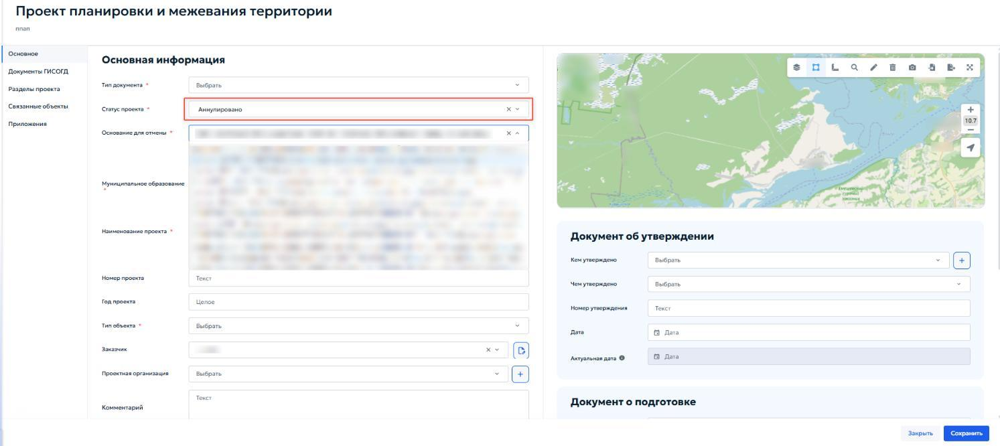

2.2) При выборе статуса «Аннулировано» появляется кнопка «Поменять статус в документах ГИСОГД на «Недействующий»» (рисунок 89). После нажатия — все связанные с проектом документы ГИСОГД перейдут в статус недействующих.

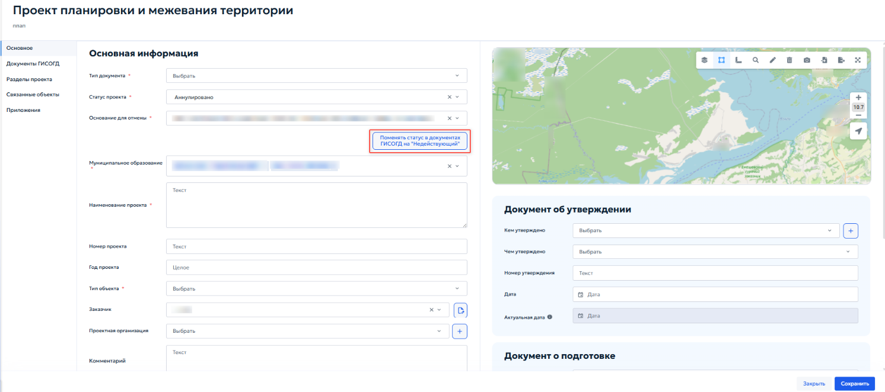

3) «Муниципальное образование» — выберите муниципальное образование, на территории которого планируется разработка проекта;
4) «Наименование проекта» — введите полное наименование проекта в соответствии с документацией;

5) «Номер проекта» — укажите присвоенный органом власти учетный номер проекта;
6) «Год проекта» — укажите год разработки или утверждения проекта;
7) «Тип объекта» — выберите тип объекта из справочника;
8) «Заказчик» — выберите организацию-заказчика из справочника;
9) «Проектная организация» — выберите организацию-разработка проекта из справочника;
10) «Комментарии» — при необходимости введите текстовые примечания. При установке флажока «Общественные обсуждения» в левой навигационной панели карточки появляется дополнительная одноименная вкладка. Заполнение блока «Документ об утверждении» выполняется аналогично описанному в пункте 5.4.3.2. В блоке «Документ о подготовке» содержатся сведения о разрешении на подготовку проекта. Укажите следующие данные о разрешении на подготовку проекта:
1) «Номер заявки» — укажите регистрационный номер обращения застройщика;
2) «Дата заявки» — укажите дату подачи заявки;
3) «Кем утверждено» — укажите орган, выдавший разрешение на подготовку;
4) «Чем утверждено» — выберите вид акта;
5) «Номер утверждения» — укажите номер акта;
6) «Дата утверждения» — укажите дату выдачи разрешения;
7) «Номер градзадания» — номер градостроительного задания на проектирование;
8) «Срок разработки» — плановая дата завершения разработки проекта;
9) «Дата выдачи ИРД» — при наличии укажите дату выдачи исходно- разрешительной документации.

### 5.4.7.1 Вкладка «Общественные обсуждения»

Вкладка «Общественные обсуждения» в карточке «Проект планирования и межевания территории» (рисунок 90) предназначена для учета сведений, проведенных по проекту планировку и межевания территории.

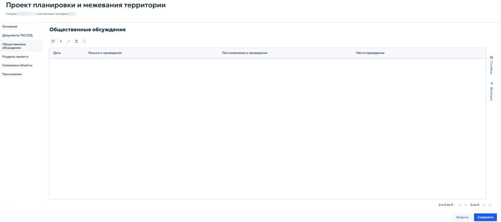

Для добавления записи об общественных обсуждениях нажмите кнопку «Добавить » на панели инструментов вкладки. Откроется карточка ( рисунок 91), в которой необходимо указать следующие данные:

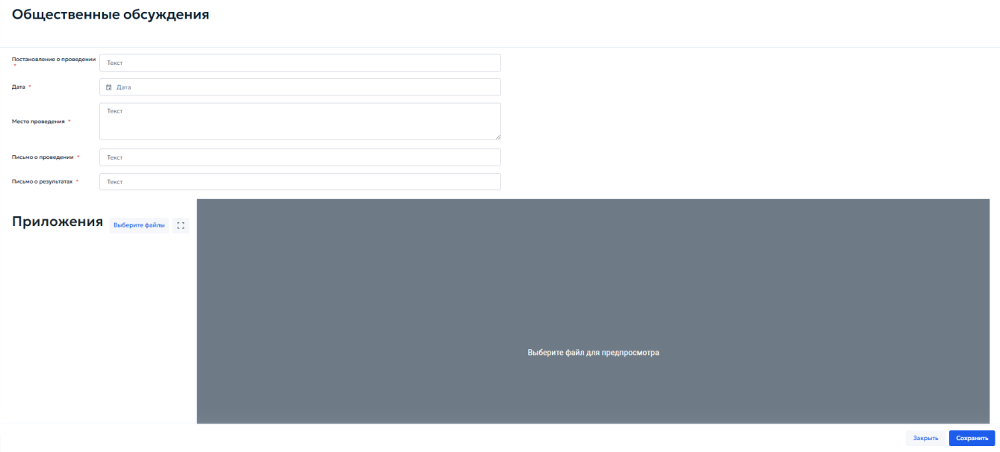

1) «Постановление о проведении» — укажите реквизиты правового акта, которым назначены общественные обсуждения;
2) «Дата» — выберите дату проведения обсуждений с помощью календаря;
3) «Место проведения» — введите адрес или наименование места, где проводились обсуждения;
4) «Письмо о проведении» — укажите реквизиты исходящего письма, направленного для организации обсуждений;
5) «Письмо о результатах» — укажите реквизиты документа, фиксирующего итоги обсуждений.

### 5.4.7.2 Вкладка «Разделы проекта»

Вкладка «Разделы проекта» (рисунок 92) предназначена для создания и управления структурой цифровой модели проекта планировки и межевания территории. Здесь определяются смысловые разделы проекта, загружаются векторные данные и проверяются пересечения земельных участков с кадастровым планом территории.

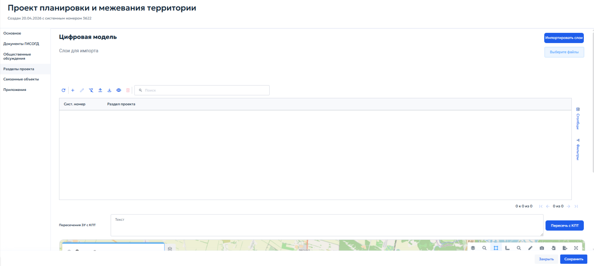

В верхней части вкладки расположен блок «Цифровая модель» для загрузки векторных данных. Кнопка «Выберите файлы» открывает проводник операционной системы. Импорт поддерживается из векторных форматов файлов, которые должны быть упакованы в zip-архив. После выбора необходимого архива система выполнит аналитику содержимого и отобразит список доступных векторных слоев. Для импорта выполните следующие действия:

1) В списке отметьте флажоками слои, которые необходимо загрузить в проект (рисунок 93);

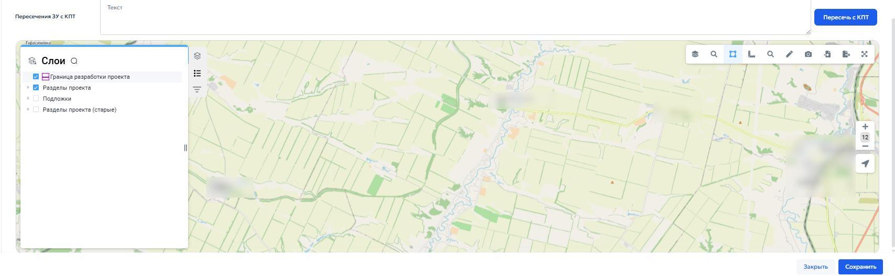

2) Нажмите кнопку «Импортировать слои» — система выгрузит выбранные слои и автоматически распределит их по соответствующим разделам проекта. Если после импорта требуется добавить дополнительные данные, повторите процедуру, отметьте новые слои и нажмите кнопку «Импортировать слои». Загруженные ранее слои не удаляются. Таблица разделов проекта содержит все добавленные разделы. Для каждого раздела указываются системный номер записи и тип раздела (рисунок 94).

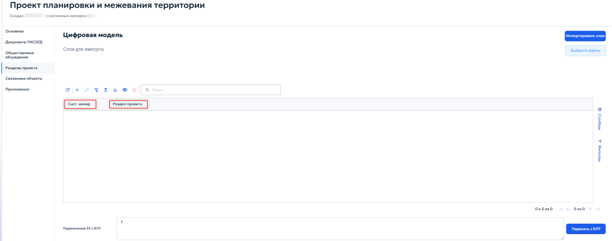

При добавлении или редактировании записи раздела открывается окно «Выберите раздел проекта» с выпадающим списком (рисунок 95).

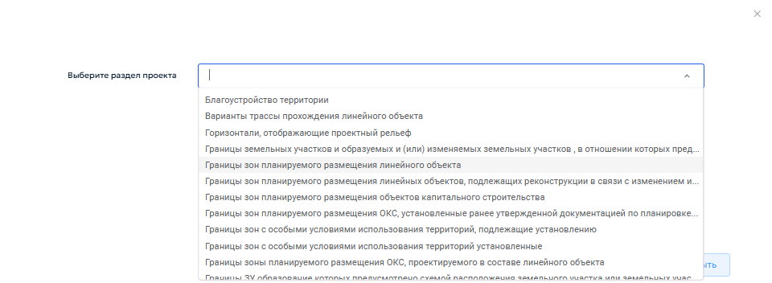

После выбора типа раздела и нажатия кнопки «Далее» открывается карточка «Раздел проекта» (рисунок 96).

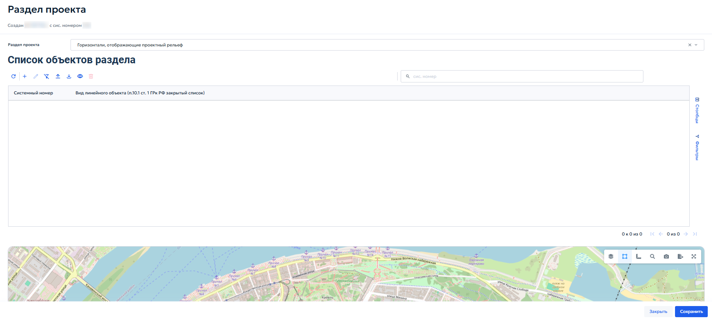

В блоке «Список объектов раздела» представлена таблица, содержащая перечень всех пространственных объектов, входящих в данный раздел. В таблице указывается системный номер записи и вид линейного объекта в соответствии с Градостроительным кодексом РФ. При нажатии кнопки «Добавить» откроется карточка «Горизонтали, отображающие проектный рельеф» (рисунок 97).

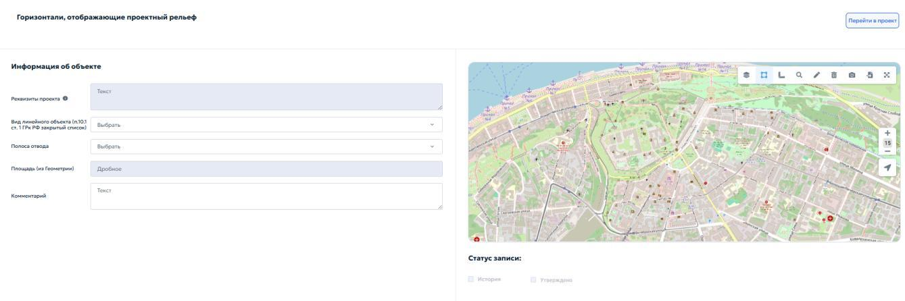

Карточка предназначена для загрузки геометрии конкретного объекта и заполнения его атрибутов. В блоке «Информация об объекте» укажите следующие данные:

1) «Реквизиты проекта» — укажите реквизиты документации, на основании которой создается объект;
2) «Примечание» — при необходимости введите дополнительные сведения об объекте. В статусе записи укажите необходимый флажок:
1) «История» — установите флажок, если объект относится к архивным;
2) «Утверждено» — установите флажок, если объект утвержден в составе документации по планировке территории. При нажатии кнопки «Перейти в проект» система закрывает карточку объекта раздела и открывает карточку родительского проекта планировки и межевания территории.

### 5.4.7.3 Вкладка «Связанные объекты»

Вкладка «Связанные объекты» в карточке «Проект планировки и межевания территории» предназначена для установления и визуализации логических связей между документацией по планировке территории и смежными объектами учета, размещенными в других разделах ГИСОГД.

1) «Дела о земельных участках» (Дела о ЗУ) — отображение земельных участков, входящих в границы проекта планировки;

2) «Инженерные изыскания» — отображение материалов изысканий, выполненных для данной территории;
3) «Надземные и подземные коммуникации» — отображение существующих и проектируемых сетей;
4) «Зоны с особыми условиями использования территории» (ЗОУИТ) — отображение зон с особыми условиями использования территории. Для каждого из перечисленных подразделов интерфейс предоставляет стандартные элементы управления табличными формами, позволяющие как создать новые объекты, так и устанавливать ссылки на уже существующие записи в соответствующих реестрах. Детальное описание состава атрибутов, порядка заполнения карточек и правил работы с объектами приведено в соответствующих разделах настоящего Руководства:
1) Порядок работы с «Делами о ЗУ», включая формирование ГПЗУ, разрешений на строительство, СРЗУ и ведение истории участка, приведен в разделе 5.4.13;
2) Порядок работы с «Инженерными изысканиями» приведен в разделе 5.4.8;
3) Порядок работы с «Надземными и подземными коммуникациями» — см. раздел 5.4.11;
4) Порядок работы с ЗОУИТ приведен в разделе 5.4.10 «Раздел 10. ЗОУИТ». Операции по установлению связей через кнопку «Связать» выполняются по общим правилам работы со связанными реестрами, описанными в пункте 4.3 настоящего Руководства.

## 5.4.8 Раздел 8. Инженерные изыскания

Раздел «Инженерные изыскания» предназначен для сбора, учета, хранения и систематизации сведений о материалах и результатах инженерных изысканий, выполненных на территории региона. Ведение раздела осуществляется в соответствии с пунктом 10 части 4 статьи 56 Градостроительного кодекса

Российской Федерации и постановлением Правительства Российской Федерации от 13.03.2020 № 279 «Об информационном обеспечении градостроительной деятельности». В реестр включаются сведения о следующих видах работ:

1) Инженерные изыскания для подготовки проектной документации объектов капитального строительства;
2) Инженерные изыскания для подготовки документации по планировке территории из раздела 7;
3) Исполнительная съемка, выполняемая в процессе строительства, реконструкции объектов капитального строительства, а также по их окончании;
4) Инвентаризация существующих инженерных сетей и сооружений, выполняемая для целей кадастрового учета и установления границ зон с особыми условиями использования территории. Реестр обеспечивает возможность установления связей между записью об инженерных изысканиях и объектами других разделов ГИСОГД:
1) С проектом планировки и межевания территории — если изыскания выполнялись в рамках разработки документации по планировке территории;
2) С делом о застроенном или подлежащем застройке земельном участке — если изыскания выполнялись в отношении конкретного земельного участка. При открытии раздела «Инженерные изыскания» отображается табличная форма, содержащая перечень записей реестра. Работа с реестром осуществляется в соответствии с общими принципами, описанными в разделе 4.2 настоящего Руководства. Добавление новой записи или редактирование существующей осуществляется в карточке «Инженерные изыскания» содержащей вкладки: «Основное», «Документы ГИСОГД», «Приложения» (рисунок 98).

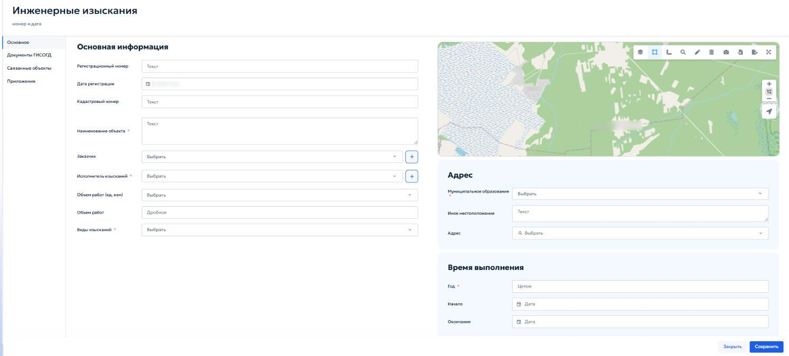

Вкладка «Основное» в карточке предназначена для ввода характеристик выполненных инженерных изысканий. В блоке «Основная информация» укажите следующие данные:

1) «Регистрационный номер» — введите учетный номер материалов изысканий;
2) «Дата регистрации» — в поле автоматически указывается текущая дата при сохранении записи;
3) «Кадастровый номер» — укажите номер земельного участка;
4) «Наименование объекта» — введите имя объекта, в отношении которого выполнены изыскания;
5) «Заказчик» — выберите из выпадающего списка необходимую

организацию. Кнопка « » позволяет добавить новую организацию в справочник;

6) «Исполнитель изысканий» — выберите из выпадающего списка исполнителя, который будет выполнять изыскания по земельному участку. Кнопка « » позволяет добавить новую организацию в справочник;
7) Объем работ (ед. изм.) — выберите единицы измерения объема выполненных работ из выпадающего списка;

8) Виды изысканий — выберите одно или несколько значений из выпадающего списка видов изысканий. В блоке «адрес» укажите следующие местоположение участка выполнения работ:
1) «Муниципальное образование» — выберите городской округ или муниципальный район, к которому относятся инженерные изыскания;
2) «Иное местоположение» — опишите дополнительные детали местоположение объекта если они отличаются от текущего местоположения;
3) «Адрес» — укажите местоположение объекта. Для корректного заполнения нажмите кнопку «Выбрать». Откроется окно для заполнения элементов адреса (рисунок 99).

В блоке «Время выполнения» указываются:

1) Год — год завершения работ (указывается целым числом);
2) Начало — дата начала выполнения работ;
3) Окончание — дата завершения работ. Во вкладках «Документы ГИСОГД», «Приложения» и «Связанные объекты» выполняются действия, описанные в пунктах 5.2.3, 5.3.2, 5.3.3 и 5.4.7.3.
## 5.4.9 Раздел 9. Искусственные земельные участки

Раздел «Искусственные земельные участки» предназначен для ведения реестра сведений, документов и материалов в отношении искусственных земельных участков, созданных на водных объектах или иных территориях в соответствии с законодательством Российской Федерации. Ведение раздела осуществляется в соответствии с пунктом 11 части 4 статьи 56 Градостроительного кодекса Российской Федерации и постановлением Правительства Российской Федерации от 13.03.2020 № 279. В реестр включаются следующие типы документов:

1) Разрешение на создание искусственного земельного участка;
2) Разрешение на проведение работ по созданию искусственного земельного участка;
3) Разрешение на ввод искусственно созданного земельного участка в эксплуатацию. Для каждого искусственного земельного участка в реестре создается отдельная запись, к которой прикрепляются соответствующие документы ГИСОГД. На карте отображаются границы искусственного земельного участка. При открытии раздела отображается табличная форма со списком записей. Работа с реестром выполняется в соответствии с общими принципами, описанными в разделе 4.2 настоящего Руководства. Добавление и редактирование записей выполняется в карточке «Искусственный земельный участок». Карточка содержит вкладки «Основное», «Документы ГИСОГД» и «Приложения» (рисунок 100).

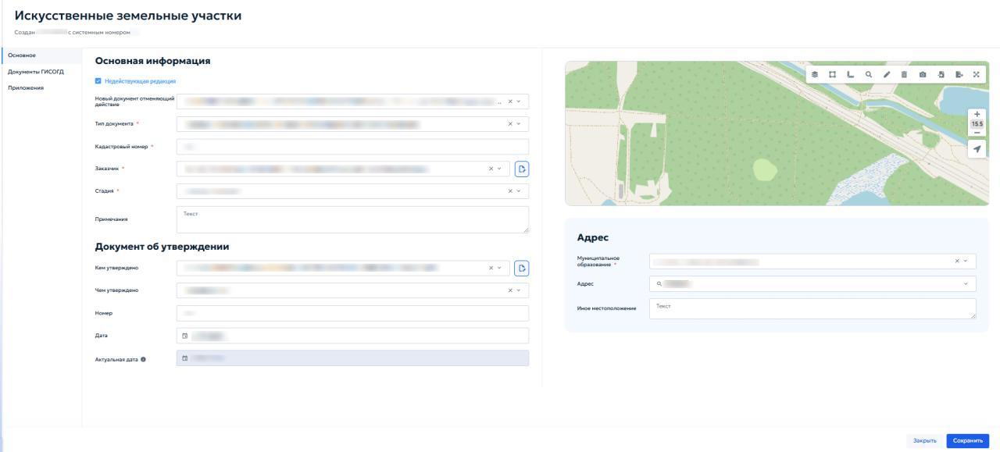

Вкладка «Основное» предназначена для ввода основных сведений об искусственном земельном участке и документе, на основании которого внесены данные. В блоке «Основная информация» укажите следующие данные:

1) «Недействующая редакция» — установите флажок, если запись или документ утратили силу. После установки флажка отображается поле «Новый документ, отменяющий действие» (рисунок 101). Выберите в нём соответствующий документ ГИСОГД;

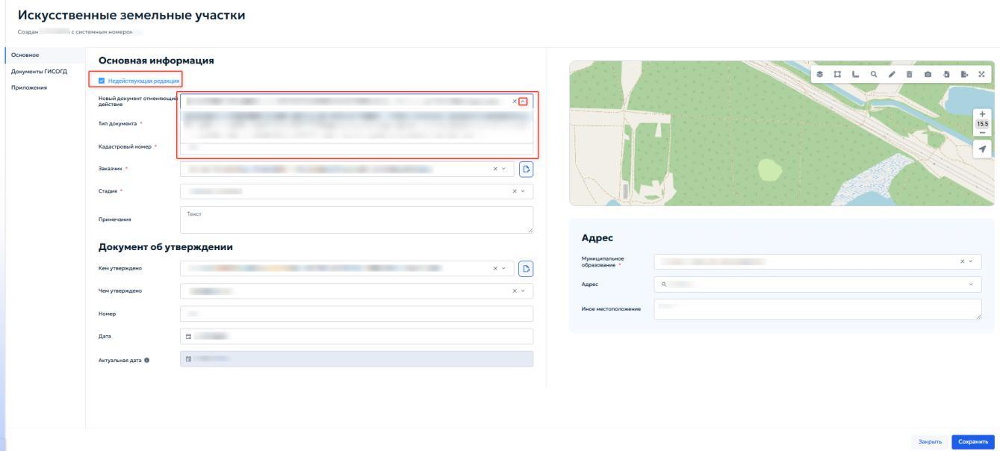

2) «Тип документа» — выберите из выпадающего списка документы ГИСОГД, указывающие тип вашего документа;
3) «Кадастровый номер» — введите кадастровый номер искусственного земельного участка;
4) «Заказчик» — выберите из выпадающего списка организацию или

физическое лицо, выполняющая роль заказчика. Кнопка « » позволяет добавить новую запись в справочник;

5) «Стадия» — выберите из выпадающего списка текущую стадию участка;
6) «Примечания» — при необходимости введите примечание по объекту. В блоке «Документ об утверждении» укажите следующие данные:
1) «Кем утверждено» — выберите орган или лицо, утвердившее документ;
2) «Чем утверждено» — выберите вид документа, которым утверждено создание искусственного земельного участка;
3) «Номер» — укажите номер документа об утверждении;
4) «Дата» — укажите дату документа об утверждении;
5) «Актуальная дата» — поле заполняется автоматически при внесении изменений документом ГИСОГД. В блоке «Адрес» укажите следующие данные:
1) «Муниципальное образование» — выберите из списка нужный городской округ или муниципальный район;
2) «Адрес» — укажите местоположение объекта. Нажмите кнопку «Выбрать» и заполните адрес в открывшемся окне по таким же принципам, как указано в пункте 5.4.8 настоящего Руководства.
3) «Иное местоположение» — укажите дополнительные сведения о местоположении объекта, если они отличаются от выбранного адреса. Во вкладке «Документы ГИСОГД» и «Приложения» выполняются действия, описываемые в пунктах 5.2.3 и 5.3.2 настоящего Руководства.

## 5.4.10 Раздел 10. ЗОУИТ

Раздел предназначен для учета сведений об установлении, изменении и прекращении существования зон с особыми условиями использования территории (ЗОУИТ). В раздел вносятся документы, на основании которых такие зоны создаются или ликвидируются, и информация об их характеристиках. Зоны с особыми условиями использования территории устанавливаются для защиты:

1) «Объектов природного происхождения» — леса, водные объекты, источники питьевого водоснабжения;
2) «Искусственных объектов» — промышленные предприятия, линии электропередачи, трубопроводы, объекты культурного наследия. В зависимости от назначения зоны подразделяются на:
1) «Охранные» — зоны вокруг линий электропередачи, магистральных трубопроводов, железных дорог и т. п.;
2) «Санитарно-защитные» — отделяющие жилую застройку от производственных объектов;
3) «Водоохранные и рыбоохранные» — примыкающие к водным объектам;
4) Зоны охраны объектов культурного наследия;
5) Иные виды, предусмотренные статьей 105 Земельного кодекса РФ и классификатором, утвержденным приказом Минстроя России от 06.08.2020 №443. Каждая зона утверждается решением, постановлением, приказом или иным документом уполномоченного органа власти. Ограничения использования земельных участков в границах зоны определяются отраслевыми нормативными актами. При открытии раздела отображается табличная форма со списком записей. Работа с реестром выполняется в соответствии с общими принципами, описанными в разделе 4.2 настоящего Руководства.

Добавление новой записи или редактирование существующей осуществляется в карточке, содержащей вкладки: «Основное», «Документы ГИСОГД», «Выписка», «Связанные объекты», «Приложения». В блоке «Основная информация» укажите следующие данные:

1) «Недействующая редакция» — установите флажок, если документ или зона утратили силу. Порядок работы с недействующей редакцией приведён в пункте 5.4.9;
2) «Тип документа» — выберите из выпадающего списка документы ГИСОГД, указывающие тип вашего документа;
3) «Учетный номер ЕГРН» — введите учетный номер зоны в Едином государственном реестре недвижимости;
4) «Дата постановки на учет» — укажите с помощью календаря даты внесения сведений о зоне в ЕГРН;
5) «Категория доступа» — выберите из выпадающего списка категорию доступа;
6) «Вид объекта» — выберите из выпадающего списка образующую зону;
7) «Наименование объекта» — укажите наименование объекта, в отношении которого установлена зона;
8) «Вид ЗОУИТ» — выберите из выпадающего списка классификатор вида зон с условиями использования территории;
9) «Наименование ЗОУИТ» — укажите полное наименование зоны;
10) «Кадастровый номер ОКС» — укажите кадастровый номер объекта капитального строительства;
11) «Кадастровый номер ЗУ» — укажите кадастровый номер земельного участка;
12) «Состояние» — выберите из выпадающего списка состояние зоны;
13) «Размер, м» — укажите площадь зоны в метрах;
14) «Площадь, кв. м» — укажите площадь зоны в квадратных метрах;
15) «Примечания» — при необходимости введите примечание по объекту;

16) «Ограничения» — при необходимости укажите ограничения использования земельного участка и объектов капитального строительства в границах зоны. В блоке «Адрес» укажите следующие данные:
1) «Муниципальное образование» — выберите из списка нужный городской округ или муниципальный район, относящийся к ЗОУИТ;
2) «Адрес» — нажмите кнопку «Выбрать». В открывшемся окне укажите адрес зоны. Работа окна выполняется в соответствии с пунктом 5.4.8 настоящего Руководства;
3) «Иное использование» — опишите местоположение зоны и ориентиры, связанные с ней. В блоке «Документ об утверждении» содержатся реквизиты правового акта или иного документа, на основании которого внесена запись:
1) «Кем утверждено» — выберите из выпадающего списка орган власти или организацию, принявшую документ. При нажатии кнопки « » откроется окно с реквизитами лиц.
2) «Чем утверждено» — выберите из выпадающего списка чем утвержден данный документ. Границы зоны отображаются на карте в правой части карточки. Для загрузки координат из файла используйте кнопку «Импорт» на панели инструментов карты; порядок импорта описан в пункте 4.5.2.12. При наличии кадастровой выписки учитывайте порядок осей в системе координат. После заполнения всех полей нажмите кнопку «Сохранить». Во вкладке «Документы ГИСОГД» приложите документы к записи о зоне. Порядок работы с вкладкой приведён в пункте 5.3.2. Во вкладке «Связанные объекты» установите связи между записью ЗОУИТ и объектами других разделов ГИСОГД. Общие правила работы со связанными реестрами описаны в пункте 4.3, порядок установления связей — в пункте 5.4.7.3.

Во вкладке «Приложения» при необходимости приложите дополнительные файлы для ЗОУИТ.

### 5.4.10.1 Вкладка «Выписка»

Вкладка предназначена для учёта и хранения выписок из реестра ЗОУИТ. Здесь отображается список созданных выписок (рисунок 103).

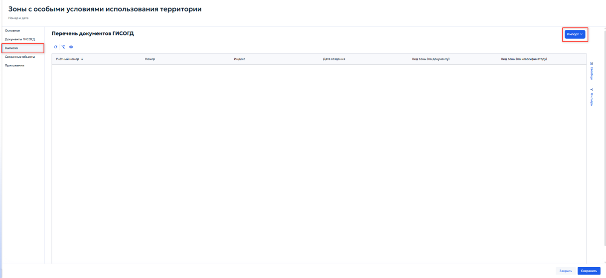

Кнопки панели инструментов позволяют добавить или отредактировать запись о выписке. Кнопка «Импорт» загружает выписку в формате.xml.

## 5.4.11 Раздел 11. Надземные и подземные коммуникации

Раздел предназначен для ведения реестра сведений, документов и материалов, содержащих информацию о местоположении и характеристиках существующих и проектируемых сетей инженерно -технического обеспечения, электрических сетей и сетей связи. Ведение раздела осуществляется в соответствии с пунктом 14 части 4 статьи 56 Градостроительного кодекса Российской Федерации и постановлением Правительства Российской Федерации от 13.03.2020 № 279. Записи раздела могут быть связаны с объектами других разделов ГИСОГД:

1) Дела о земельных участках;

2) Документацией по планировке территории;
3) Инженерные изыскания;
4) Зоны с особыми условиями использования территории. При открытии раздела отображается табличная форма, работа с которой описана в пункте 4.2. Карточка содержит вкладки «Основное», «Документы ГИСОГД», «Характеристики сети», «Связанные объекты» и «Приложения» (рисунок 104).

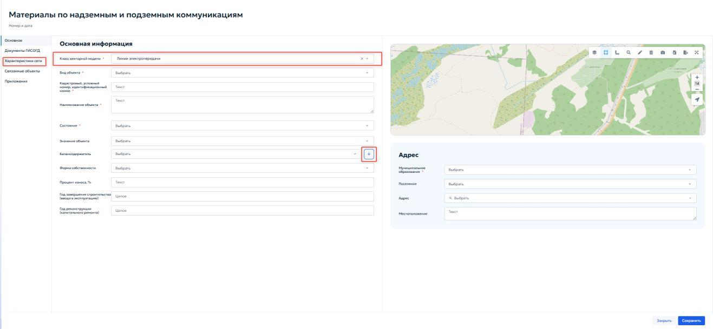

Вкладка «Основное» предназначена для ввода общей информации о коммуникации. В блоке «Основная информация» укажите следующие данные:

1) «Класс векторной модели» — выберите из выпадающего списка доступные значения, соответствующие типам инженерных сетей. После выбора значения в левой части карточки появляется вкладка «Характеристики сети»;
2) «Вид объекта» — выберите из справочника вид линейного объекта;
3) «Кадастровый, условный номер, идентификационный номер» — укажите номер объекта недвижимости;
4) «Наименование объекта» — укажите наименование коммуникации;
5) «Состояние» — выберите из выпадающего списка текущую стадию существования сети;

6) «Значение объекта» — выберите категорию значения объекта из выпадающего списка;
7) «Балансодержатель» — выберите из справочника организацию, ответственную за баланс коммуникации. Кнопка « » позволяет добавить новую организацию. Подробнее добавление новой организации описано в пункте 5.2.1 настоящего Руководства.
8) «Форма собственности» — выберите форму собственности из выпадающего списка;
9) «Процент износа, %» — укажите процент износа сети;
10) «Год завершения строительства (ввода в эксплуатацию)» — укажите год завершения строительства и ввода в эксплуатацию проекта;
11) «Год реконструкции (капитального ремонта)» — укажите год последней реконструкции или капитального ремонта. В блоке «Адрес» укажите следующие данные:
1) «Муниципальное образование» — выберите из справочника нужный городской округ или муниципальный район, где находится коммуникация;
2) «Поселение» — выберите из справочника поселение, где находится коммуникация;
3) «Адрес» — укажите с помощью кнопки «Выбрать» адрес нахождения коммуникации. Выбор адреса описан в пункте 5.4.8 настоящего Руководства.
4) «Местоположение» — введите дополнительное описание местоположения коммуникации. Границы коммуникации отображаются на карте в правой части карточки. Для загрузки точных координат из файла используйте кнопку «Импорт» на панели инструментов карты. Порядок импорта описан в пункте 4.5.2.12. Во вкладке «Документы ГИСОГД» приложите документы о коммуникации. Порядок работы с вкладкой приведён в пунктах 5.3.2 и 5.3.3. Во вкладке «Связанные объекты» установите связи между записью о коммуникации и объектами других разделов ГИСОГД. Работа со связанными
реестрами осуществляется в соответствии с описанным пунктом 4.3. Порядок установления связей описан в разделе 5.4.7.3. Во вкладке «Приложения» приложите файлы, не отнесенные к категории документов ГИСОГД. Работа с вкладкой соответствует описанному в пункте 4.5.1.

### 5.4.11.1 Вкладка «Характеристики сети»

Вкладка предназначена для ввода технических параметров выбранного типа инженерной сети. Данные используются при формировании выписок, аналитической обработке, определении границ охранных зон и расчёте нагрузок (рисунок 105).

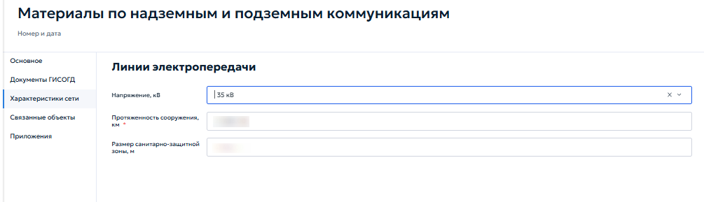

Состав полей динамически изменяется в зависимости от выбранного класса. Для класса «Линии электропередачи» отображаются следующие поля:

1) «Напряжение, кВ» — выберите номинальное напряжение линии из выпадающего списка;
2) «Протяженность сооружения, км» — укажите дробное число для указания общей длины сети в километрах;
3) «Размер санитарно-защитной зоны, м» — укажите дробное число для указания размера санитарно-защитной зоны в метрах. Для других классов перечень полей будет отличаться в соответствии с нормативными требованиями к описанию объектов соответствующего типа.

## 5.4.12 Раздел 12. Резервирование земель и изъятие земельных участков

Раздел предназначен для ведения реестра решений о резервировании земель и решений об изъятии участков для государственных или муниципальных нужд. Ведение раздела осуществляется в соответствии с пунктом 15 части 4 статьи 56 Градостроительного кодекса Российской Федерации и постановлением Правительства Российской Федерации от 13.03.2020 № 279. В реестр включаются правовые акты, на основании которых:

1) Определенные территории резервируются для будущего строительства объектов государственного или муниципального значения — дороги, инженерные сети, социальные объекты;
2) Земельные участки изымаются у правообладателей для реализации таких проектов. Каждая запись реестра содержит сведения о виде документа, реквизиты утвердившего акта, при наличии кадастровый номер, сведения о территории, а также графическую информацию о границах резервируемого или изымаемого участка на карте. Записи раздела могут быть связаны с делами о земельных участках для обеспечения наблюдения истории каждого участка. При открытии раздела отображается табличная форма, работа с которой описана в пункте 4.2. Карточка содержит вкладки «Основное», «Документы ГИСОГД», «Связанные объекты» и «Приложения» (рисунок 106).

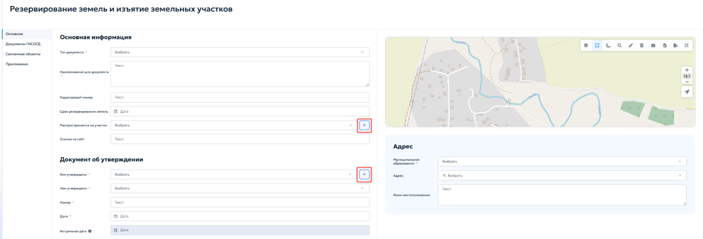

Вкладка «Основное» предназначена для ввода общих сведений о документе и характеристиках земельного участка. В блоке «Основная информация» указываются следующие данные:

1) «Тип документа» — выберите из выпадающего списка соответствующее решение о земельном участке;
2) «Наименование документа» — укажите наименование документа;
3) «Кадастровый номер» — укажите кадастровый номер земельного участка;
4) «Срок резервирования земель» — укажите сроки окончания резервирования земли с помощью календаря;
5) «Распространяется на участки» — выберите из выпадающего списка способ образования или распределения на участке. При нажатии кнопки « » открывается окно выбора записей из реестра «Дела о земельных участках». Выбранные участки будут отображаться в списке, а сам документ окажется связанным с их историей.
6) «Ссылка на сайт» — укажите ссылку на страницу публикации документа в сети Интернет. В блоке «Документ об утверждении» указываются реквизиты правового акта: кем и чем утверждено, номер и дата издания документа, по аналогии с другими пунктами (см. пункт 5.4.3.2). При нажатии кнопки « » открывается окно для ввода реквизитов лица. Подробное описание работы с формой добавления реквизитов приведено в пункте 5.2.1 настоящего Руководства. Блок «Адрес» заполняется аналогично пунктам 5.4.8 и 5.4.10. Границы резервируемого или изымаемого земельного участка отображаются и редактируются на карте. Для точного ввода координат используйте кнопку «Импорт» на панели инструментов карты; порядок импорта приведён в пункте 4.5.2.12. Ручная отрисовка не рекомендуется, если в дальнейшем потребуются официальные координаты. Во вкладке «Документы ГИСОГД» прикрепляются документы о резервировании или изъятии земельного участка, графические материалы

и сопроводительные документы. Порядок работы с вкладкой приведён в пунктах 5.3.2 и 5.3.3. Во вкладке «Связанные объекты» устанавливаются связи между записью о резервировании или изъятии земельного участка. Работа со связанными реестрами осуществляется в соответствии с общими правилами, описанными в пункте 4.3. Порядок установления связей аналогичен описанному в разделе 5.4.7.3. Вкладка «Приложения» предназначена для хранения дополнительных файлов, не относящихся к документам ГИСОГД: сопроводительной переписки, копий уведомлений и обзорных схем. Порядок работы с вкладкой приведён в пункте 4.5.1.
