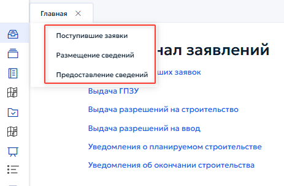
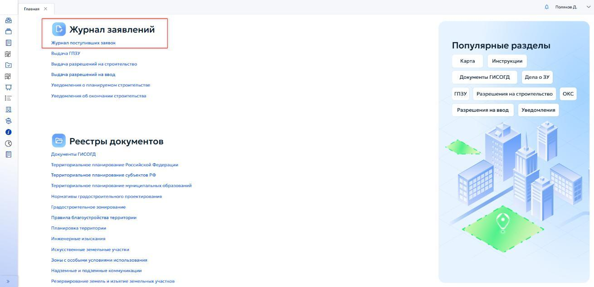
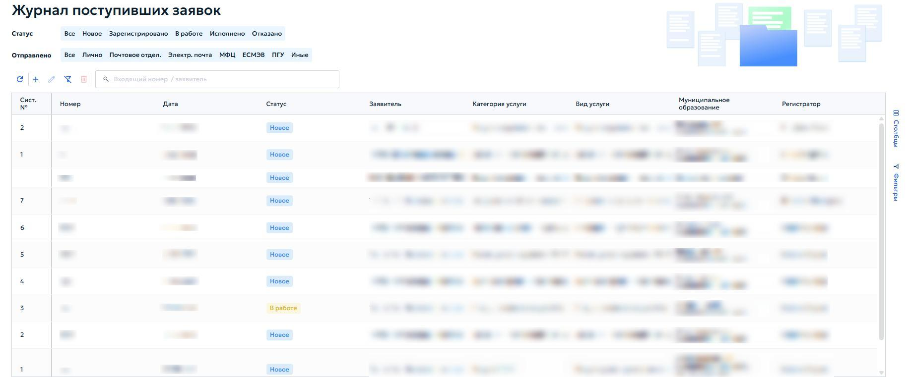
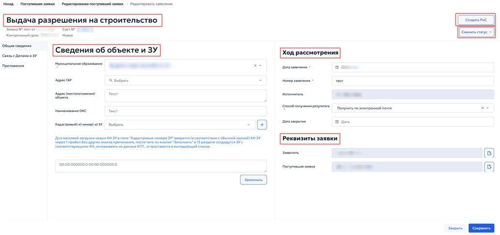
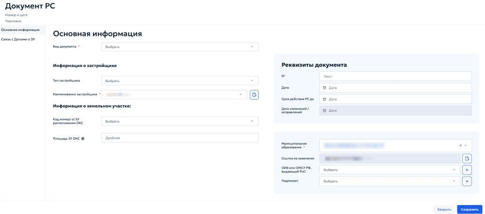
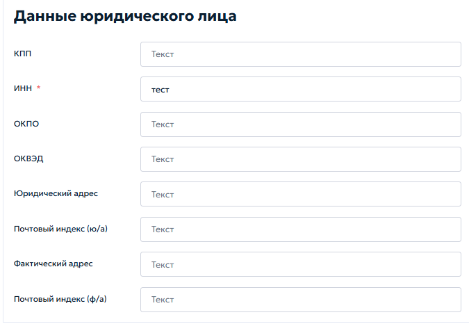
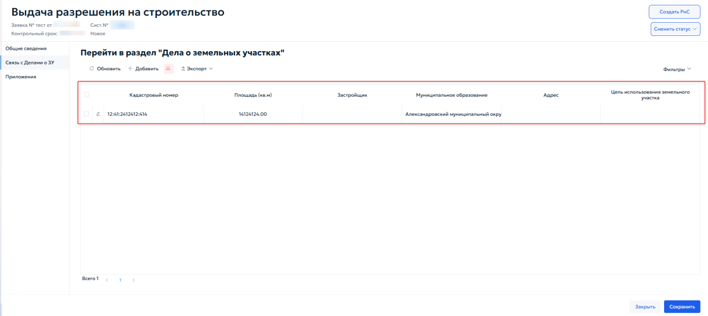
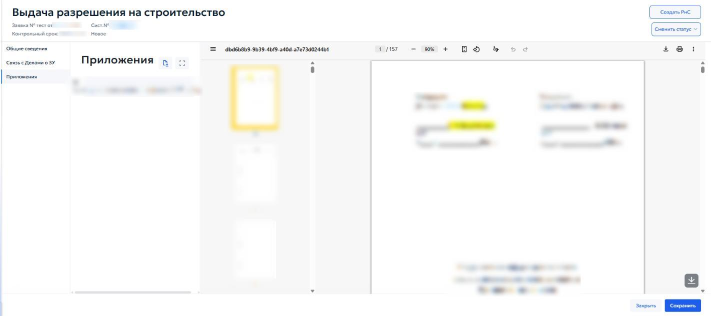

# 5.2 Регистрация заявок

Все входящие документы регистрируются в реестре «Поступившие заявки». Реестр содержит загруженные документы ГИСОГД и заявки, поступившие в систему. В реестре обрабатываются заявки на размещение и предоставление документов ГИСОГД, а также заявления на оказание государственной услуги по выдаче документа, поданные в электронной форме. Журнал поступивших заявок открывается одним из следующих способов:

1) через левое боковое меню: разверните «Журнал Заявлений» и выберите необходимый раздел (рисунок 39);

2) через главную страницу ГИСОГД: в блоке «Журнал заявлений» выберите пункт «Журнал поступивших заявок» (рисунок 40).

В журнале поступивших заявок (рисунок 41) доступна фильтрация записей, в том числе по статусу просмотра («Все», «Новое», «Зарегистрировано», «В работе», «Исполнено», «Отказано») и по статусу отправителя («Все», «Лично», «Почтовое отделение», «Электронная почта», «МФЦ», «ЕСМЭВ», «ПГУ», «Иные»). Подробнее фильтрация записей описана в разделе 4.4.

Для создания новой заявки в журнале поступивших заявок нажмите кнопку «Добавить». Для открытия редактирования поступившей заявки нажмите два раза левой кнопкой мыши по одной из действующих карточек (рисунок 42).

При нажатии кнопки «Перейти в заявление» открывается редактор заявления «Выдача разрешения на строительство», предназначенный для регистрации и обработки заявок на получение разрешения на строительство (рисунок 43).

Заявление состоит из вкладок «Общие сведения», «Связь с делами о земельных участках» и «Приложение».

### 5.2.1 Выдача разрешения на строительство

В заявление «Выдача разрешения на строительство» входят вкладки «Общие сведения», «Связь с делами о земельных участках» и «Приложение». Во вкладке «Общие сведения» находятся информационные блоки «Сведения об объекте и ЗУ», «Ход рассмотрения» и «Реквизиты заявки».

При нажатии кнопки «Создать РнС» открывается окно «Новое разрешение на строительство» (рисунок 44).

При нажатии кнопки «Сменить статус» открывается выпадающий список, в котором можно выбрать статус заявки: «Новое», «Зарегистрировано», «В работе», «Черновик», «Отправлено в ведомство», «Услуга оказана», «Отказ» (рисунок 45).

В блоке «Сведения об объекте и ЗУ» указываются данные о земельном участке и объекте капитального строительства. Для начала регистрации заявления необходимо указать следующие данные: муниципальное образование, Адрес согласно государственному адресному реестру (ГАР), фактическое местоположение объекта, наименование объекта капитального строительства (ОКС), а также кадастровый номер земельного участка.

В блоке «Ход рассмотрения» заполняются сведения о процессе обработки заявки:

- «Дата заявления» — укажите дату подачи заявления;
- «Номер заявления» — введите регистрационный номер заявления;
- «Исполнитель» — выберите сотрудника, ответственного за рассмотрение заявки;
- «Способ получения результата» — выберите способ получения результата услуги: через портал государственных услуг, по электронной почте, через веб-сайт, при личном обращении в уполномоченный орган или через МФЦ. В блоке «Реквизиты заявки» отображаются сведения о заявителе и поступившей заявке. Справа от поля «Заявитель» нажмите кнопку «Открыть». Откроется окно «Реквизиты», в котором можно просмотреть и отредактировать данные заявителя (рисунок 46).

Окно «Реквизиты» содержит следующие разделы:

1) «Основное» — заполните организационно-правовую форму, краткое и полное наименование организации, дату регистрации, ОГРН.
2) «Контакты» — укажите данные руководителя (ФИО, должность, телефон, e- mail, документ о полномочиях, срок их действия) и контактного лица (ФИО, должность, телефон, e-mail).

3) «Данные юридического лица» — заполните КПП, ИНН, ОКПО, ОКВЭД, юридический адрес с почтовым индексом, фактический адрес с почтовым индексом (рисунок 47).

После внесения изменений нажмите кнопку «Сохранить». Для выхода без сохранения нажмите кнопку «Закрыть». После закрытия окна пользователь возвращается в карточку заявки. В блоке «Реквизиты заявки» справа от поля «Поступившая заявка» нажмите кнопку «Открыть» (рисунок 46). Откроется окно редактирования поступившей заявки. В этом окне можно просмотреть и изменить номер, дату, контрольный срок, сведения о заявителе, муниципальное образование, способ и форму направления данных, категорию и вид услуги, а также реквизиты заявления и сопроводительного письма. Здесь же можно изменить статус заявки и дату поступления. После сохранения изменения автоматически обновляются в основной карточке заявки.

### 5.2.2 Связь с делами о земельных участках

Во вкладке «Связь с делами о земельных участках» отображаются земельные участки, связанные с заявкой на получение разрешения на строительство. Чтобы перейти к этим сведениям, в карточке «Выдача разрешения на строительство» откройте вкладку «Связь с делами о земельных участках» (рисунок 48).

В разделе «Дела о земельном участке» отображается перечень земельных участков, на которых планируется строительство объекта капитального строительства. Раздел позволяет привязать к заявке уже существующие дела о земельных участках. Панель инструментов раздела содержит следующие кнопки (рисунок 49):

1) «Обновить» — обновляет список земельных участков.
2) «Добавить» — открывает окно создания нового дела о земельном участке.
3) Кнопка «Ножницы» — удаляет записи о земельном участке.
4) «Экспорт» — выгружает перечень земельных участков в выбранном формате.

Таблица земельных участков содержит следующие сведения по каждому участку: кадастровый номер, площадь (кв. м), застройщик, муниципальное образование, адрес, цель использования земельного участка (рисунок 50).

### 5.2.3 Приложения

Вкладка «Приложение» предназначена для загрузки и предварительного просмотра файлов, прилагаемых к заявке на получение разрешения на

строительство. Чтобы перейти к работе с файлами, в карточке «Выдача разрешения на строительство» откройте вкладку «Приложение» (рисунок 51).

Для загрузки файла в окно предпросмотра необходимо выполнить следующие действия:

1) Нажмите кнопку « » — откроется проводник вашей операционной системы.
2) Выберите один или несколько файлов.
3) После выбора файла — система отобразит его содержимое в области предпросмотра (рисунок 52).

