# 4.5.2 Работа с картой

В верхней части рабочей области карты находится панель инструментов со следующими элементами: На рисунке 18 показаны инструменты работы с картой.

### 4.5.2.1 Работа со слоями карты

Кнопка «Слои» — при нажатии открывается панель управления слоями. Слои могут группироваться по определенным характеристикам в выпадающие списки. Видимость слоя настраивается с помощью флажока расположенного слева от наименования слоя (рисунок 19).

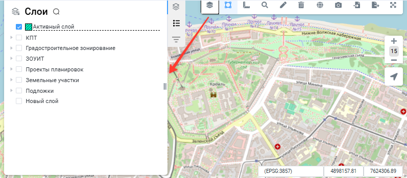

### 4.5.2.2 Выбор объекта и просмотр информации об объекте

При нажатии кнопки «Выбор объектов» открывается выпадающий список со способами выбора объектов на карте (рисунок 20):

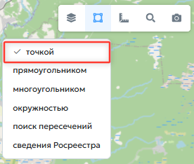

- «Точкой» — наведите курсор на нужный объект и щелкните левой кнопкой мыши (рисунок 21);

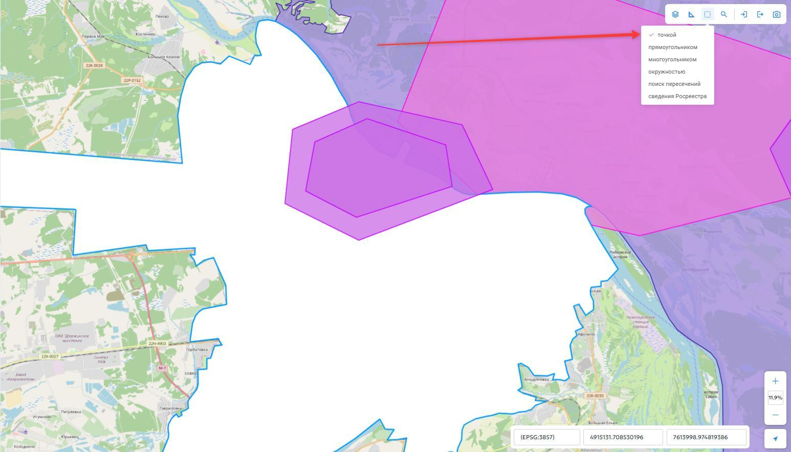

- «Прямоугольник» — нажмите левую кнопку мыши на карте и, не отпуская ее, переместите курсор, чтобы задать прямоугольную область выбора (рисунок 22);

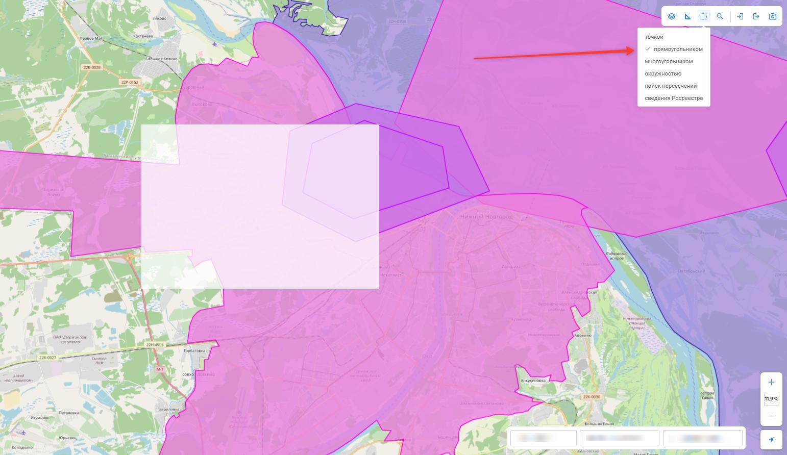

- «Многоугольник» — последовательно нажмите левую кнопку мыши в нужных точках, чтобы задать область выбора (рисунок 23);

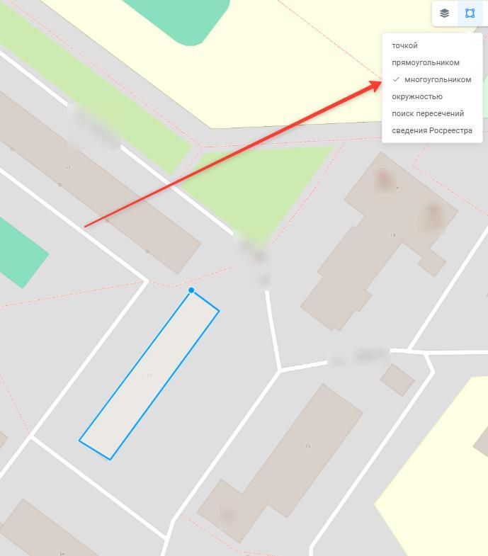

- «Окружность» — нажмите левую кнопку мыши на карте и, не отпуская ее, переместите курсор, чтобы задать область выбора в форме окружности (рисунок 24);

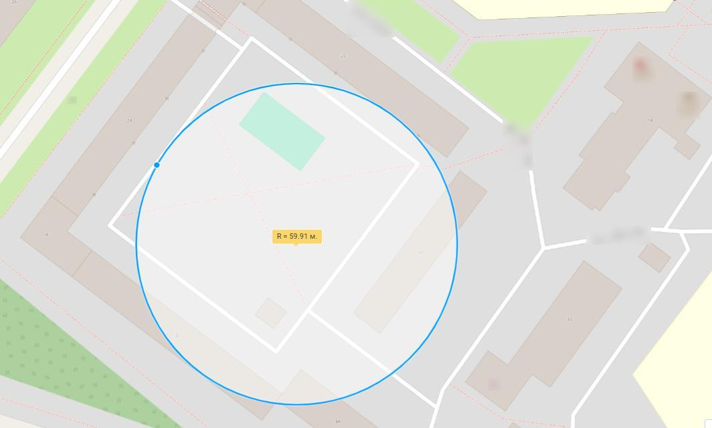

- «Поиск пересечений» — нарисуйте многоугольник последовательными щелчками левой кнопки мыши. Система выберет слои, контуры которых пересекают нарисованный многоугольник или находятся внутри него. Список выбранных слоев отобразится в информационном окне (рисунок 25).

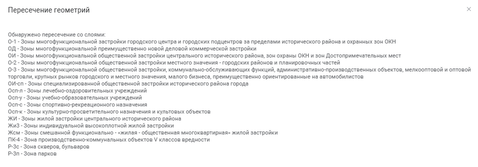

Выбранный объект отображается на карте голубым цветом. Сведения о выбранном объекте отображаются на панели слоев во вкладке «Свойства». Вкладка «Свойства» расположена на той же панели, что и список слоев, и выделена на рисунке 26 красной рамкой. Состав сведений во вкладке зависит от вида выбранного объекта.

### 4.5.2.3 Измерение расстояний и площадей

Кнопка «Измерение расстояний и площадей» при нажатии раскрывает выпадающий список возможных функций:

- «Дистанция» — измерение расстояния;
- «Площадь» — измерение площади;
- «Очистить» — удаление всех ранее выполненных измерений с карты.

### 4.5.2.4 Измерение расстояния

Для измерения расстояния необходимо выполнить следующие действия:

1. На панели инструментов нажать кнопку «Измерение расстояний и площадей»;
2. В открывшемся списке выбрать пункт «Дистанция»;

3. Наведите курсор мыши на начало объекта, длину которого необходимо измерить, и щелчком левой кнопки мыши зафиксируйте первую точку;
4. Если требуется измерить расстояние по ломаной линии, фиксируйте щелчком левой кнопки мыши каждый поворот, последовательно перемещая курсор вдоль линии. Измеряемое расстояние будет отображаться синей линией. Если необходимо измерить расстояние по прямой линии, пропустите этот пункт и перейдите к следующему (рисунок 27).

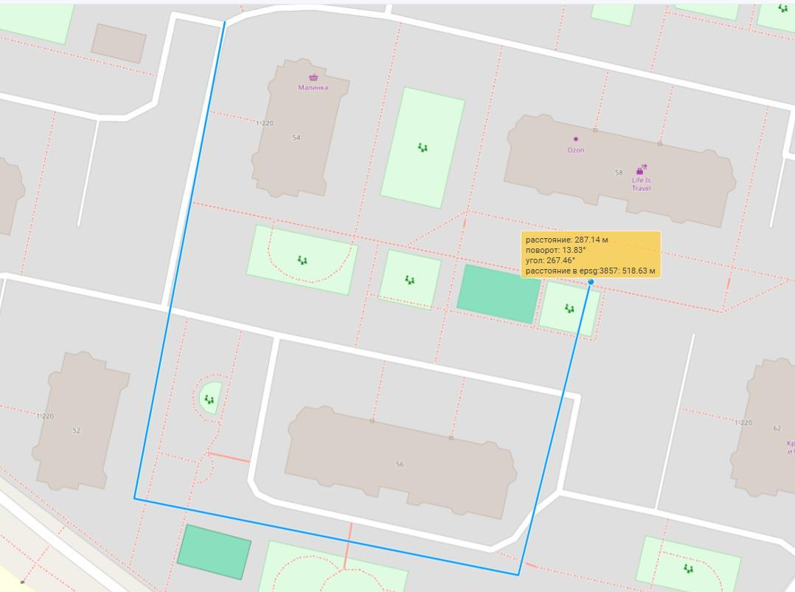

5. Зафиксируйте конечную точку двойным щелчком левой кнопки мыши. В месте фиксации конечной точки отобразится информационная плашка с результатом измерения (рисунок 28).

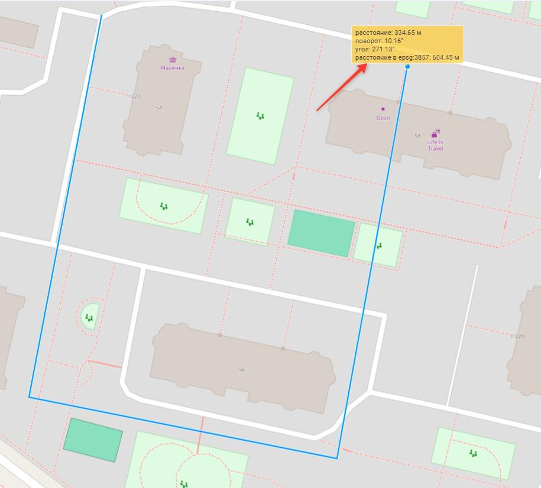

### 4.5.2.5 Измерение площади

Для измерения площади выполните следующие действия:

1. На панели инструментов нажмите кнопку «Измерение расстояний и площадей»;
2. В открывшемся списке выберите пункт «Площадь»;
3. Наведите курсор мыши на один из углов объекта, площадь которого необходимо измерить, и щелчком левой кнопки мыши зафиксируйте точку;
4. Переместите курсор мыши в следующий угол объекта и зафиксируйте точку щелчком левой кнопки мыши. Контур фигуры будет отображаться синей линией;

5. Продолжая последовательно перемещать курсор мыши к каждому углу фигуры и фиксируя точки щелчком левой кнопки мыши, обведите весь объект на карте (рисунок 29);

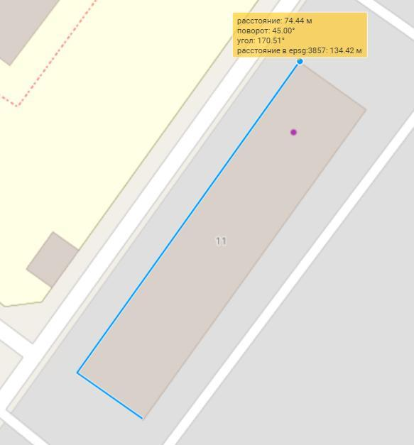

6. После фиксации всех углов верните курсор мыши в первую точку и двойным щелчком левой кнопки мыши завершите построение контура. В центре фигуры появится плашка с информацией о выполненном измерении (рисунок 30).

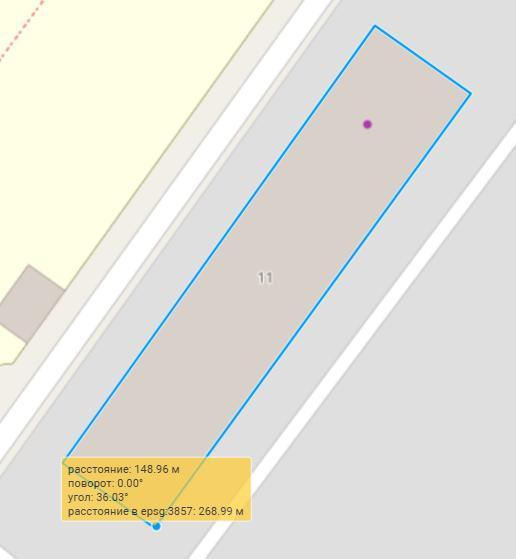

### 4.5.2.6 Очистка результатов измерений

Для удаления с карты всех ранее выполненных измерений выполните следующие действия:

1. На панели инструментов нажмите кнопку «Измерение расстояний и площадей»;
2. В открывшемся списке выберите пункт «Очистить». Все результаты измерений будут удалены с карты.

### 4.5.2.7 Поиск объектов на карте

Для поиска объекта на карте нажмите на панели инструментов кнопку «Поиск» (рисунок 31). Откроется выпадающий список со следующими способами поиска:

- «Координаты» — поиск объекта по координатам;
- «Адрес» — поиск объекта по адресу;
- «Поиск в НСПД» — поиск объекта на портале пространственных данных.

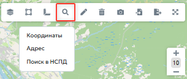

### 4.5.2.8 Поиск по координатам

Для поиска по координатам выберите пункт «Координаты». В открывшемся окне введите координаты и нажмите кнопку «Перейти» ( рисунок 32).

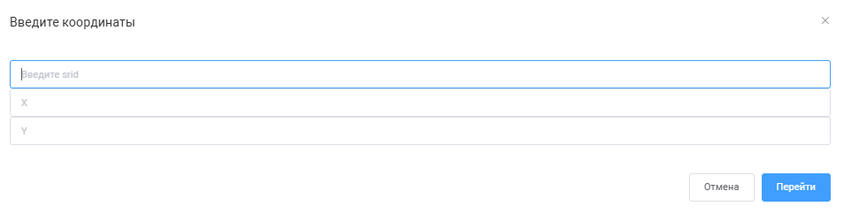

### 4.5.2.9 Поиск по адресу

Для поиска по адресу выберите пункт «Адрес». В открывшемся окне введите адрес и нажмите кнопку «Перейти» (рисунок 33).

### 4.5.2.10 Добавление и удаление геометрии

Для добавления геометрии на карте нажмите кнопку «Рисование геометрии». В открывшемся выпадающем списке укажите подходящий тип геометрии (рисунок 34).

Геометрия типа «Точка», «Прямоугольник», «Многоугольник» рисуется щелчками левой кнопки мыши на карте. Для рисования окружности нажмите и удерживайте левую кнопку мыши — на экране появится круглая фигура, размер которой можно изменять движением курсора. Для сохранения нарисованной геометрии нажмите кнопку «Сохранить» в карточке редактирования объекта реестра. Ввод геометрии по координатам требует указания системы координат (рисунок 35).

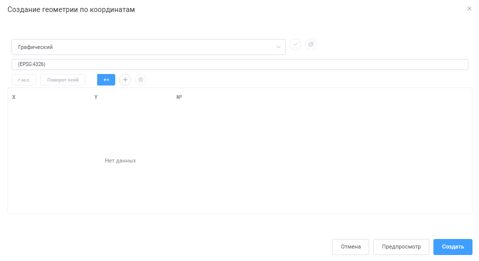

В поле «Система координат» введите сочетание букв «МСК» (местная система координат), выберите систему координат и зону региона щелчком мыши в списке. Нажмите кнопку «Выбрать систему координат». Сведения Росреестра (например, координаты границ земельных участков) в кадастровых выписках предоставляются в местной системе координат региона. В кадастровой выписке оси системы координат геодезические (первая координата — направление на север, вторая — на восток), поэтому если координаты вводятся из кадастровой выписки, то при вводе координаты необходимо менять местами. После выбора системы координат добавьте точки с помощью кнопки «+» и введите координаты точки. Для удаления нарисованной геометрии выберите объект, затем нажмите кнопку «Удаление геометрии» на панели инструментов.

### 4.5.2.11 Печать карты

При нажатии кнопки «Печать карты» открывается окно предварительного просмотра и печати текущего вида карты (рисунок 36).

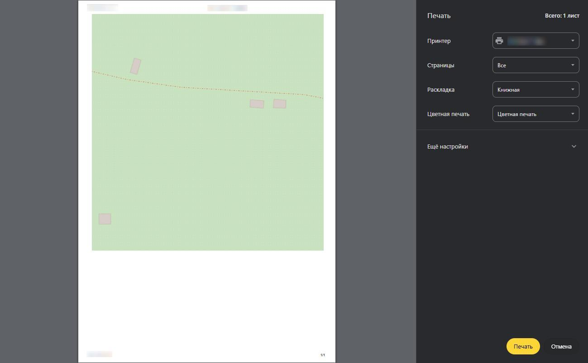

### 4.5.2.12 Импорт геометрии

Для импорта геометрии из файла нажмите кнопку «Импорт», затем в открывшемся окне выберите пункт «Файл» (рисунок 37). Импорт возможен из текстового формата.wkt, а также из графических файлов формата MIF, DXF, TAB.

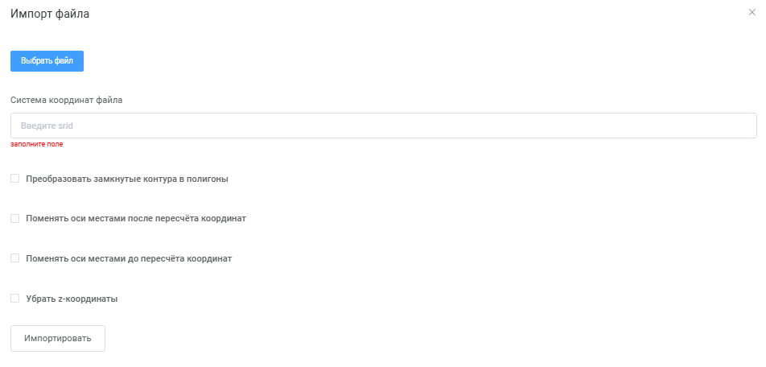

В окне импорта выберите файл с координатами. Обычно используются текстовые файлы формата.mif. В поле «Система координат» введите сочетание букв «МСК» и нажмите клавишу Enter — система предложит доступные варианты. Если координата X начинается с 1 млн, выберите первую зону соответствующей МСК. Для импорта нажмите кнопку «Импортировать». После загрузки координат на карте отобразится граница загруженных объектов. Для импорта из формата.wkt необходимо выбрать «Импорт → WKT». При импорте из.wkt необходимо ввести тип геометрии и координаты в текстовой строке. Также необходимо выбрать систему координат (рисунок 38).

Пример формата.wkt для полигона: POLYGON ((X1 Y1, X2 Y2,….Xn Yn)).

### 4.5.2.13 Экспорт геометрии

Кнопка «Экспорт» позволяет выгрузить выбранную геометрию или весь слой в заданный формат файла. Также можно сделать копию карты в файл PNG.

### 4.5.2.14 Изменение размера карты

Кнопка «Развернуть» при нажатии разворачивает карту на всю рабочую область. Кнопка «Cвернуть» сворачивает карту обратно.
