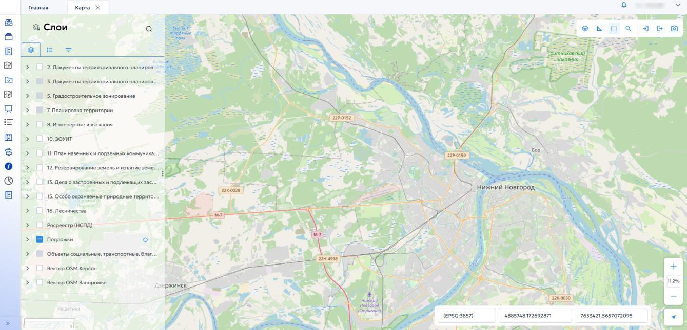
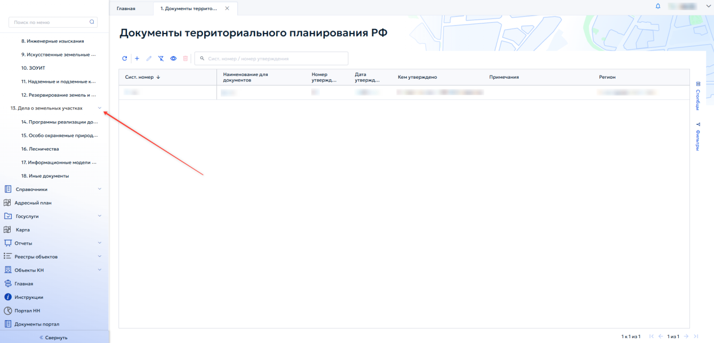
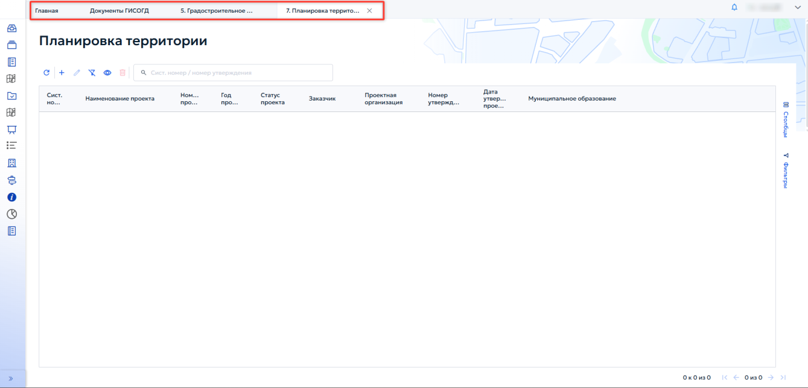
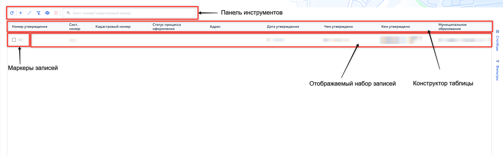

# 4 Описание операций

## 4.1 Навигация в системе

Меню расположено в левой части экрана и может находиться в развернутом или свернутом состоянии.

Для сворачивания меню нажать кнопку в нижней части меню. Для разворачивания меню нажать соответствующую кнопку.

Для открытия пункта меню навести на него указатель мыши и щелкнуть левой кнопкой. Содержимое выбранного пункта отобразится в правой области экрана (рисунок 4).

<figure class="doc-figure" markdown="span">
  
  <figcaption>Рисунок 4 — Открытие пункта меню.</figcaption>
</figure>

Если пункт меню содержит вложенные подпункты (является группировочным), его необходимо предварительно раскрыть, нажав кнопку { .ui-icon }. Работа с группировочным пунктом меню показана на рисунке 5.

<figure class="doc-figure" markdown="span">
  
  <figcaption>Рисунок 5 — Работа с группировочным пунктом меню.</figcaption>
</figure>

Для просмотра ранее открытых пунктов меню и быстрого переключения между ними предназначена панель вкладок. При открытии нового раздела соответствующая вкладка добавляется на панель. Для перехода к ранее открытому разделу нажать на его вкладку левой кнопкой мыши (рисунок 6).

<figure class="doc-figure" markdown="span">
  
  <figcaption>Рисунок 6 — Панель вкладок.</figcaption>
</figure>

## 4.2 Работа с табличными формами

В разделах ГИСОГД на базе платформы «Акцент» для отображения информации используются гибкие и настраиваемые табличные формы. Они предоставляют пользователю возможность поиска, фильтрации, группировки данных.

### 4.2.1 Основные элементы табличной формы

Типовая табличная форма содержит следующие элементы:

1. отображаемый набор записей — данные, представленные в виде строк таблицы;

2. панель инструментов — набор кнопок для управления содержимым таблицы;

3. маркеры записей — элементы для выделения одной или нескольких записей с целью выполнения групповых операций;

4. конструктор таблицы («Шапка») — строка с названиями колонок, которая позволяет:

- изменять порядок колонок (перетаскиванием);

- сортировать данные по возрастанию или убыванию;

- применять фильтры по значениям колонок;

- выполнять поиск по содержимому;

- группировать записи по выбранным полям.

Элементы табличной формы показаны на рисунке 7.

<figure class="doc-figure" markdown="span">
  
  <figcaption>Рисунок 7 — Типовые элементы табличной формы.</figcaption>
</figure>
