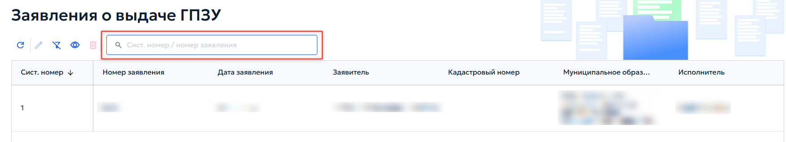
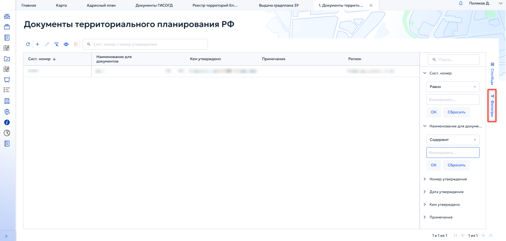
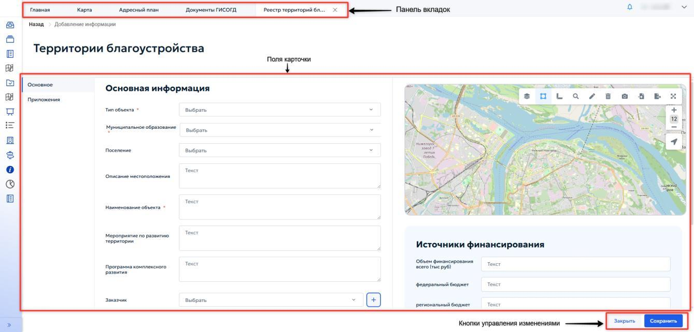
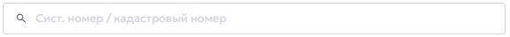
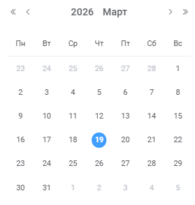
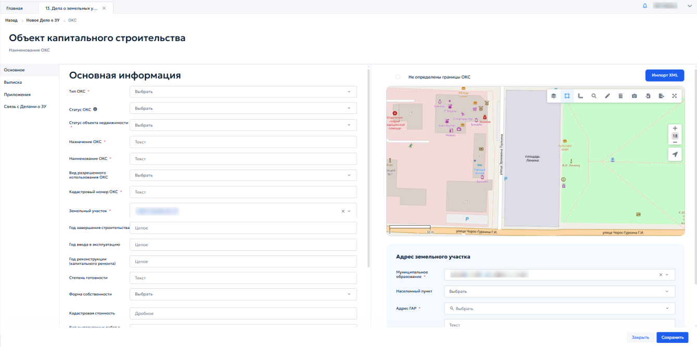
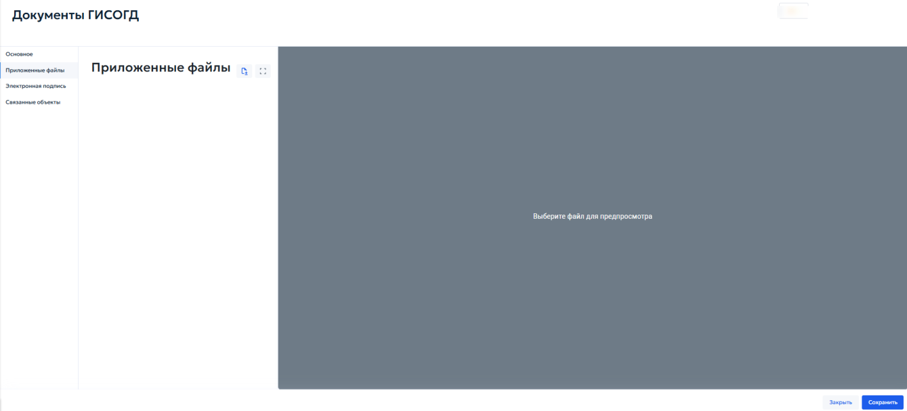

# 4.3 Управление записями в реестре

Для работы с записями реестра предусмотрены следующие функции:

- обновление;
- добавление;
- удаление;
- редактирование.

Чтобы обновить отображение реестра, необходимо нажать кнопку « ».

Для добавления новой записи нажмите кнопку « ». Для редактирования записи нажмите кнопку « ». Чтобы удалить одну или несколько записей, выделите их с помощью

маркеров и нажмите кнопку « ». На панели инструментов также могут находиться кнопки для «Экспорта»

и «Импорта» (или соответствующие кнопки — и ) в различные форматы. Для связанных реестров могут быть доступны следующие кнопки:

- кнопка связи (отображение кнопки — ) открывает реестр для выбора существующей записи, которую необходимо связать с текущим объектом;

- кнопка разрыва связи (отображение кнопки — ) разрывает связь с выбранной записью (предварительно выделите запись в списке связанных объектов).

## 4.4 Фильтрация записей

С помощью поля поиска можно выполнить быстрый поиск по основным атрибутам реестра (рисунок 8). Для этого укажите искомое значение и нажмите клавишу Enter.

Панель фильтров реестра расположена в правой части рабочей области вкладки (рисунок 9).

В окне фильтров доступен выбор одного или нескольких полей для фильтрации. После указания нужных значений нажмите кнопку «Найти», чтобы применить фильтр ( рисунок 10). Для повторного использования фильтра используйте кнопку «Сохранить фильтр».

Для быстрой фильтрации данных по любому столбцу таблицы нажмите кнопку «Фильтры» в выпадающем меню заголовка столбца. Если столбец содержит числовые значения или даты, в меню фильтрации отображаются поля для указания различного диапазона данных. Если фильтр применяется к строковым данным, меню фильтрации содержит поле для ввода произвольной подстроки поиска, а также выпадающий список быстрого выбора значений, встречающихся в ячейках столбца. В выпадающем списке отметьте одно или несколько значений. После применения фильтра в таблице останутся только записи, соответствующие выбранным условиям.

## 4.5 Работа с карточкой записи

Большая часть данных, отображаемая в табличных формах, редактируется через карточку записи. Добавление новой записи выполняется с помощью карточки (рисунок 11).

«Поля формы» — раздел для отображения и редактирования данных выбранной записи. Элементы управления для разных типов полей могут отличаться. Строковые и текстовые поля позволяют вводить произвольные символы; числовые ограничены вводом только цифровых значений; логические поля — значения «да» или «нет»; поля с типом «дата» — выпадающий элемент управления «Календарь» или ручной ввод дат в формате «ДД.ММ.ГГГГ». Существует несколько видов полей для ввода данных:

- Строка/текст — позволяет вносить произвольный текст (рисунок 12);

- «Дата» — выберите дату документа с помощью календаря (рисунок 13);

- Целое — позволяет вносить только целое числовое значение;
- Дробное — позволяет вносить дробное числовое значение;
- Одиночный выбор из списка (рисунок 14) — значение выбирается из выпадающего списка « ». Для поиска необходимого значения введите часть текста и нажмите кнопку Enter. Чтобы удалить выбранное значение, нажмите кнопку « » в правой части поля;

- Множественный выбор из списка (рисунок 15) — работает аналогично одиночному выбору, поддерживает поиск. Для удаления одного значения нажмите кнопку « » рядом с ним, для удаления всех значений — кнопку в правой части поля;

- Флажок — позволяет установить или снять отметку для учета определенного параметра. Чтобы изменить состояние флажка, нажмите левой кнопкой мыши в поле флажока. Связанные реестры (рисунок 16) отображают записи из других реестров, имеющие связь с текущей записью. Управление записями в связанных реестрах выполняется аналогично действиям, описанным в разделе 4.3.

В карточках записи используются следующие условные обозначения:

- * — поле обязательно для заполнения;
- серый цвет поля — поле недоступно для редактирования. Для полей ссылочного типа (простая ссылка, множественная ссылка) используются следующие элементы управления:
- очистказначения поля;
- открытие выпадающего списка значений из связанной таблицы. Для поиска необходимого значения достаточно ввести произвольную подстроку в поле ввода — список автоматически предложит все подходящие варианты.

«» — кнопка для сохранения внесенных данных или внесенных изменений данных карточки.

«» — кнопка для выхода без сохранения внесенных данных или внесенных изменений данных карточки.

### 4.5.1 Вкладка «Приложенные файлы»

Вкладка «Приложенные файлы» является типовой и содержит следующие элементы (рисунок 17):

- список прикрепленных файлов, расположенный в левой части рабочей области вкладки;
- поле предварительного просмотра файлов (если возможность предпросмотра предусмотрена, при выборе файла или списка в этом поле отображается его содержимое);
- кнопка «Выберите файлы», предназначенная для добавления файлов во вкладку «Приложенные файлы».

Можно загружать файлы различных форматов. Просмотр в окне документа доступен для файлов форматов PDF, JPG, PNG и других, поддерживаемых системой. Текстовые файлы в формате Word выгружаются и просматриваются вне системы.
