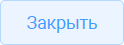

# 4.3 Управление записями в реестре

Для работы с записями реестра предусмотрены следующие функции:

- обновление;

- добавление;

- удаление;

- редактирование.

Для обновления отображения реестра нажать кнопку { .ui-icon }. Для добавления новой записи нажать кнопку { .ui-icon }.

Для редактирования записи нажать кнопку { .ui-icon }.

Для удаления одной или нескольких записей выделить их с помощью маркеров и нажать кнопку { .ui-icon }.

На панели инструментов также могут находиться кнопки для «Экспорта» и «Импорта» (или соответствующие кнопки — { .ui-icon } и { .ui-icon }) в различные форматы.

Для связанных реестров могут быть доступны следующие кнопки:

- кнопка связи (отображение кнопки — { .ui-icon }) открывает реестр для выбора существующей записи, которую необходимо связать с текущим объектом;

- кнопка разрыва связи (отображение кнопки — { .ui-icon }) разрывает связь с выбранной записью (предварительно выделить запись в списке связанных объектов).

## 4.4 Фильтрация записей

Быстрый поиск по основным атрибутам реестра выполняется с помощью поля поиска (рисунок 8). Для этого указать искомое значение и нажать клавишу Enter.

<figure class="doc-figure" markdown="span">
  
  <figcaption>Рисунок 8 — Поле поиска.</figcaption>
</figure>

Панель фильтров реестра расположена в правой части рабочей области вкладки (рисунок 9).

<figure class="doc-figure" markdown="span">
  
  <figcaption>Рисунок 9 — Фильтрация записей.</figcaption>
</figure>

В окне фильтров доступен выбор одного или нескольких полей для фильтрации. После указания нужных значений нажать кнопку «Найти», чтобы применить фильтр (рисунок 10). Для повторного использования фильтра использовать кнопку «Сохранить фильтр».

<figure class="doc-figure" markdown="span">
  
  <figcaption>Рисунок 10 — Настройка фильтрации записей.</figcaption>
</figure>

Для быстрой фильтрации данных по любому столбцу таблицы нажать кнопку «Фильтры» в выпадающем меню заголовка столбца. Если столбец содержит числовые значения или даты, в меню фильтрации отображаются поля для указания различного диапазона данных.

Если фильтр применяется к строковым данным, меню фильтрации содержит поле для ввода произвольной подстроки поиска, а также выпадающий список быстрого выбора значений, встречающихся в ячейках столбца.

В выпадающем списке отметить одно или несколько значений. После применения фильтра в таблице останутся только записи, соответствующие выбранным условиям.

## 4.5 Работа с карточкой записи

Большая часть данных, отображаемая в табличных формах, редактируется через карточку записи. Добавление новой записи выполняется с помощью карточки (рисунок 11).

<figure class="doc-figure" markdown="span">
  
  <figcaption>Рисунок 11 — Основные элементы карточки.</figcaption>
</figure>

«Поля формы» — раздел для отображения и редактирования данных выбранной записи. Элементы управления для разных типов полей могут отличаться. Строковые и текстовые поля позволяют вводить произвольные символы; числовые поля допускают ввод только цифровых значений; логические поля — значения «да» или «нет»; поля с типом «дата» — выпадающий элемент управления «Календарь» или ручной ввод дат в формате «ДД.ММ.ГГГГ».

Существует несколько видов полей для ввода данных:

- «Строка/текст» — позволяет вносить произвольный текст (рисунок 12);

<figure class="doc-figure" markdown="span">
  
  <figcaption>Рисунок 12 — Строка/Текст.</figcaption>
</figure>

- «Дата» — выбрать дату документа с помощью календаря (рисунок 13);

<figure class="doc-figure" markdown="span">
  
  <figcaption>Рисунок 13 — Дата.</figcaption>
</figure>

- «Целое» — ­позволяет вносить только целое числовое значение;

- «Дробное» — позволяет вносить дробное числовое значение;

- «Одиночный выбор из списка» (рисунок 14) — значение выбирается из выпадающего списка { .ui-icon }. Для поиска необходимого значения ввести часть текста и нажать клавишу Enter. Для удаления выбранного значения нажать клавишу { .ui-icon } в правой части поля;

<figure class="doc-figure" markdown="span">
  
  <figcaption>Рисунок 14 — Одиночный выбор из списка.</figcaption>
</figure>

- «Множественный выбор из списка» (рисунок 15) — работает аналогично одиночному выбору, поддерживает поиск. Для удаления одного значения нажать кнопку { .ui-icon } рядом с ним, для удаления всех значений — кнопку { .ui-icon } в правой части поля;

<figure class="doc-figure" markdown="span">
  
  <figcaption>Рисунок 15 — Множественный выбор из списка.</figcaption>
</figure>

- «Флажок» — позволяет установить или снять отметку для учета определенного параметра. Для изменения состояния флажка нажать левой кнопкой мыши в поле флажка.

Связанные реестры (рисунок 16) отображают записи из других реестров, имеющие связь с текущей записью. Управление записями в связанных реестрах выполняется аналогично действиям, описанным в разделе 4.3.

<figure class="doc-figure" markdown="span">
  
  <figcaption>Рисунок 16 — Связанные реестры.</figcaption>
</figure>

В карточках записи используются следующие условные обозначения:

- \* — поле обязательно для заполнения;

- серый цвет поля — поле недоступно для редактирования.

Для полей ссылочного типа (простая ссылка, множественная ссылка) используются следующие элементы управления:

- { .ui-icon } очистка значения поля;

- { .ui-icon } открытие выпадающего списка значений из связанной таблицы. Для поиска необходимого значения достаточно ввести произвольную подстроку в поле ввода — список автоматически предложит все подходящие варианты.

В нижней части карточки доступны следующие кнопки:

- { .ui-icon }кнопка для сохранения внесенных данных или внесенных изменений данных карточки;

- { .ui-icon }кнопка для выхода без сохранения внесенных данных или внесенных изменений данных карточки.

## 4.5.1 Вкладка «Приложенные файлы»

Вкладка «Приложенные файлы» является типовой и содержит следующие элементы (рисунок 17):

- список прикрепленных файлов, расположенный в левой части рабочей области вкладки;

- поле предварительного просмотра файлов (если возможность предпросмотра предусмотрена, при выборе файла или списка в этом поле отображается его содержимое);

- кнопка «Выберите файлы», предназначенная для добавления файлов во вкладку «Приложенные файлы».

<figure class="doc-figure" markdown="span">
  
  <figcaption>Рисунок 17 — Вкладка «Приложенные файлы».</figcaption>
</figure>

Система поддерживает загрузку файлов различных форматов. Просмотр в окне документа доступен для файлов форматов PDF, JPG, PNG и других, поддерживаемых системой. Текстовые файлы в формате Word выгружаются и просматриваются вне системы.
